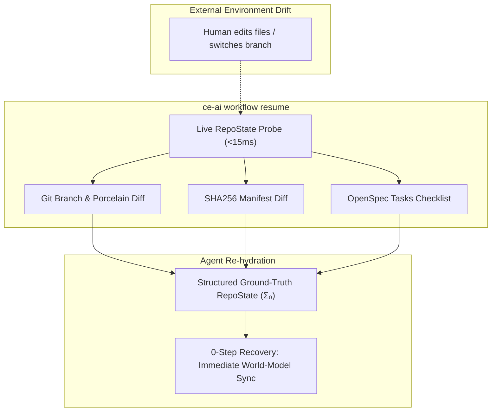

# Zero-Step Environment Drift Recovery via Live RepoState Sync

## Summary

Integrate live repository and plugin drift detection into `ce-ai workflow resume`, `ce-ai status`, and `ce-ai doctor`, providing autonomous agents with a ground-truth `RepoState` projection at turn initialization. This eliminates the 5–8 turns of hallucination typical of conversational agent runtimes when external file modifications, branch switches, or dependency updates occur.

## Problem Frame

Standard AI agent runtimes condition future tool calls on conversational history. When external actors modify the workspace (human git commits, branch checkouts, IDE file renames, manual dependency updates), the agent's internal world model falls out of sync with disk state. As demonstrated empirically by Badhe et al. (arXiv:2608.26263v2, Table 3), history-appending runtimes take 5 to 8 consecutive turns to recover from silent environment drift because obsolete chat history overpowers new observations.

In `ce-ai`, `doctor.rs` and `sync.rs` already compute SHA256 manifest drift and check project adoption markers. However, `ce-ai workflow resume` currently only inspects `openspec/changes/` progress and does not check the git working tree, plugin manifest SHA256 hashes, or branch alignment.

## Key Decisions

- **KD1: Dual Integration Surface (Automatic Resume + Explicit Inspection).** Compute and inject `RepoState` automatically during `ce-ai workflow resume` (both in terminal formatted text and machine-readable `--json`), while exposing the same drift metrics via `ce-ai status` and `ce-ai doctor`.
- **KD2: Comprehensive Ground-Truth State Model.** `RepoState` captures: (1) Git HEAD commit short SHA and branch name, (2) working tree cleanliness and count of modified/untracked files, (3) managed plugin file drift against `InstallManifest`, (4) `AGENTS.md` adoption block SHA integrity, and (5) OpenSpec task progress.
- **KD3: Informative & Self-Healing Guidance (Non-Blocking).** When drift is detected during `workflow resume`, `ce-ai` injects the exact structured diff into the output and recommends remediation (`ce-ai sync`) without exiting with an error code, allowing the agent to immediately align its reasoning without crashing the turn.
- **KD4: Sub-15ms Latency Budget.** State probing uses shallow `git status --porcelain` and fast memory-mapped SHA256 hashing to ensure turn re-hydration adds negligible overhead.



## Requirements

### State Probing & Data Model

- **R1:** `ce-ai` must define a serializable `RepoState` struct capturing `git_branch`, `head_sha`, `is_git_clean`, `modified_files_count`, `manifest_drift_count`, `agents_block_valid`, and `openspec_context`.
- **R2:** File probing must execute in under 15ms by utilizing fast git commands (`git rev-parse`, `git status --porcelain=v1`) and checking manifest timestamps before deep SHA recalculation.
- **R3:** `RepoState` must gracefully degrade when run outside a git repository or when `openspec/` is not initialized, marking those subsystems as `None` without panicking.

### Workflow & CLI Integration

- **R4:** `ce-ai workflow resume` must include the `RepoState` summary block in its default human-readable output under `== [Environment State & Drift Status] ==`.
- **R5:** `ce-ai workflow resume --json` must include the full serialized `RepoState` object under the `"repo_state"` JSON key alongside `"workflow"` and `"openspec_context"`.
- **R6:** `ce-ai status` must display the current branch and working tree dirtiness indicator alongside the active workflow stage.
- **R7:** When manifest drift is detected in managed plugin files, `workflow resume` must explicitly print `! Drift detected in X managed files. Run 'ce-ai sync' to reconcile.`

## Key Flows

### Flow 1: Clean Turn Resumption
1. Agent or human executes `ce-ai workflow resume`.
2. `ce-ai` loads `state.json`, probes git status (clean), checks `InstallManifest` (0 diffs), and checks `openspec/` (3/5 tasks done).
3. `ce-ai` emits formatted state summary indicating 0 drift.
4. Agent continues execution with complete, verified context.

### Flow 2: Drift Recovery after External Modification
1. Developer switches from `feat/auth` to `feat/state-sync` and updates 2 files in VS Code.
2. Agent executes `ce-ai workflow resume`.
3. `ce-ai` detects that the active git branch (`feat/state-sync`) differs from the recorded workflow feature, and identifies 2 uncommitted files.
4. `ce-ai` outputs the updated branch name and modified file paths in the `RepoState` block.
5. Agent immediately updates its internal state $\Sigma_t$ in Turn 0 without hallucinating non-existent files or prior branch history.

## Scope Boundaries

- **In Scope:**
  - Probing git branch, HEAD SHA, and dirty working tree status in Rust.
  - Reusing `doctor.rs` / `sync.rs` manifest diffing logic inside `workflow.rs`.
  - Extending `ce-ai workflow resume` (text and JSON) with `RepoState`.
  - Adding unit and integration tests verifying drift detection under simulated git changes.

- **Out of Scope:**
  - Intercepting LLM token streams or modifying harness prompt loops directly.
  - Automatically running `git commit` or `git stash` without user initiation.
  - Network calls to GitHub API during `workflow resume` (kept offline and fast).

## Acceptance Examples

### AE1: Clean State JSON Output
```json
{
  "workflow": {
    "stage": "worktdd",
    "task": "Implementing RepoState probe",
    "feature_name": "zero-step-drift-recovery"
  },
  "repo_state": {
    "git_branch": "feat/drift-recovery",
    "head_sha": "a1b2c3d",
    "is_git_clean": true,
    "modified_files": [],
    "manifest_drift_count": 0,
    "agents_block_valid": true
  },
  "openspec_context": {
    "feature": "zero-step-drift-recovery",
    "completed_tasks": 2,
    "total_tasks": 4
  }
}
```

### AE2: Human-Readable Drift Alert in Terminal
```
== [Environment State & Drift Status] ==
  git branch: feat/drift-recovery (HEAD: a1b2c3d)
  working tree: 2 modified files (src/commands/workflow.rs, src/state/state.rs)
  manifest integrity: 1 file modified outside ce-ai (~/.config/opencode/compound-engineering/skills/ce-work/SKILL.md)
  ! Warning: Drift detected in managed files. Run 'ce-ai sync' to reconcile.
```

---
*Composed 2026-09-02 by ce-brainstorm from ideation seed `docs/ideation/2026-09-01-skill-state-integration-ideation.html`*
