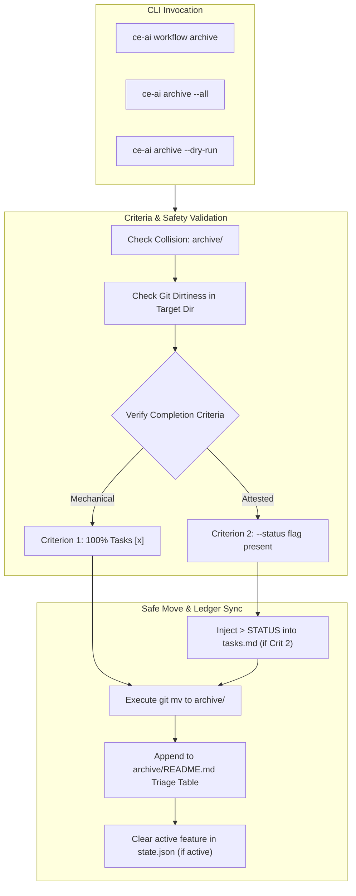

# OpenSpec Change Archival CLI Command & Ledger Synchronization

## Summary

Introduce a dedicated, git-safe CLI command `ce-ai workflow archive [feature]` (with top-level alias `ce-ai archive`), supporting single-feature archival, batch remediation (`--all`), dry-run preview (`--dry-run`), Criterion 2 status attestation (`--status "<ref>"`), and automatic `archive/README.md` ledger and `state.json` synchronization. This eliminates the manual shell convention friction that previously caused 33 completed OpenSpec changes to linger unarchived.

## Problem Frame

In `ce-ai v1.44.2` (Issue #323), `probe_unarchived_completed_changes` was added to detect change folders under `openspec/changes/` where 100% of tasks in `tasks.md` are marked `[x]`. However, automated directory moving was deliberately excluded from that change to avoid unrequested git mutations, leaving archival as an undocumented manual convention:
1. Manually finding which folders are complete across `openspec/changes/`.
2. Running `mkdir -p openspec/changes/archive/` and `git mv openspec/changes/<feature> openspec/changes/archive/<feature>`.
3. Manually updating the markdown triage table and historical sweep log in `openspec/changes/archive/README.md`.
4. Manually handling folders that shipped with rescoped tasks under Criterion 2 (STATUS-verified shipped).

Because no execution command existed, neither human developers nor AI agents consistently performed this chore. Consequently, **33 completed change folders** accumulated in `openspec/changes/`, causing continuous diagnostic noise (33 warnings on every Turn-0 `workflow resume` and `ce-ai doctor` check).

## Key Decisions

- **KD1: Dual Command Surface (`ce-ai workflow archive` + `ce-ai archive`).** Expose `Archive` as a subcommand under `workflow` (`ce-ai workflow archive [feature]`) for FSM cohesion, and provide a top-level alias `ce-ai archive` in `src/commands/registry.rs` for maximum developer ergonomics.
- **KD2: Dual Completion Criteria Support.**
  - **Criterion 1 (Mechanical):** Allows immediate archival if `total_tasks > 0 && completed_tasks == total_tasks`.
  - **Criterion 2 (STATUS-Attested):** Allows archiving changes with residual unchecked tasks when supplied with `--status "<ship evidence>"`. Injects the canonical `> STATUS: <evidence>` markdown callout at line 1 of `tasks.md` before moving.
- **KD3: Zero-Data-Loss Safe Mover.** Archival operations must:
  - Assert that `openspec/changes/<feature>` exists and `openspec/changes/archive/<feature>` does not already exist.
  - Assert that the target directory has no uncommitted git conflicts or dirty modifications outside `tasks.md`.
  - Execute `git mv` if git is clean, falling back to atomic directory rename + git staging.
  - Fail-closed with `CeError::Verification` (exit code 6) if criteria are not met.
- **KD4: Ledger & State Synchronization.**
  - Automatically update `openspec/changes/archive/README.md` by recording the archived feature in the historical sweep ledger table.
  - If the archived feature matches the currently recorded active feature in `state.json` (`state.workflow`), cleanly clear the active feature pointer to prevent stale context re-hydration.
- **KD5: Backlog Drain Capability (`--all` & `--dry-run`).**
  - `--all`: Iterates through all detected unarchived completed changes from `probe_unarchived_completed_changes` and archives them sequentially.
  - `--dry-run`: Emits planned moves and ledger updates without modifying disk or git index.



## Requirements

### CLI Interface & Options

- **R1:** The CLI must support `ce-ai workflow archive [feature]` with a top-level alias `ce-ai archive [feature]`.
- **R2:** When `[feature]` is omitted, the command must target the current active feature recorded in `state.json` (or error if none is active and `--all` is not passed).
- **R3:** The command must support `--all` to automatically discover and archive all features returned by `probe_unarchived_completed_changes(repo_root)`.
- **R4:** The command must support `--dry-run` to print intended actions and verification results without writing to disk or moving git trees.
- **R5:** The command must support `--status <text>` to satisfy Criterion 2 for features that have incomplete task checkboxes.

### Verification & Safety Gates

- **R6:** The command must verify that `openspec/changes/<feature>` exists and is a directory; otherwise return `CeError::Usage` (exit code 2).
- **R7:** The command must verify that `openspec/changes/archive/<feature>` does not already exist; if collision occurs, return `CeError::State` (exit code 3) without overwriting.
- **R8:** If the feature has incomplete tasks and `--status` is not provided, the command must abort with `CeError::Verification` (exit code 6), printing the remaining unchecked task count and directing the user to either complete the tasks or supply `--status`.
- **R9:** The command must check whether the feature directory contains uncommitted modifications to non-spec files, aborting if the working tree is dirty to prevent accidental commits.

### Execution & Ledger Synchronization

- **R10:** Moving must prioritize `git mv openspec/changes/<feature> openspec/changes/archive/<feature>`, gracefully falling back to filesystem directory rename and git add when running outside standard git worktrees.
- **R11:** When `--status <text>` is used, `ce-ai` must prepend `> STATUS: <text>\n\n` to `openspec/changes/<feature>/tasks.md` prior to the move.
- **R12:** Upon successful move, `ce-ai` must update `openspec/changes/archive/README.md` by appending an entry to the historical notes or triage log.
- **R13:** If the archived feature matches `state.workflow.as_ref().map(|w| &w.feature)`, `state.json` must be atomically updated to clear the completed feature context.

## Key Flows

### Flow 1: Single Completed Feature Archival
1. Developer runs `ce-ai archive auto-configure-rtk-hook-injection`.
2. `ce-ai` inspects `tasks.md` (26/26 tasks complete -> Criterion 1 satisfied).
3. `ce-ai` verifies `openspec/changes/archive/auto-configure-rtk-hook-injection` does not exist.
4. `ce-ai` executes `git mv openspec/changes/auto-configure-rtk-hook-injection openspec/changes/archive/`.
5. `ce-ai` appends the feature record to `openspec/changes/archive/README.md`.
6. Command prints: `archived: auto-configure-rtk-hook-injection -> openspec/changes/archive/auto-configure-rtk-hook-injection (26/26 tasks)`.

### Flow 2: Draining the 33-Backlog via `--all`
1. Developer runs `ce-ai archive --all`.
2. `ce-ai` invokes `probe_unarchived_completed_changes` and finds 33 fully-checked feature folders.
3. For each feature, `ce-ai` validates destination availability and executes the git move.
4. `ce-ai` updates `archive/README.md` with a batch sweep entry citing the current date and count.
5. Command outputs: `archived 33 completed OpenSpec change(s) successfully`.
6. Subsequent `ce-ai doctor` check outputs: `openspec ledger: clean (0 pending archival)`.

### Flow 3: Archiving Shipped Feature with Open Tasks via Criterion 2
1. Developer runs `ce-ai archive feature-x --status "Shipped in v1.50.0, PR #340; 2 optional tasks cut"`.
2. `ce-ai` detects 8/10 tasks complete, but observes `--status` is supplied.
3. `ce-ai` writes `> STATUS: Shipped in v1.50.0, PR #340; 2 optional tasks cut` at the top of `tasks.md`.
4. `ce-ai` executes `git mv` and updates `archive/README.md`.
5. Command prints: `archived (Criterion 2 STATUS-attested): feature-x -> openspec/changes/archive/feature-x`.

## Scope Boundaries

- **In Scope:**
  - `ce-ai workflow archive` implementation and top-level `ce-ai archive` alias.
  - `--all`, `--dry-run`, and `--status <ref>` flags.
  - Atomic directory move and git staging.
  - Updating `archive/README.md` and resetting active feature in `state.json`.
  - Comprehensive unit and CLI integration tests in `tests/cli.rs`.

- **Out of Scope:**
  - Automatic background daemon or watcher that moves folders without operator invocation (explicit command required).
  - Deleting any folders under `openspec/` (archiving preserves all files permanently).
  - Automated git push or PR creation (local staging and commit preparation only).

## Acceptance Examples

### AE1: Dry-Run Output
```bash
$ ce-ai archive --all --dry-run
dry-run: would archive 33 completed change(s):
  - antigravity-pre-invocation-drift-delivery (7/7 tasks) -> openspec/changes/archive/antigravity-pre-invocation-drift-delivery
  - auto-configure-rtk-hook-injection (26/26 tasks) -> openspec/changes/archive/auto-configure-rtk-hook-injection
  ...
  - zero-step-drift-recovery (21/21 tasks) -> openspec/changes/archive/zero-step-drift-recovery
dry-run: 0 filesystem mutations applied.
```

### AE2: Rejection of Incomplete Feature Without Status
```bash
$ ce-ai archive incomplete-feature
error: verification failed: openspec change 'incomplete-feature' has 3 open task(s) (5/8 completed)
help: complete all tasks in tasks.md (Criterion 1), or provide --status "<evidence>" citing release evidence (Criterion 2)
```
