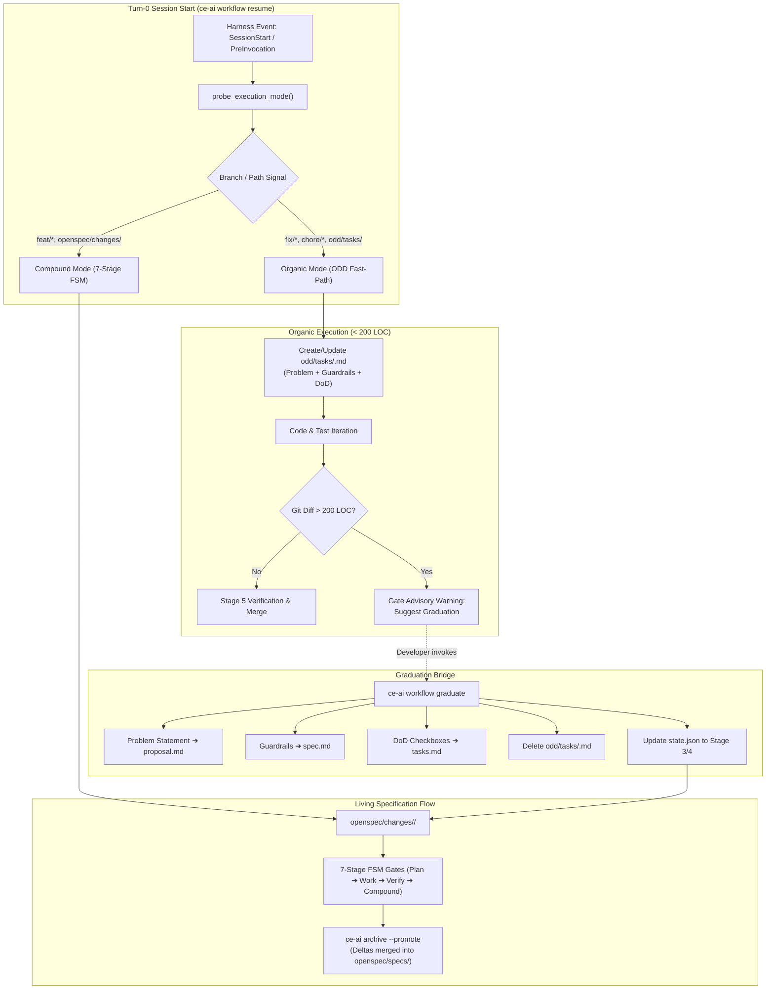

# Adaptive Mode Router (ODD Fast-Path vs OpenSpec Compound) & Graduation Bridge

## Summary

Introduce an adaptive, deterministic **Turn-0 Mode Router** and **Graduation Bridge** in `ce-ai`. This allows developers and AI agents to work with zero ceremony on everyday tactical tasks (< 200 LOC, bugfixes, chores) using Gentle AI's Organic Driven Development (ODD) format (`odd/tasks/<feature>.md` containing Problem Statement, Guardrails, and Definition of Done), while preserving the 7-stage Compound Engineering flywheel and living contracts (`openspec/specs/`) for architectural features. A native command, `ce-ai workflow graduate <feature>`, enables organic tasks to cleanly graduate into formal OpenSpec change packages without duplicate bookkeeping.

## Problem Frame

`ce-ai`'s 7-stage Compound Engineering workflow (`Ideation ➔ OpenSpec ➔ Plan ➔ Work ➔ Verify ➔ Compound ➔ Ship`) and strict gate checks (`src/commands/gate.rs`) guarantee architectural integrity, compliance (ISO/IEC 27001, ISO 42001, NIST AI RMF), and cryptographic drift control across multiple harnesses.

However, enforcing the full 5-file OpenSpec contract (`proposal.md`, `exploration.md`, `design.md`, `spec.md`, `tasks.md`) for every small change creates severe friction:
1. **Ceremony Overkill for Tactical Tasks:** A 15-line bugfix, typo repair, or local chore requires generating multiple markdown specification documents before writing a single line of code.
2. **Cognitive Overhead & Token Consumption:** Upfront spec-driven development (SDD) on small issues burns context tokens and risks specification drift when exploratory discovery invalidates premature prose.
3. **Gentle AI ODD Evolution:** Gentle AI moved away from heavy SDD toward a lightweight triad: **Problem Statement**, **Guardrails/Invariants**, and **Definition of Done (DoD)**. While discarding OpenSpec entirely would destroy `ce-ai`'s living contracts and release auditability, `ce-ai` currently lacks a native fast-path to accommodate this lighter organic pattern.
4. **The Missing Graduation Mechanism:** When an organic exploratory spike reveals unexpected architectural complexity (> 200 LOC), there is no automated bridge to promote the lightweight notes into a formal OpenSpec change package.

## Key Decisions

- **KD1: Deterministic Turn-0 Heuristic Router (< 5ms overhead).**
  Rather than deploying an expensive, non-deterministic LLM-based router agent (which adds 2–4s of latency and recurring token costs), `ce-ai workflow resume` inspects local environment signals during session initiation to dynamically select the mode:
  - **Organic Mode (ODD):** Activated on `fix/*`, `chore/*`, `spike/*`, `test/*` branches, when `odd/tasks/<feature>.md` exists, or when `AdoptionTier::Minimal` is set.
  - **Compound Mode (OpenSpec):** Activated on `feat/*`, `spec/*` branches, when an active `openspec/changes/<feature>/` directory is present, or when `AdoptionTier::Full` is set.
  - **Explicit Override:** Always honors `--mode [odd|compound]` flags or user directives.

- **KD2: Canonical ODD Brief Specification (`odd/tasks/<feature>.md`).**
  Standardizes the single-file ODD format proposed by Gentle AI:
  - YAML frontmatter with `feature`, `mode: organic`, `created`, `status: active`.
  - `# Problem Statement`: Clear description of the observed friction or failure.
  - `# Guardrails & Invariants`: Inviolable boundaries (security, backwards compatibility, performance limits).
  - `# Definition of Done (DoD)`: Concrete, testable, empirical completion criteria with markdown checkboxes (`- [ ]`).

- **KD3: Automated Graduation Bridge (`ce-ai workflow graduate <feature>`).**
  When an organic task grows into a structural change, running `ce-ai workflow graduate <feature>` mechanically transforms `odd/tasks/<feature>.md` into `openspec/changes/<feature>/`:
  - Problem Statement ➔ `proposal.md`
  - Guardrails & Invariants ➔ `spec.md` (formatted with RFC 2119 / WHEN... THEN... criteria)
  - Definition of Done Checklists ➔ `tasks.md` (preserving all checked `[x]` items and adding work-unit LOC estimates)
  - Removes `odd/tasks/<feature>.md` upon successful migration to eliminate dual-ledger desynchronization.
  - Updates `state.json` to register the active feature and advances workflow directly to Stage 4 (`WorkTdd`).

- **KD4: Observe-Only Safety Gate Policy with LOC Ceilings.**
  In `src/commands/gate.rs`:
  - `ExecutionMode::Organic` permits file writes without requiring an active OpenSpec directory.
  - If the git diff in Organic Mode exceeds **200 LOC** (the atomic work unit standard from `CONTRIBUTING.md`), the gate emits an advisory notice:
    `"Notice: Organic diff (+240 LOC) exceeds tactical threshold (~200 LOC). Consider running 'ce-ai workflow graduate' to formalize living specs in OpenSpec."`
  - The notice is observe-only and never blocks developer flow during editing.

- **KD5: Unified Engram Topic Mirroring (`tasks/<feature>`).**
  Both ODD tasks and OpenSpec tasks mirror their state into Engram persistent memory under the stable topic key `tasks/<feature>`. Context re-hydration on harness reboot or compaction functions identically regardless of which mode generated the task.

## Requirements

### R-ModeRouter: Deterministic Turn-0 Mode Classification

- **R1:** The CLI must implement `ExecutionMode` enum in `src/state/state.rs` supporting `Auto`, `Organic`, and `Compound`.
- **R2:** `ce-ai workflow resume` must evaluate `probe_execution_mode()` in under 5ms without issuing external network requests or calling LLM APIs.
- **R3:** When branch prefix is `fix/`, `chore/`, `spike/`, or `test/`, and no unresolved `openspec/changes/` directory exists, `probe_execution_mode()` must resolve to `ExecutionMode::Organic`.
- **R3b:** In non-git workspaces, `probe_execution_mode()` must evaluate directory presence (`openspec/changes/` active ➔ Compound Mode; `odd/tasks/` active ➔ Organic Mode; otherwise defaulting to Organic if `AdoptionTier::Minimal`, or Compound if `AdoptionTier::Full`).
- **R4:** When branch prefix is `feat/`, `spec/`, or an active directory exists in `openspec/changes/`, `probe_execution_mode()` must resolve to `ExecutionMode::Compound`.
- **R4b:** If an active directory exists in `openspec/changes/<feature>/`, Compound Mode must strictly take precedence over branch naming prefixes and `odd/tasks/` presence to eliminate dual-tracking ambiguity.
- **R5:** The CLI must accept `--mode [odd|organic|compound|ce]` on `workflow resume`, `workflow checkpoint`, and `workflow status` to override heuristic detection.
- **R6:** When in Organic Mode, `workflow resume` must emit an ODD Fast-Path banner instructing the agent to adhere to the Problem + Guardrails + DoD triad.
- **R7:** When in Compound Mode, `workflow resume` must emit the full 7-stage FSM progress table and OpenSpec status lines.

### R-ODDBrief: Canonical ODD Single-File Format

- **R8:** The standard path for organic tasks must be `odd/tasks/<feature>.md`.
- **R9:** `odd/tasks/<feature>.md` must use a standardized schema containing YAML frontmatter (`feature`, `mode: organic`, `created`, `status`), `# Problem Statement`, `# Guardrails & Invariants`, and `# Definition of Done (DoD)`.
- **R10:** The Definition of Done section must use standard markdown task checkboxes (`- [ ]`, `- [x]`).

### R-Graduation: Automated Bridge to OpenSpec

- **R11:** The CLI must provide the command `ce-ai workflow graduate [feature]` with a top-level alias `ce-ai graduate [feature]`.
- **R12:** `workflow graduate` must read `odd/tasks/<feature>.md` and create `openspec/changes/<feature>/` containing `proposal.md`, `spec.md`, and `tasks.md`. If `odd/tasks/<feature>.md` does not exist, it must return `CeError::Usage` (exit code 2). If `openspec/changes/<feature>` already exists, it must abort with `CeError::State` (exit code 3) without overwriting.
- **R13:** `workflow graduate` must map the Problem Statement section into `proposal.md`.
- **R14:** `workflow graduate` must map the Guardrails & Invariants section into `spec.md`, structuring them as formal acceptance criteria.
- **R15:** `workflow graduate` must map the Definition of Done items into `tasks.md`, preserving the completion state of existing checked (`[x]`) tasks.
- **R16:** Upon successful generation of `openspec/changes/<feature>/`, `workflow graduate` must remove `odd/tasks/<feature>.md` to prevent dual-tracking drift.
- **R17:** `workflow graduate` must record the active feature in `state.json` and transition the workflow state directly to Stage 4 (`WorkTdd`), as the `tasks.md` checklist generated from DoD satisfies the execution plan contract.

### R-Gate: Observe-Only Safety Gate & Ceilings

- **R18:** In `src/commands/gate.rs`, `evaluate_gate_policy()` must permit file modifications when `ExecutionMode::Organic` is active, without requiring an existing OpenSpec package.
- **R19:** When `ExecutionMode::Organic` is active and uncommitted git diff exceeds 200 LOC, the gate must emit an observe-only warning recommending graduation.
- **R20:** The 200 LOC ceiling warning must not block tool writes or return exit code 2 to the harness.

### R-Persistence: Engram Memory Alignment

- **R21:** Both `odd/tasks/<feature>.md` and `openspec/changes/<feature>/tasks.md` must mirror task state into Engram memory using the stable topic key `tasks/<feature>`.
- **R22:** Context recovery via `mem_context` must surface the active task regardless of whether it originated in ODD or OpenSpec.

## Key Flows

### Flow 1: Tactical Bugfix via ODD Fast-Path (< 200 LOC)
1. Developer/agent creates branch `fix/parser-escape-bug`.
2. Harness initiates session; hook triggers `ce-ai workflow resume`.
3. `resume_lines()` detects `fix/` branch, no OpenSpec dir ➔ activates **Organic Mode**.
4. Agent writes `odd/tasks/parser-escape-bug.md` defining Problem, Guardrails, and DoD.
5. Agent writes failing test, fixes the parser, and passes `cargo test`.
6. Gate monitors writes: diff is 45 LOC (&lt; 200 LOC) ➔ Gate passes cleanly.
7. Agent runs `ce-ai workflow review-receipt` and opens PR. No OpenSpec files required.

### Flow 2: Organic Task Expansion & Graduation to OpenSpec (> 200 LOC)
1. Developer/agent starts a task on `fix/streaming-buffer`.
2. Agent creates `odd/tasks/streaming-buffer.md` and begins exploration.
3. Exploration reveals that fixing the buffer requires refactoring the internal channel architecture across 4 modules.
4. Diff reaches 260 LOC; gate emits notice: `Organic diff (+260 LOC) exceeds tactical ceiling (~200 LOC). Recommend 'ce-ai workflow graduate'`.
5. Agent or developer runs `ce-ai workflow graduate streaming-buffer`.
6. `odd/tasks/streaming-buffer.md` is converted into `openspec/changes/streaming-buffer/{proposal.md, spec.md, tasks.md}`.
7. `odd/tasks/streaming-buffer.md` is removed. `state.json` updates to Stage 4 (`WorkTdd`).
8. Development continues under formal Compound Engineering governance.
9. Upon completion, `ce-ai archive streaming-buffer --promote` merges the delta into `openspec/specs/workflow.md`.

## Scope Boundaries

### In Scope
- Mode classification heuristics in `src/commands/workflow.rs` (`probe_execution_mode`).
- Banner customization in `resume_lines()` for Organic vs Compound mode.
- ODD single-file schema template (`odd/tasks/<feature>.md`).
- `ce-ai workflow graduate <feature>` implementation.
- Gate exemption and LOC ceiling advisory in `src/commands/gate.rs`.
- Topic key alignment in Engram memory protocol (`tasks/<feature>`).

### Out of Scope
- Runtime LLM routing agent: Not supported due to token cost and latency.
- Deprecation of `openspec/`: OpenSpec remains the mandatory system of record for features and living specs.
- Automatic git branching: The router adapts to the branch name; it does not automatically switch branches.

## Success Criteria & Verification

- **Zero-Latency Turn-0:** `ce-ai workflow resume` executes in &lt; 10ms with mode resolution.
- **Zero-Ceremony Small Fixes:** A bugfix under 200 LOC can be implemented, verified, and shipped without creating any `openspec/changes/` directory.
- **Lossless Graduation:** Running `ce-ai workflow graduate` on an ODD file produces a valid OpenSpec change package with 100% of Problem, Guardrails, and completed checkboxes preserved.
- **Zero Clippy Warnings & 100% Passing Tests:** `cargo clippy --all-targets --all-features -- -D warnings` and `cargo test` pass cleanly.
