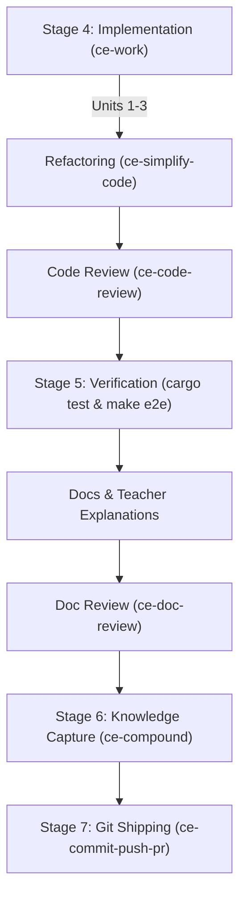

# Technical Execution Plan: Release v0.6.0 Implementation & Quality Flywheel

> **Spec Reference**: [`openspec/changes/v0_6_0_roadmap/`](../../openspec/changes/v0_6_0_roadmap/)
> **Created**: 2026-08-21
> **Scope**: Release v0.6.0 features, TUI FSM Dashboard, Extended Doctor Health Checks, Sync Watcher, E2E Testing, Teacher-Style User Documentation, and Quality Gates.

---

## 🎯 Executive Overview & Goals

This execution plan defines **HOW** Release v0.6.0 will be implemented, verified, documented, and shipped across the 7-stage Compound Engineering Flywheel:
1. **Interactive FSM Dashboard in TUI** (`src/tui.rs`): Full-screen tab showing live 7-Stage FSM gauge, active checkpoint strings, and state history.
2. **Extended Doctor Health Diagnostics** (`src/commands/doctor.rs`): Deep empirical health checks for Engram SQLite DB, CodeGraph index staleness, Context7 latency, and RTK binary PATH.
3. **Real-Time Sync Watcher** (`src/commands/sync.rs`): `--watch` mode re-syncing managed paths upon detecting file mutations.
4. **Teacher-Style Documentation**: Explaining new concepts in user guides with clear analogies, updating `README.md`, and maintaining sitemap consistency.
5. **Quality & Review Protocol**: Enforcing `ce-simplify-code`, `ce-code-review`, containerized `make e2e` tests, `ce-doc-review`, `ce-compound`, and `ce-commit-push-pr`.

---

## 📂 Targeted Files & Module Map

### Codebase Mutations:
- `src/tui.rs` — Add `Workflow (FSM)` tab, 7-stage progress gauge, and active checkpoints table widget.
- `src/commands/doctor.rs` — Implement `doctor_check_engram_db()`, `doctor_check_codegraph_index()`, and `doctor_check_rtk_path()`.
- `src/commands/sync.rs` — Add `--watch` flag parsing and real-time re-sync watcher loop.
- `src/main.rs` — Connect CLI subcommand flags for sync watcher.

### Verification & Testing Files:
- `tests/cli.rs` — CLI integration tests for TUI workflow tab state loading, extended doctor health checks, and sync watcher flags.
- `tests/e2e.rs` — Docker containerized E2E test gate (`make e2e`).

### Documentation & Roadmap Files:
- `docs/user-guide/harnesses-loops-and-context-masterclass.md` — Teacher-style explanation of TUI Workflow Live Visualization and Real-Time Watchers.
- `docs/user-guide/quick-start-workflow-guide.md` — Updated quick-start guide incorporating `--watch` and extended doctor diagnostics.
- `README.md` — Updated features list, subcommands table, and sitemap table for v0.6.0.
- `openspec/changes/v0_6_0_roadmap/tasks.md` — OpenSpec tasks checklist.

---

## 🔄 Phased Execution & Lifecycle Choreography



---

## 🛠️ Step-by-Step Task Units

### Phase 1: Feature Implementation (`ce-work`)
- **Unit 1: TUI Workflow Dashboard (`src/tui.rs`)**
  - Add tab selector `[ Install | Status | Models | Tools | Workflow | Upgrade | Doctor ]`.
  - Render 7-stage progress gauge mapping `FsmPhase` enum to percentage.
  - Render table listing active checkpoints read from `state.json`.
- **Unit 2: Extended Doctor Diagnostics (`src/commands/doctor.rs`)**
  - Implement SQLite database file check for `~/.engram/engram.db`.
  - Implement `.codegraph/` index presence check.
  - Implement `rtk` PATH binary check.
- **Unit 3: Real-Time Sync Watcher (`src/commands/sync.rs`)**
  - Add `--watch` flag parsing in Clap.
  - Implement re-sync loop monitoring managed configuration paths.

### Phase 2: Refactoring & Quality (`ce-simplify-code`)
- Run `/ce-simplify-code` over modified files (`src/tui.rs`, `src/commands/doctor.rs`, `src/commands/sync.rs`).
- Optimize Ratatui layout calculations and clean up un-needed heap allocations.

### Phase 3: Code Review (`ce-code-review`)
- Run `/ce-code-review` for bugs, regressions, performance anti-patterns, and strict `-D warnings` compliance.

### Phase 4: Empirical & E2E Testing
- Run unit and CLI integration tests:
  ```bash
  cargo fmt --check
  cargo clippy --all-targets --all-features -- -D warnings
  cargo test
  ```
- Run containerized Docker E2E test gate:
  ```bash
  make e2e
  ```

### Phase 5: Documentation & Teacher-Style Explanations
- Update user guides with **teacher-style explanations**:
  - Explain how the TUI Workflow Dashboard acts like a live flight cockpit for AI coding agents.
  - Explain how `--watch` acts like an automatic guardrail keeping harness configs in sync.
- Update `README.md` and `openspec/changes/v0_6_0_roadmap/tasks.md` checklist (`- [x]`).
- Run **`/ce-doc-review`** to review all updated planning and user documentation for clarity, completeness, and link integrity.

### Phase 6: Knowledge Capture (`ce-compound`)
- Run `/ce-compound` to document learnings in `docs/solutions/` and update `CONCEPTS.md`.

### Phase 7: Git Delivery (`ce-commit-push-pr`)
- Create branch `feature/v0-6-0-roadmap-implementation`.
- Run `/ce-commit-push-pr` to commit with conventional commit message, open Pull Request, wait for green GitHub Actions CI, and merge into `main`.
