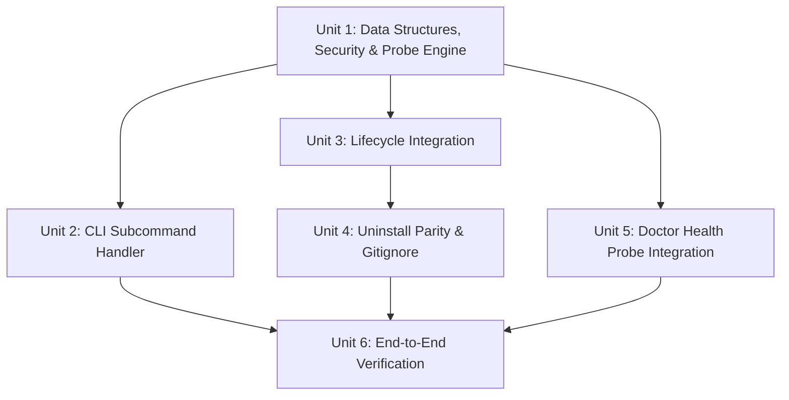

# Implementation Plan: Multi-Harness Skill Registry Engine (`ce-ai skills`)

- **Type**: `feat`
- **Issue Reference**: #96
- **Origin Document**: `docs/brainstorms/2026-08-22-skill-registry-engine-requirements.md` (see `R1`-`R6`)
- **OpenSpec Reference**: `openspec/changes/skill_registry_engine/`
- **Status**: Proposed
- **Date**: 2026-08-22

---

## 1. Problem Statement & System Boundaries

### Problem
`ce-ai` manages skills and loader scripts across 12 host AI coding agent harnesses (`opencode`, `claude`, `pi`, `cursor`, `copilot`, `codex`, `grok`, `kimi`, `agy`, `deepseek`, `fx`, `custom`). While `install-manifest.json` tracks file paths and SHA256 hashes for drift detection, `ce-ai` lacks a structured, harness-neutral skill registry index.

### Traceability to Requirements (`R1`-`R6`)
- **[R1] Master Storage**: Harness-neutral JSON index at `~/.ce-ai/skills-registry.json` using `write_atomic` with Unix mode `0644` applied post-write.
- **[R2] Multi-Harness Resolution**: 4-tier precedence scanning (`.ce-ai/skills/` > `.opencode/skills/` > harness base paths from `HarnessKind` > `~/.ce-ai/skills/`).
- **[R3] Security Boundary**: Strict path canonicalization; rejecting relative path traversals (`../`) or symlinks escaping authorized skill roots.
- **[R4] YAML Parsing**: Frontmatter extraction (`name`, `description`, `scope`, `triggers`, `harness_paths`) supporting YAML list bullet syntax (`- trigger`).
- **[R5] CLI Subcommands**: `ce-ai skills list`, `ce-ai skills resolve --harness <kind> --query <query>` (dual-format Markdown + JSON), and `ce-ai skills doctor`.
- **[R6] Lifecycle & Uninstall Parity**: Auto-refresh on `install`, `sync`, `upgrade`, `init-prj` (gated behind `if !ctx.dry_run`); complete deletion on `uninstall`; stub & sentinel `.gitignore` removal (`# BEGIN CE-AI MANAGED BLOCK`) on `deinit-prj`.

---

## 2. Key Architectural Decisions & Rationale

| Decision ID | Topic | Decision Made | Rationale |
|-------------|-------|---------------|-----------|
| **DEC-01** | Output Format | Dual Format: Markdown prompt block + JSON (`--json`) | Direct sub-agent prompt injection (`## Skills to load...`) while remaining machine-parseable. |
| **DEC-02** | Precedence | 4-Tier Precedence: Local Workspace (`.ce-ai/skills/` > `.opencode/skills/`) > Harness User (`HarnessKind::base_dir`) > Global Managed (`~/.ce-ai/skills/`) | Workspace-local skills override global skills cleanly. |
| **DEC-03** | Degradation Handling | Explicit status tag (`paths-injected` \| `fallback-fuzzy` \| `none`) + `stderr` warning | Full observability for AI orchestrators without hard-failing prompt generation. |
| **DEC-04** | Harness Neutrality | Global Master Index at `~/.ce-ai/skills-registry.json` | Maintains multi-harness neutrality across all 12 agent harnesses. |
| **DEC-05** | Probe Alignment | Shared `check_skill_registry_health` Probe Helper | `ce-ai skills doctor` acts as a direct alias to the probe shared with `ce-ai doctor`. |
| **DEC-06** | Sentinel Boundaries | `.gitignore` Hash Comments (`# BEGIN CE-AI MANAGED BLOCK` / `# END CE-AI MANAGED BLOCK`) | Guarantees lossless removal of gitignore entries on `deinit-prj` and `uninstall` without corrupting user lines. |

---

## 3. Implementation Units

### Unit 1: Data Structures, YAML Parser, Security & Probe Engine
- **Files**:
  - Create `src/source/registry.rs`
  - Update `src/source/mod.rs`
- **Goal**: Implement `SkillEntry`, `SkillRegistry`, YAML frontmatter extraction (supporting list syntax `- trigger`), path canonicalization security check (`R3`), SHA256 digest computation, atomic storage with POSIX `0644` permissions, and the shared `check_skill_registry_health` diagnostic helper function.
- **Approach**:
  - Define `SkillEntry` and `SkillRegistry` structs with `serde`.
  - Implement frontmatter parser for `---\n...\n---` headers parsing key-value pairs and `- bullet` list items for `triggers` and `harness_paths`.
  - Implement `canonicalize_and_validate_path(path: &Path, roots: &[PathBuf]) -> Result<PathBuf, CeError>`: canonicalizes both candidate and root paths to check `canonical_path.starts_with(canonical_root)`, preventing symlink escapes (`R3`).
  - Implement Tier 3 scanning using `HarnessKind::all()` and harness base path resolution methods from `src/harness/mod.rs`.
  - Implement `SkillRegistry::save(&self, path: &Path) -> Result<(), CeError>` using `crate::state::write_atomic` followed by `std::fs::set_permissions(path, Permissions::from_mode(0644))` on Unix.
  - Implement `pub fn check_skill_registry_health(ctx: &Context) -> Result<Vec<String>, CeError>` as a reusable probe helper.
- **Test Scenarios**:
  - `test_frontmatter_extraction_yaml_lists`: Parses `SKILL.md` headers with bulleted `triggers` and `harness_paths`.
  - `test_path_traversal_rejection`: Rejects relative paths with `../` escaping skill roots.
  - `test_symlink_escape_rejection`: Rejects symlinks pointing outside authorized skill root boundaries.
  - `test_registry_4_tier_precedence_override`: Verifies local workspace skill (`.ce-ai/skills/`) overrides global skill of the same name.
  - `test_registry_atomic_save_and_permissions`: Round-trips `SkillRegistry` through `~/.ce-ai/skills-registry.json` and verifies mode bits.

---

### Unit 2: CLI Subcommand Handler (`ce-ai skills`)
- **Files**:
  - Create `src/commands/skills.rs`
  - Update `src/commands/mod.rs`
  - Update `src/main.rs`
- **Goal**: Implement `ce-ai skills` subcommand suite (`list`, `resolve --harness <kind> --query <query> [--json]`, `doctor`).
- **Approach**:
  - Define Clap subcommand enums in `src/commands/skills.rs`.
  - `ce-ai skills list`: Displays formatted table with harness availability and SHA256 health status.
  - `ce-ai skills resolve --harness <kind> --query <query> [--json]`:
    - Re-validates SHA256 digest at resolution time. If validation fails or skill file is missing, sets `status=fallback-fuzzy` and emits a warning to `stderr`.
    - Re-verifies resolved skill file path with `canonicalize_and_validate_path` before prompt emission.
    - Outputs Markdown prompt block (default) or JSON (`--json`).
  - `ce-ai skills doctor`: Calls `crate::source::registry::check_skill_registry_health(ctx)`.
- **Test Scenarios**:
  - `test_skills_list_formatting`: Verifies formatted table output.
  - `test_skills_resolve_dual_format`: Verifies Markdown prompt block comments and `--json` structure.
  - `test_skills_resolve_degradation_warning`: Verifies `stderr` warning and `fallback-fuzzy` tag when a skill is missing or corrupted.

---

### Unit 3: Lifecycle Integration & Dry-Run Safety (`install`, `sync`, `upgrade`, `init-prj`)
- **Files**:
  - Update `src/commands/install.rs`
  - Update `src/commands/sync.rs`
  - Update `src/commands/upgrade.rs`
  - Update `src/commands/init_prj.rs`
- **Goal**: Auto-generate and refresh `skills-registry.json` during state-modifying operations while strictly respecting `--dry-run`.
- **Approach**:
  - In `install.rs`, `sync.rs`, `upgrade.rs`, and `init_prj.rs`: Gate index persistence behind `if !ctx.dry_run`:
    ```rust
    if !ctx.dry_run {
        let registry = SkillRegistry::build(ctx)?;
        registry.save(&ctx.config_dir.join("skills-registry.json"))?;
    }
    ```
  - In `init_prj.rs`: Inject sentinel-bounded `.gitignore` entries (`# BEGIN CE-AI MANAGED BLOCK` / `# END CE-AI MANAGED BLOCK`) using dedicated `#` comment constants, validating block pairing before modification.
- **Test Scenarios**:
  - `test_install_generates_skills_registry`: Verifies `~/.ce-ai/skills-registry.json` exists after `ce-ai install`.
  - `test_dry_run_does_not_create_skills_registry`: Verifies `ce-ai install --dry-run` writes nothing to disk.
  - `test_sync_refreshes_skills_registry`: Verifies `ce-ai sync` updates skill hashes.
  - `test_upgrade_refreshes_skills_registry`: Verifies `ce-ai upgrade` re-indexes skills.
  - `test_init_prj_injects_sentinel_gitignore`: Verifies `.gitignore` contains sentinel block `# BEGIN CE-AI MANAGED BLOCK`.

---

### Unit 4: Uninstall Parity & Sentinel `.gitignore` Removal
- **Files**:
  - Update `src/commands/uninstall.rs`
  - Update `src/commands/deinit_prj.rs`
- **Goal**: Complete erasure of global registry files, temporary `.tmp*` artifacts, project stubs, and sentinel-bounded `.gitignore` entries.
- **Approach**:
  - In `uninstall.rs`: Remove `~/.ce-ai/skills-registry.json` and sweep temporary `.skills-registry.json.tmp*` files using `std::fs::symlink_metadata` to verify target files are regular non-symlink files within `~/.ce-ai/`.
  - In `deinit_prj.rs`: Remove workspace skill stubs (`.ce-ai/skills/`) and strip sentinel-bounded `.gitignore` entries (`# BEGIN CE-AI MANAGED BLOCK` / `# END CE-AI MANAGED BLOCK`) cleanly after validating block pairing.
- **Test Scenarios**:
  - `test_uninstall_removes_skills_registry_and_tmp`: Verifies registry and temporary atomic files are deleted cleanly.
  - `test_deinit_prj_removes_sentinel_gitignore`: Verifies `.gitignore` block is removed without affecting user lines.

---

### Unit 5: Health Probe Integration (`doctor`)
- **Files**:
  - Update `src/commands/doctor.rs`
- **Goal**: Wire `skill-registry-integrity` diagnostic probe into `ce-ai doctor`.
- **Approach**:
  - In `doctor.rs`: Call `crate::source::registry::check_skill_registry_health(ctx)` as part of the system health check suite, reporting missing files, corrupted SHA256 digests, and invalid frontmatter syntax.
- **Test Scenarios**:
  - `test_doctor_reports_skill_registry_integrity`: Verifies `ce-ai doctor` flags corrupted or missing skill files.

---

### Unit 6: Automated Verification & Integration Gates
- **Files**:
  - Update `tests/cli.rs`
  - Update `tests/security.rs`
- **Goal**: Ensure 100% test pass rate across unit, CLI integration, and security test suites.
- **Verification Commands**:
  ```bash
  cargo fmt --check
  cargo clippy --all-targets --all-features -- -D warnings
  cargo test
  make e2e
  ```

---

## 4. Dependencies & Sequencing



1. **Phase 1**: Unit 1 (Data structures, security validation & probe helper `check_skill_registry_health`).
2. **Phase 2**: Unit 2 (CLI subcommands) & Unit 3 (Lifecycle hooks with `--dry-run` safety).
3. **Phase 3**: Unit 4 (Uninstall parity & sentinel gitignore removal) & Unit 5 (`ce-ai doctor` integration).
4. **Phase 4**: Unit 6 (Verification & DoD gate).
