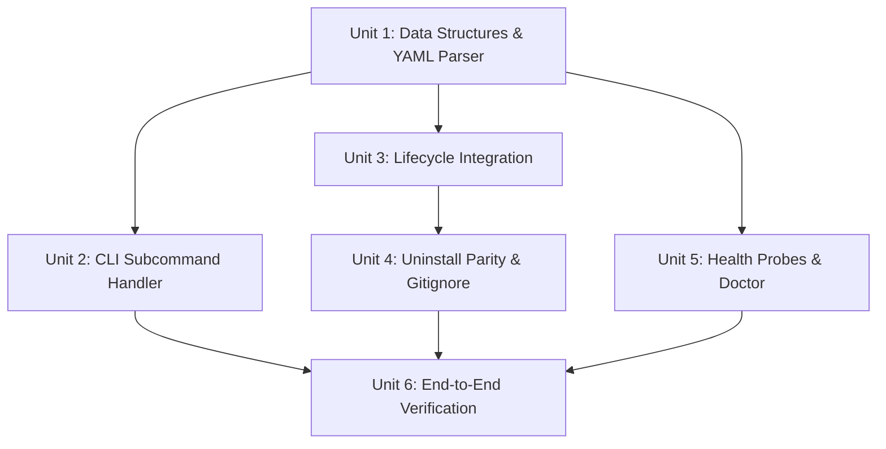

# Implementation Plan: Multi-Harness Skill Registry Engine (`ce-ai skills`)

- **Type**: `feat`
- **Issue Reference**: #96
- **Origin Document**: `docs/brainstorms/2026-08-22-skill-registry-engine-requirements.md` (see `R1`-`R6`)
- **OpenSpec Reference**: `openspec/changes/skill_registry_engine/`
- **Status**: Proposed
- **Date**: 2026-08-22

---

## 1. Problem Statement & System Boundaries

### Problem
`ce-ai` manages skills and loader scripts across 12 host AI coding agent harnesses (`opencode`, `claude`, `pi`, `cursor`, `copilot`, `codex`, `grok`, `kimi`, `agy`, `deepseek`, `fx`, `custom`). While `install-manifest.json` tracks file paths and SHA256 hashes for drift detection, `ce-ai` lacks a structured, harness-neutral skill registry index.

### Traceability to Requirements (`R1`-`R6`)
- **[R1] Master Storage**: Harness-neutral JSON index at `~/.ce-ai/skills-registry.json` using `write_atomic` with mode `0600`/`0644`.
- **[R2] Multi-Harness Resolution**: 4-tier precedence scanning (`.ce-ai/skills/` > `.opencode/skills/` > `~/.config/<harness>/skills/` > `~/.ce-ai/skills/`).
- **[R3] Security Boundary**: Strict path canonicalization; rejecting relative path traversals (`../`) or symlinks escaping authorized skill roots.
- **[R4] YAML Parsing**: Frontmatter extraction (`name`, `description`, `scope`, `triggers`, `harness_paths`).
- **[R5] CLI Subcommands**: `ce-ai skills list`, `ce-ai skills resolve` (dual-format Markdown + JSON), and `ce-ai skills doctor`.
- **[R6] Lifecycle & Uninstall Parity**: Auto-refresh on `install`, `sync`, `upgrade`, `init-prj`; complete deletion on `uninstall`; stub & sentinel `.gitignore` removal on `deinit-prj`.

---

## 2. Key Architectural Decisions & Rationale

| Decision | Approach | Rationale |
|----------|----------|-----------|
| **DEC-01: Storage** | Central JSON at `~/.ce-ai/skills-registry.json` | Maintains multi-harness neutrality across all 12 agent harnesses. |
| **DEC-02: Precedence** | 4-Tier: Local Workspace (`.ce-ai/skills/` > `.opencode/skills/`) > Global User (`~/.config/<harness>/skills/`) > Global Managed (`~/.ce-ai/skills/`) | Allows project-specific skills to override global defaults cleanly. |
| **DEC-03: Security** | Path canonicalization + Boundary Rejection | Prevents malicious repos from reading sensitive host files via relative paths or symlinks. |
| **DEC-04: Degradation** | Explicit status tag (`paths-injected` \| `fallback-fuzzy` \| `none`) + `stderr` warning | Provides full observability for AI orchestrators without hard-failing prompt generation. |
| **DEC-05: Sentinel .gitignore** | `# BEGIN CE-AI MANAGED BLOCK` / `# END CE-AI MANAGED BLOCK` | Guarantees lossless removal of gitignore entries on `deinit-prj` and `uninstall`. |

---

## 3. Implementation Units

### Unit 1: Data Structures, YAML Parsing & Integrity Engine
- **Files**:
  - Create `src/source/registry.rs`
  - Update `src/source/mod.rs`
- **Goal**: Implement `SkillEntry`, `SkillRegistry`, YAML frontmatter extraction, path canonicalization security check (`R3`), SHA256 digest computation, and atomic storage.
- **Approach**:
  - Define `SkillEntry` and `SkillRegistry` structs with `serde`.
  - Implement a lightweight, line-based frontmatter parser for `---\n...\n---` headers extracting `name`, `description`, `scope`, `triggers`, and `harness_paths`.
  - Implement `canonicalize_and_validate_path(path: &Path, roots: &[PathBuf]) -> Result<PathBuf, CeError>` to enforce boundary security (`R3`).
  - Implement `SkillRegistry::build(ctx: &Context) -> Result<Self, CeError>` to scan global and workspace paths.
  - Implement `SkillRegistry::save(&self, path: &Path) -> Result<(), CeError>` using `write_atomic`.
- **Test Scenarios**:
  - `test_frontmatter_extraction_valid_yaml`: Parses standard `SKILL.md` headers cleanly.
  - `test_path_traversal_rejection`: Rejects paths with `../` escaping workspace or global roots.
  - `test_registry_atomic_save_and_load`: Round-trips `SkillRegistry` through `~/.ce-ai/skills-registry.json`.

---

### Unit 2: CLI Subcommand Handler (`ce-ai skills`)
- **Files**:
  - Create `src/commands/skills.rs`
  - Update `src/commands/mod.rs`
  - Update `src/main.rs`
- **Goal**: Implement `ce-ai skills` subcommand suite (`list`, `resolve`, `doctor`).
- **Approach**:
  - Define Clap subcommand enums in `src/commands/skills.rs`.
  - `ce-ai skills list`: Displays catalog table with harness availability and SHA256 health status.
  - `ce-ai skills resolve`: Implements dual-format resolution:
    - Calculates SHA256 at resolution time; if hash fails, sets `status=fallback-fuzzy` and warns on `stderr`.
    - Outputs Markdown prompt block (default) or JSON (`--json`).
  - `ce-ai skills doctor`: Invokes the shared `skill-registry-integrity` probe.
- **Test Scenarios**:
  - `test_skills_list_formatting`: Verifies formatted table output.
  - `test_skills_resolve_dual_format`: Verifies Markdown prompt block comments and `--json` structure.
  - `test_skills_resolve_degradation_warning`: Verifies `stderr` warning and `fallback-fuzzy` tag when a skill is missing or corrupted.

---

### Unit 3: Lifecycle Integration (`install`, `sync`, `upgrade`, `init-prj`)
- **Files**:
  - Update `src/commands/install.rs`
  - Update `src/commands/sync.rs`
  - Update `src/commands/upgrade.rs`
  - Update `src/commands/init_prj.rs`
- **Goal**: Auto-generate and refresh `skills-registry.json` during state-modifying operations.
- **Approach**:
  - In `install.rs`, `sync.rs`, and `upgrade.rs`: Call `SkillRegistry::build(ctx)?.save(&registry_path)?` after writing managed files.
  - In `init_prj.rs`: Initialize project stubs, inject sentinel-bounded `.gitignore` entries (`# BEGIN CE-AI MANAGED BLOCK`), and refresh `skills-registry.json`.
- **Test Scenarios**:
  - `test_install_generates_skills_registry`: Verifies `~/.ce-ai/skills-registry.json` exists after `ce-ai install`.
  - `test_init_prj_injects_sentinel_gitignore`: Verifies `.gitignore` contains sentinel block and initial index is refreshed.

---

### Unit 4: Uninstall Parity & Sentinel `.gitignore` Removal
- **Files**:
  - Update `src/commands/uninstall.rs`
  - Update `src/commands/deinit_prj.rs`
- **Goal**: Complete erasure of registry files and lossless removal of `.gitignore` entries.
- **Approach**:
  - In `uninstall.rs`: Remove `~/.ce-ai/skills-registry.json`, sweep temporary `.skills-registry.json.tmp*` files, and clean managed `.gitignore` blocks.
  - In `deinit_prj.rs`: Remove workspace-local registry stubs (`.ce-ai/skills-registry.json`) and strip sentinel-bounded `.gitignore` entries cleanly.
- **Test Scenarios**:
  - `test_uninstall_removes_skills_registry_and_tmp`: Verifies registry and temporary atomic files are deleted cleanly.
  - `test_deinit_prj_removes_sentinel_gitignore`: Verifies `.gitignore` block is removed without affecting user lines.

---

### Unit 5: Diagnostic Probe & Health Integration
- **Files**:
  - Update `src/commands/doctor.rs`
  - Update `src/commands/status.rs`
  - Update `src/tui.rs`
- **Goal**: Add `skill-registry-integrity` probe to `ce-ai doctor` and expose status metrics.
- **Approach**:
  - In `doctor.rs`: Implement `check_skill_registry_health(ctx)` verifying missing files, SHA256 digests, and frontmatter syntax.
  - In `status.rs`: Display indexed skills count and integrity state.
  - In `tui.rs`: Display skill registry status item in Ratatui dashboard.
- **Test Scenarios**:
  - `test_doctor_reports_skill_registry_integrity`: Verifies `ce-ai doctor` flags corrupted skills.

---

### Unit 6: Automated Verification & Integration Gates
- **Files**:
  - Update `tests/cli.rs`
  - Update `tests/security.rs`
- **Goal**: Ensure 100% test pass rate across unit, CLI integration, and security test suites.
- **Verification Commands**:
  ```bash
  cargo fmt --check
  cargo clippy --all-targets --all-features -- -D warnings
  cargo test
  make e2e
  ```

---

## 4. Dependencies & Sequencing



1. **Phase 1**: Unit 1 (Data structures & security validation).
2. **Phase 2**: Unit 2 (CLI subcommands) & Unit 3 (Lifecycle hooks).
3. **Phase 3**: Unit 4 (Uninstall parity) & Unit 5 (Health probes).
4. **Phase 4**: Unit 6 (Verification & DoD gate).
