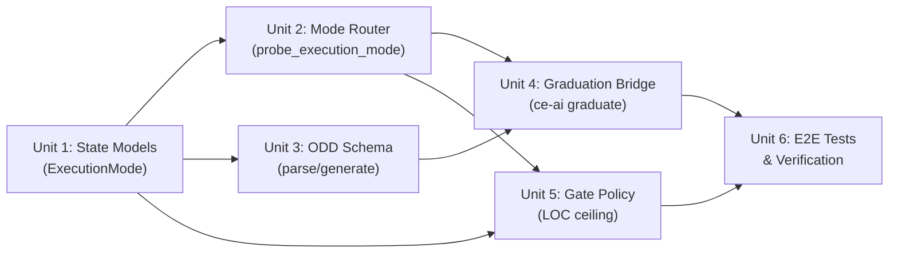

# Technical Implementation Plan: Adaptive Mode Router & Graduation Bridge

## Summary

Implement an adaptive, deterministic **Turn-0 Mode Router** and **Graduation Bridge** in `ce-ai`. This introduces a lightweight Organic Driven Development (ODD) fast-path for tactical tasks (< 200 LOC, bugfixes, chores) using single-file briefs (`odd/tasks/<feature>.md`: Problem + Guardrails + DoD), while preserving living contracts (`openspec/specs/`) and 7-stage Compound Engineering governance for architectural changes. The graduation bridge (`ce-ai workflow graduate <feature>`) mechanically promotes organic tasks to formal OpenSpec packages without duplicate bookkeeping.

## Problem Frame

Enforcing the full 5-file OpenSpec contract (`proposal.md`, `exploration.md`, `design.md`, `spec.md`, `tasks.md`) for every minor bugfix or chore imposes unnecessary ceremony, burns context tokens, and risks speculative specification drift. Conversely, discarding OpenSpec entirely would destroy `ce-ai`'s auditability, living contracts, and cryptographic drift guarantees. 

This plan implements a deterministic, zero-latency Turn-0 router inside `ce-ai workflow resume` and an observe-only gate policy in `src/commands/gate.rs`, connected via an automated graduation bridge command.

## Key Technical Decisions (KTDs)

- **KTD1: Deterministic In-Binary Classification (`probe_execution_mode`).** (see origin: `KD1`)
  Embedded directly in `src/commands/workflow.rs`. Evaluates Git branch name (`fix/*`, `chore/*`, `spike/*`, `test/*` vs `feat/*`, `spec/*`), active `openspec/changes/` presence, and adoption tier in < 5ms with zero LLM API calls or token costs.
- **KTD2: OpenSpec Precedence Rule (Anti-Dual-Tracking).** (see origin: `R4b`)
  If an unresolved directory exists in `openspec/changes/<feature>/`, `Compound Mode` strictly takes precedence over branch naming and `odd/tasks/` presence, preventing state ambiguity.
- **KTD3: Non-Destructive Ingest with Clean Post-Move Removal.** (see origin: `KD3`, `R16`)
  `ce-ai workflow graduate <feature>` reads `odd/tasks/<feature>.md`, creates `openspec/changes/<feature>/` (`proposal.md` from Problem, `spec.md` from Guardrails, `tasks.md` from DoD), and deletes `odd/tasks/<feature>.md` upon success to eliminate dual-ledger desynchronization.
- **KTD4: Direct Stage 4 Transition on Graduation.** (see origin: `R17`)
  Because `tasks.md` is populated directly from the DoD checklist during graduation, the execution plan contract is satisfied. `workflow graduate` records the active feature in `state.json` and transitions directly to `Stage 4 (WorkTdd)`.
- **KTD5: Observe-Only 200 LOC Tactical Ceiling Gate.** (see origin: `KD4`, `R19-R20`)
  In `src/commands/gate.rs`, `ExecutionMode::Organic` permits tool writes without OpenSpec. If uncommitted git diff exceeds 200 LOC, the gate emits an advisory notice recommending graduation without blocking execution (exit code 0).

## Requirements Traceability

- **R1–R7 (Mode Router):** Addressed in Unit 1 and Unit 2.
- **R3b (Non-Git Fallback):** Addressed in Unit 2.
- **R4b (Precedence Rule):** Addressed in Unit 2.
- **R8–R10 (ODD Brief Schema):** Addressed in Unit 3.
- **R11–R17 (Graduation Bridge):** Addressed in Unit 4.
- **R18–R20 (Observe-Only Gate):** Addressed in Unit 5.
- **R21–R22 (Persistence & E2E):** Addressed in Unit 6.

## System Architecture & Data Flow

```mermaid
flowchart TD
    subgraph Resume["Turn-0 resume_lines()"]
        Probe["probe_execution_mode()"]
        Probe --> ModeCheck{"ExecutionMode"}
        ModeCheck -- Organic --> ODD_Banner["Format ODD Fast-Path Banner\n(Problem + Guardrails + DoD)"]
        ModeCheck -- Compound --> FSM_Banner["Format 7-Stage FSM Banner\n(OpenSpec Status Table)"]
    end

    subgraph GateCheck["src/commands/gate.rs"]
        WriteEvent["Agent File Write"] --> GateEval["evaluate_gate_policy()"]
        GateEval --> ModeBranch{"ExecutionMode"}
        ModeBranch -- Organic --> CheckLOC{"Diff > 200 LOC?"}
        CheckLOC -- No --> PassClean["Pass (0)"]
        CheckLOC -- Yes --> WarnCeiling["Pass (0) + Advisory Warning"]
        ModeBranch -- Compound --> StrictOpenSpec["Require OpenSpec in Stage 4"]
    end

    subgraph Graduation["ce-ai workflow graduate <feature>"]
        Ingest["Read odd/tasks/<feature>.md"] --> Validate["Assert Dest Not Exist\nopenspec/changes/<feature>"]
        Validate --> Transform["Map Problem ➔ proposal.md\nMap Guardrails ➔ spec.md\nMap DoD ➔ tasks.md"]
        Transform --> CleanODD["rm odd/tasks/<feature>.md"]
        CleanODD --> AdvanceFSM["state.workflow.stage = WorkTdd"]
    end
```



## Implementation Units

### Unit 1: Domain Models & State Extensions
- **Goal:** Introduce `ExecutionMode` enum and wire serialization into `State` and `WorkflowState`.
- **Files:**
  - `src/state/state.rs`
  - `src/state/tests/state.rs`
- **Approach:**
  - Define `#[derive(Debug, Clone, Copy, PartialEq, Eq, Serialize, Deserialize, Default)] #[serde(rename_all = "lowercase")] pub enum ExecutionMode { #[default] Auto, Organic, Compound }`.
  - Add parse helper `ExecutionMode::parse(s: &str)` supporting `odd`, `organic`, `compound`, `ce`, and `auto`.
  - Add `pub execution_mode: Option<ExecutionMode>` to `WorkflowState`.
  - Ensure backward-compatible deserialization (`#[serde(default, skip_serializing_if = "Option::is_none")]`).
- **Test Scenarios:**
  - `test_execution_mode_parse_aliases`: Parse strings `odd`, `organic`, `compound`, `ce` correctly.
  - `test_workflow_state_execution_mode_roundtrip`: Serialize and deserialize `WorkflowState` with and without `execution_mode`.
- **Estimated Scope:** ~120 LOC.

### Unit 2: Deterministic Turn-0 Mode Classification & Banner Delivery
- **Goal:** Implement heuristic mode detection and custom Turn-0 banner in `ce-ai workflow resume`.
- **Files:**
  - `src/commands/workflow.rs`
  - `src/commands/tests/workflow.rs`
- **Approach:**
  - Implement `probe_execution_mode(repo_root: &Path, branch: Option<&str>, wf: &Option<WorkflowState>, tier: AdoptionTier, cli_override: Option<ExecutionMode>) -> ExecutionMode`:
    1. CLI override flag takes precedence.
    2. Active `openspec/changes/` directory enforces `Compound` (R4b).
    3. Non-git workspace falls back to directory presence (`odd/tasks/` -> `Organic`, `openspec/changes/` -> `Compound`) or `AdoptionTier` (R3b).
    4. Git branch prefix: `fix/*`, `chore/*`, `spike/*`, `test/*` -> `Organic`; `feat/*`, `spec/*` -> `Compound`.
    5. Active `odd/tasks/<feature>.md` -> `Organic`.
  - Add `--mode <mode>` argument to `Action::Resume`, `Action::Status`, `Action::Checkpoint`.
  - Update `resume_lines()`: when in `Organic` mode, emit the ODD Fast-Path guidance block (Problem + Guardrails + DoD) and hide the 7-stage OpenSpec warning.
- **Test Scenarios:**
  - `test_probe_execution_mode_branches`: Verify `fix/foo` is Organic, `feat/bar` is Compound.
  - `test_probe_execution_mode_openspec_precedence`: Verify active OpenSpec dir overrides `fix/` branch.
  - `test_probe_execution_mode_non_git`: Verify non-git directory fallback.
  - `test_resume_lines_organic_banner`: Verify output format when Organic mode is active.
- **Estimated Scope:** ~180 LOC.

### Unit 3: Canonical ODD Single-File Brief Specification & Helpers
- **Goal:** Provide standardized schema and generation helper for `odd/tasks/<feature>.md`.
- **Files:**
  - `src/commands/workflow.rs`
  - `src/commands/tests/workflow.rs`
- **Approach:**
  - Implement helper `generate_odd_task_template(feature: &str) -> String` generating:
    ```markdown
    ---
    feature: <feature>
    mode: organic
    created: <YYYY-MM-DD>
    status: active
    ---

    # Problem Statement
    <!-- Describe the observed symptom, error, or tactical friction -->

    # Guardrails & Invariants
    <!-- Non-negotiable safety, performance, and compatibility limits -->

    # Definition of Done (DoD)
    - [ ] Add reproduction test case
    - [ ] Implement fix
    - [ ] cargo clippy and cargo test pass cleanly
    ```
  - Implement parser `parse_odd_task_file(path: &Path) -> Result<OddTaskContent, CeError>` to extract Problem, Guardrails, and DoD checkbox items with checked state.
- **Test Scenarios:**
  - `test_odd_template_generation`: Verify generated markdown matches canonical schema.
  - `test_odd_parser_roundtrip`: Verify parser correctly extracts Problem, Guardrails, and preserved `[x]` / `[ ]` checkboxes.
- **Estimated Scope:** ~110 LOC.

### Unit 4: Graduation Bridge (`ce-ai workflow graduate`)
- **Goal:** Implement the mechanical promotion command from ODD to OpenSpec.
- **Files:**
  - `src/commands/workflow.rs`
  - `src/commands/registry.rs`
  - `src/commands/tests/workflow.rs`
- **Approach:**
  - Add `Action::Graduate(GraduateArgs)` to `workflow::Args` and register top-level alias `Commands::Graduate(GraduateArgs)`.
  - Implement `run_graduate(ctx: &Context, args: &GraduateArgs) -> Result<(), CeError>`:
    1. Target feature resolution: from args or active feature.
    2. Check source: `odd/tasks/<feature>.md`. If missing, return `CeError::Usage` (exit 2).
    3. Check destination: `openspec/changes/<feature>`. If exists, return `CeError::State` (exit 3).
    4. Read and parse ODD task file using `parse_odd_task_file`.
    5. Create directory `openspec/changes/<feature>`.
    6. Write `proposal.md` with Problem Statement and motivation context.
    7. Write `spec.md` with Guardrails & Invariants formatted as formal acceptance criteria.
    8. Write `tasks.md` with DoD checkboxes, mapping each item to an executable work unit.
    9. Delete `odd/tasks/<feature>.md` cleanly (via git rm or atomic fs remove).
    10. Update `state.json` via `write_atomic`: set active feature, set `stage: WorkflowStage::WorkTdd`, set `execution_mode: ExecutionMode::Compound`.
- **Test Scenarios:**
  - `test_graduate_missing_source_fails_usage`: Exit code 2 when file not found.
  - `test_graduate_destination_collision_fails_state`: Exit code 3 when destination exists.
  - `test_graduate_successful_transformation`: Verify files created, content mapped, source deleted, and stage set to WorkTdd.
- **Estimated Scope:** ~220 LOC.

### Unit 5: Dual-Track Gate Engine with Tactical LOC Ceilings
- **Goal:** Update write gate in `src/commands/gate.rs` to allow Organic mode writes and emit observe-only LOC warnings.
- **Files:**
  - `src/commands/gate.rs`
  - `src/commands/tests/gate.rs`
- **Approach:**
  - In `evaluate_gate_policy()`:
    1. Resolve active `ExecutionMode`.
    2. If `ExecutionMode::Organic`:
       - Permit write without OpenSpec contract (`GateDecision::Pass`).
       - Compute git diff shortstat lines changed (`probe_git_dirty_files` or `git diff --numstat`).
       - If changed lines > 200 LOC, append notice to telemetry/reasons:
         `"Notice: Organic task diff exceeds 200 LOC ceiling. Consider running 'ce-ai workflow graduate' to formalize in OpenSpec."`
       - Ensure exit code remains 0 (observe-only, no tool blocking).
- **Test Scenarios:**
  - `test_gate_organic_mode_allows_write`: Pass without OpenSpec directory.
  - `test_gate_organic_mode_diff_under_200_clean`: Clean pass with no advisory.
  - `test_gate_organic_mode_diff_over_200_emits_advisory`: Pass with advisory warning in reasons.
- **Estimated Scope:** ~140 LOC.

### Unit 6: CLI Integration, Engram Persistence Alignment & Verification
- **Goal:** Wire top-level CLI aliases, verify Engram persistence mirror protocol, and run full verification suite.
- **Files:**
  - `src/main.rs`
  - `src/commands/registry.rs`
  - `tests/cli.rs`
- **Approach:**
  - Add end-to-end CLI integration tests in `tests/cli.rs`:
    - Session start in `fix/` branch with `workflow resume` verifying ODD banner.
    - Creating `odd/tasks/fix-test.md` and verifying gate check passes.
    - Executing `ce-ai graduate fix-test` and verifying OpenSpec package generated.
    - Verifying Engram topic key `tasks/<feature>` consistency.
- **Test Scenarios:**
  - `test_cli_workflow_mode_odd_lifecycle`: Full end-to-end command sequence in isolated temp dir.
- **Estimated Scope:** ~160 LOC.

## Dependencies & Sequencing



- **Sequencing:**
  1. Unit 1 is foundational (defines enum and state serialization).
  2. Unit 2 and Unit 3 can proceed in parallel.
  3. Unit 4 requires Unit 1, 2, and 3.
  4. Unit 5 requires Unit 1 and 2.
  5. Unit 6 verifies the integrated system.

## Risks & Mitigations

- **Risk 1: False Positive Organic Mode on Architectural Refactors.**
  - *Mitigation:* Explicit flag `--mode compound` allows manual override; presence of any directory in `openspec/changes/` strictly overrides branch prefixes (R4b); gate emits advisory when diff exceeds 200 LOC.
- **Risk 2: File Deletion Failure during Graduation.**
  - *Mitigation:* Atomic validation: `openspec/changes/<feature>` is completely written and flushed to disk before `odd/tasks/<feature>.md` is deleted.
- **Risk 3: Performance Degradation in Turn-0 Hook.**
  - *Mitigation:* `probe_execution_mode` relies on lightweight string checks and directory existence (`Path::is_dir()`), executing in < 5ms without running subprocesses when git branch is already cached in `RepoState`.

## Verification Checklist

- [ ] `cargo fmt --check` passes with zero formatting diffs.
- [ ] `cargo clippy --all-targets --all-features -- -D warnings` passes with 0 warnings.
- [ ] `cargo test` passes 100% of unit and integration tests.
- [ ] All 6 implementation units stay within ~200 LOC per unit.
