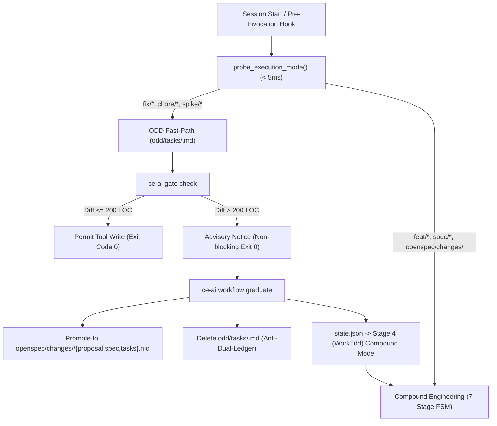

# Adaptive Mode Router and Organic Driven Development (ODD) Graduation Bridge

## Context

In standard Compound Engineering, all modifications are governed by a 7-stage stage-gated workflow (`Ideation`, `OpenSpec`, `Plan`, `WorkTdd`, `Verify`, `Compound`, `Ship`), enforced at agent file writes by `ce-ai gate check`. While this rigor is essential for multi-file features and architectural refactors, it imposes disproportionate overhead on trivial tactical chores, quick bugfixes (< 200 LOC), and speculative spikes.

Conversely, Gentle AI's Organic Driven Development (ODD) relies on a lightweight, single-file brief (`odd/tasks/<feature>.md`) defining a Problem Statement, Inviolable Guardrails, and a Definition of Done (DoD) checklist. However, unconstrained ODD risks unbounded scope expansion and architectural debt if an exploratory spike grows complex without formal specification contracts.

## Solution: Dual-Track Execution Architecture

We implemented an **Adaptive Turn-0 Mode Router** and a mechanical **Graduation Bridge** that combines the velocity of ODD with the governance of Compound Engineering.

### 1. In-Binary Deterministic Classification (`probe_execution_mode`)
Evaluated in under 5 milliseconds with zero LLM API calls:
- **CLI Override**: Explicit `--mode organic|compound|auto` flag takes immediate precedence.
- **OpenSpec Precedence Rule (Anti-Dual-Ledger)**: If an active directory exists under `openspec/changes/<feature>/`, `Compound` mode is strictly enforced, overriding any branch prefix.
- **Git Branch Heuristics**: Branches prefixed with `fix/`, `chore/`, `spike/`, or `test/` route to `Organic`; `feat/` and `spec/` route to `Compound`.
- **Non-Git Directory Fallback**: Inspects filesystem presence (`odd/tasks/` vs `openspec/changes/`) and falls back to project adoption tier (`Minimal` ➔ `Organic`, `Full` ➔ `Compound`).

### 2. Dual-Track Gate Engine (`src/commands/gate.rs`)
- In `ExecutionMode::Organic`, `evaluate_gate_policy` exempts writes from requiring an active `openspec/changes/` package, exiting with code 0 (`Pass`).
- If the uncommitted working tree diff exceeds 200 LOC (`probe_git_diff_loc`), `ce-ai gate check` emits an observe-only advisory notice encouraging graduation without blocking developer writes.

### 3. Lossless Graduation Bridge (`src/commands/workflow.rs`)
- Subcommand `ce-ai workflow graduate <feature>` (aliased to `ce-ai graduate <feature>`).
- Parses canonical brief `odd/tasks/<feature>.md`:
  - Problem Statement ➔ `proposal.md`
  - Guardrails & Invariants ➔ `spec.md`
  - Definition of Done ➔ `tasks.md` with 100% preservation of `- [x]` and `- [ ]` status.
- Atomically deletes `odd/tasks/<feature>.md` upon generation to eliminate dual-tracking drift.
- Sets workflow checkpoint directly to Stage 4 (`WorkTdd`) in `Compound` mode in `state.json`.

## Key Learnings & Guardrails

1. **Precedence Invariant**: Never allow an exploratory branch to bypass gate enforcement if an OpenSpec package already exists for that feature. The directory presence check must strictly override branch names.
2. **Lossless Checkbox Preservation**: Graduation must preserve the exact state of completed (`- [x]`) and open (`- [ ]`) checkboxes so work-in-progress is never reset or duplicated.
3. **Non-Blocking Gate Enforcement**: The 200 LOC tactical ceiling advisory in Organic mode must NEVER return an exit code other than 0 or block IDE file writes; it remains strictly advisory to keep Turn-0 and PreToolUse friction-free.
