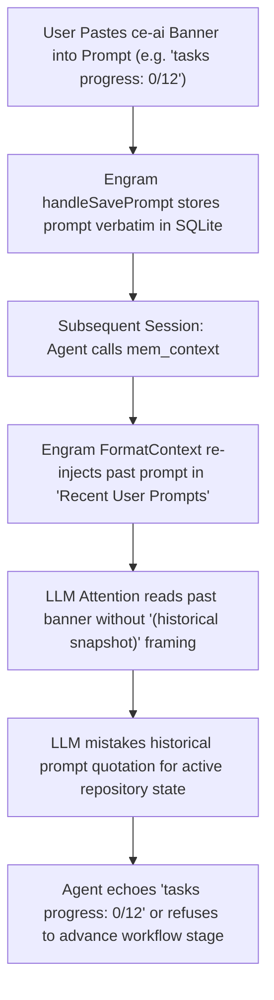

# Engram Memory Context Echo & LLM Behavioral Feedback Loop Risk

## Context & Problem

During the investigation of Issue #313, a puzzling cross-session anomaly was analyzed: the `ce-ai` workflow Finite State Machine (FSM) status banner (e.g. `tasks progress: 0/N completed` or `! Warning: Tasks desync detected`) appeared to stubbornly re-surface across distinct agent sessions even after work had progressed and tasks had been addressed in the repository.

The anomaly prompted two distinct hypotheses:
1. **Hypothesis 1 (Visual Artifact)**: Two independent systems (the `ce-ai` CLI and an external agent memory plugin) were generating superficially similar output strings without any functional coupling or state leakage between them.
2. **Hypothesis 2 (Functional Code Loop)**: A cross-cutting functional dependency existed where the persistent memory plugin was directly influencing `ce-ai`'s stage inference engine or vice versa.

A thorough technical investigation of the source code of both `ce-ai` and the third-party Engram plugin (`github.com/Gentleman-Programming/engram`) definitively resolved both hypotheses.

---

## Technical Investigation & Code Evidence

### 1. `ce-ai` Hermetic Stage Inference (Hypothesis 2 Refuted)

An audit of the workflow engine in `ce-ai` ([`src/commands/workflow.rs`](file:///Users/mastepanoski/projects/web/ai/ce-ai/src/commands/workflow.rs)) confirmed complete isolation from persistent memory:

- [`infer_stage_from_repo`](file:///Users/mastepanoski/projects/web/ai/ce-ai/src/commands/workflow.rs#L725): Derives the development stage exclusively from local repository artifacts—specifically checking Git status (`git status --porcelain=v1 -uall`), Git commit diffs against the base branch (`git diff --name-only <merge_base>...HEAD`), and counting `- [x]` versus `- [ ]` marks in `openspec/changes/<feature>/tasks.md`. It has zero code paths reading from memory stores or external plugins.
- [`maybe_auto_checkpoint`](file:///Users/mastepanoski/projects/web/ai/ce-ai/src/commands/workflow.rs#L862): Governs automated FSM stage advancement strictly using the output of `infer_stage_from_repo` and working-tree cleanliness.
- [`resume_lines`](file:///Users/mastepanoski/projects/web/ai/ce-ai/src/commands/workflow.rs#L235): Formats context re-hydration text strictly from the local workspace checkpoint recorded in `state.json`.
- **Descriptive-Only Citation**: The word `"Engram"` appears in `src/commands/workflow.rs` only once (at line 48), inside a human-facing documentation comment describing the purpose of the `resume` subcommand. There are no imports, traits, or functional hooks interacting with Engram.

**Verdict**: Hypothesis 2, as a code bug in `ce-ai`, is completely refuted. `ce-ai` operates hermetically on local repository files.

---

### 2. Third-Party Engram Plugin Architecture (`github.com/Gentleman-Programming/engram`)

Inspection of the Engram plugin implementation (Go project, installed under `~/.claude/plugins/marketplaces/engram`) revealed the exact mechanism of memory context injection:

- **Session Start vs. Context Request**:
  - `mem_session_start` / `handleSessionStart` (`mcp.go:1934`): Does **not** inject context automatically into the agent's turn. It merely registers a session record in the local SQLite database.
  - Context injection occurs exclusively when the agent proactively invokes the `mem_context` MCP tool, routed through `handleContext` (`mcp.go:1613`), which delegates to `Store.FormatContext(project, scope)` (`store.go:3298`).
- **Recent User Prompts Cutoff**:
  - Inside `Store.FormatContext` (`store.go:3298`), Engram formats several contextual blocks, including "Recent User Prompts" retrieved via `RecentPrompts(project, limit 10)` (`store.go:3341-3343`).
  - The query is strictly recency-bounded: `ORDER BY datetime(created_at) DESC LIMIT 10`. There is no semantic relevance scoring, no decaying weight, and no contextual filtering.
  - This hard limit of 10 prompts explains why the phenomenon was observed to "self-limit over time": as the user and agent interacted across subsequent turns, older prompts were pushed past the 10-prompt FIFO boundary.
- **Unsanitized Prompt Persistence**:
  - `handleSavePrompt` (`mcp.go:1564`) stores user prompts verbatim without sanitization, stripping, or semantic tagging.
  - In `FormatContext`, each prompt is printed verbatim (truncated to 200 characters) prefixed only by a timestamp (`- YYYY-MM-DD HH:MM:SS: <prompt>`).
  - When a user previously pasted terminal output from `ce-ai` (such as `tasks progress: 0/12 completed` or a desync warning) into a prompt, that exact text string is stored in SQLite and repeatedly re-injected into the agent's context whenever `mem_context` is executed over the next 10 turns.

---

## The Behavioral Feedback Loop: Cognitive, Not Code

The underlying issue is a **cognitive feedback loop in the LLM agent**, not a software bug in either system:



1. **Lack of Contextual Temporal Framing**: Engram prefixes past prompts with timestamps, but provides no semantic framing such as `(historical prompt: may not reflect current repository state)`.
2. **LLM Attention Bleed**: To an LLM optimizing its next token predictions, a verbatim quotation of an operational status banner inside the system/context block exerts strong attention weight. The agent conflates a *historical user quote* with the *live state of the repository*.
3. **Apparent State Persistence**: Even though `ce-ai`'s actual state and `tasks.md` may have advanced to Stage 4 or Stage 5, the agent sees the re-hydrated text `tasks progress: 0/12` and acts as though the project is stuck, reporting the warning back to the operator.

---

## Mitigations & Recommendations

### 1. Practiced Mitigation (Manual)
When an agent becomes trapped in a memory context echo loop, the operator can manually edit or delete the offending observation/prompt entry in Engram:
```bash
engram delete prompt <id>
# Or edit the observation to remove verbatim status quotes
```

### 2. Upstream Recommendation (for `github.com/Gentleman-Programming/engram`)
*Note: This is an architectural recommendation for the upstream third-party Engram project, outside the repository governance of `ce-ai`.*

To prevent LLMs from conflating past user prompts with current state, `Store.FormatContext` (`store.go:3298`) could introduce an explicit framing header above the prompt block:

```text
### Recent User Prompts (Historical context only — do not interpret past prompt quotes as current repository, task, or git state)
- 2026-09-07 10:15:00: ...
```

Adding this cognitive boundary prevents the LLM's attention mechanism from adopting quoted status text as active operational truth.

### 3. `ce-ai` Architectural Invariant
`ce-ai` maintains strict isolation between workflow FSM stage inference and third-party memory systems:
- FSM state is derived **strictly from verifiable disk state**: Git working tree status, Git merge-base commit diffs, and `openspec/changes/<feature>/tasks.md`.
- `ce-ai` will **never** parse external memory plugins to infer development progress, ensuring that memory corruptions or prompt echoes can never compromise the integrity of the workflow engine.
