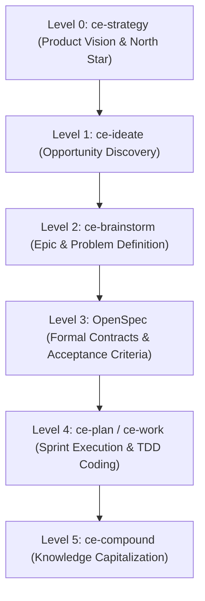
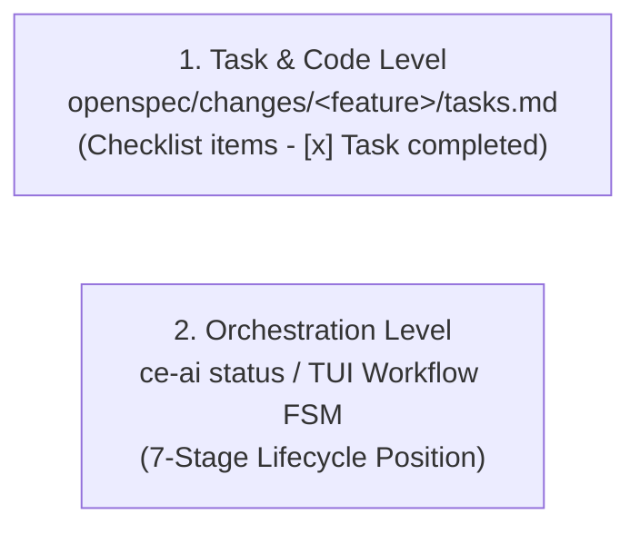

<!-- Diátaxis Quadrant: Explanation | Audience: Beginner -->
# 🎓 Compound Engineering Workflow: From Strategy to Code

Welcome! If you are new to **Compound Engineering** and **`ce-ai`**, this guide will explain how the entire development flywheel works — from high-level product strategy all the way to individual lines of code and durable team knowledge.

---

## 1. The Big Picture: The 6-Level Product & Engineering Hierarchy

A common point of confusion for newcomers is understanding how slash commands like `/ce-strategy`, `/ce-ideate`, `/ce-brainstorm`, `/ce-plan`, `/ce-work`, `/ce-compound`, and **OpenSpec** fit together without duplicating effort.

Think of it as a **6-level product management and software engineering funnel**:



---

## 2. Everyday Analogy: The Agile Product Funnel

If you are familiar with Agile software development, each level in Compound Engineering maps directly to a standard product role:

| Level | `ce-ai` Tool / Artifact | Agile & Product Analogy | Key Question Answered | Output / Deliverable |
| :---: | :--- | :--- | :--- | :--- |
| **Level 0** | **`ce-strategy`** | **Product Vision & OKRs** | *"Where is the product heading over the next 6–12 months?"* | `STRATEGY.md` / `ROADMAP.md` |
| **Level 1** | **`ce-ideate`** | **Opportunity Discovery** | *"What options or improvements could we explore?"* | 3–5 evaluated alternatives |
| **Level 2** | **`ce-brainstorm`** | **Epic & Problem Definition** | *"Which option did we pick, and what is the scope of this Epic?"* | `docs/brainstorms/` |
| **Level 3** | **OpenSpec** | **User Stories & Acceptance Criteria** | *"What are the exact formal rules (`WHEN..THEN`) and API contracts?"* | `openspec/changes/<feature>/` |
| **Level 4** | **`ce-plan` / `ce-work`** | **Sprint Backlog & Coding** | *"How do we write code and pass atomic tests (Red-Green-Refactor)?"* | Rust / TypeScript Code + TDD Tests |
| **Level 5** | **`ce-compound`** | **Retrospective & Knowledge Base** | *"What did we learn so the team never has to re-investigate this?"* | `docs/solutions/` |

---

## 3. Deep-Dive: Each Stage Explained for Newbies

### 🎯 Level 0: `ce-strategy` (Product Vision & North Star)
- **Role**: Defines the overarching goals, architectural principles, and long-term roadmap.
- **Why it matters**: Prevents the team or AI agents from spending energy building features that do not align with the product's direction.

### 💡 Level 1: `ce-ideate` (Opportunity Discovery)
- **Role**: Divergent thinking. Generates and compares multiple potential solutions (1 to N options) before committing to one.
- **Why it matters**: Avoids jumping to the first obvious solution. Explores tradeoffs, performance implications, and alternatives early.

### 🔍 Level 2: `ce-brainstorm` (Epic & Problem Definition)
- **Role**: Convergent thinking. Takes the chosen idea and frames the problem in depth.
- **Why it matters**: Clarifies user intent, identifies edge cases, and outlines the broad technical approach before writing any formal specifications.

### 📐 Level 3: OpenSpec (Formal Contracts & Acceptance Criteria)
A common beginner question is: *"Why do we need OpenSpec if we already did a brainstorm?"*
- **The Difference**:
  - `ce-brainstorm` is **narrative and conversational** (the story of why and how options were evaluated).
  - OpenSpec is **contractual and testable**. It converts the brainstorm into formal, verifiable specifications in `openspec/changes/<feature_name>/`:
    - `proposal.md`: Strict In-Scope vs. Out-of-Scope boundaries.
    - `exploration.md`: Technical investigation and tradeoff analysis.
    - `design.md`: Component architecture, structs, and API contracts.
    - `spec.md`: Formal behavioral rules written in `WHEN [condition] THEN [expected result]` format.

### ⚡ Level 4: `ce-plan` & `ce-work` (Sprint Backlog & TDD Execution)
- **Where does `/ce-plan` fit relative to OpenSpec?**
  - **`/ce-plan` runs AFTER OpenSpec specification (`proposal.md`, `design.md`, `spec.md`).**
  - You cannot plan the construction sequence (the *HOW*) without freezing the business rules (`spec.md`) and technical design (`design.md`) (the *WHAT*).
  - `/ce-plan` takes `spec.md` and `design.md` as inputs and **writes the executable checklist into `openspec/changes/<feature_name>/tasks.md`**.
- **`/ce-work` Execution Loop**:
  - Reads `tasks.md`, executes TDD (Red-Green-Refactor), and marks checkboxes (`- [x] Task 1`).

---

## 🔄 4. OpenSpec is a Living, Progressive Directory

OpenSpec is **not a static document written once**. It is a **living directory (`openspec/changes/<feature_name>/`) that evolves progressively across Compound Engineering stages**:

```mermaid
flowchart TD
    STAGE1["Stage 1: ce-brainstorm"] -->|Creates proposal.md & exploration.md| OPENSPEC_DIR["openspec/changes/&lt;feature_name&gt;/"]
    STAGE2["Stage 2: Specifying"] -->|Creates design.md & spec.md (WHEN...THEN)| OPENSPEC_DIR
    STAGE3["Stage 3: ce-plan"] -->|Generates tasks.md checklist| OPENSPEC_DIR
    STAGE4["Stage 4: ce-work"] -->|Updates tasks.md [-x] & records Spec Deltas| OPENSPEC_DIR
    STAGE6["Stage 6: ce-compound"] -->|Consolidates solution into docs/solutions/| DOCS_SOLUTIONS["docs/solutions/"]
```

| Lifecycle Phase | Active Agent / Command | Files Added / Updated in `openspec/changes/<feature>/` |
| :--- | :--- | :--- |
| **Ideation & Framing** | `ce-brainstorm` | Creates `proposal.md` (Scope) & `exploration.md` (Tradeoffs) |
| **Specification** | OpenSpec Definition | Creates `design.md` (Structs/APIs) & `spec.md` (`WHEN..THEN`) |
| **Planning** | `ce-plan` | Reads `spec.md`/`design.md` and generates `tasks.md` |
| **Development** | `ce-work` | Updates `tasks.md` (`- [x]`) and updates `spec.md` if design changes |
| **Capitalization** | `ce-compound` | Consolidates learnings into permanent `docs/solutions/` |

---

## 📊 4. How Do I Track Progress?

Newcomers often ask: *"Where do I check the progress of my feature?"*

Progress is tracked at **two complementary levels**:



1. **Granular Task & Code Progress**: Followed directly in `openspec/changes/<feature_name>/tasks.md`. As `ce-work` completes TDD tasks, checkboxes are marked `- [x]`.
2. **High-Level Workflow Progress**: Followed using `ce-ai status` or the **Workflow (FSM)** tab in the `ce-ai` TUI dashboard, showing which of the 7 stages the project is currently executing.
