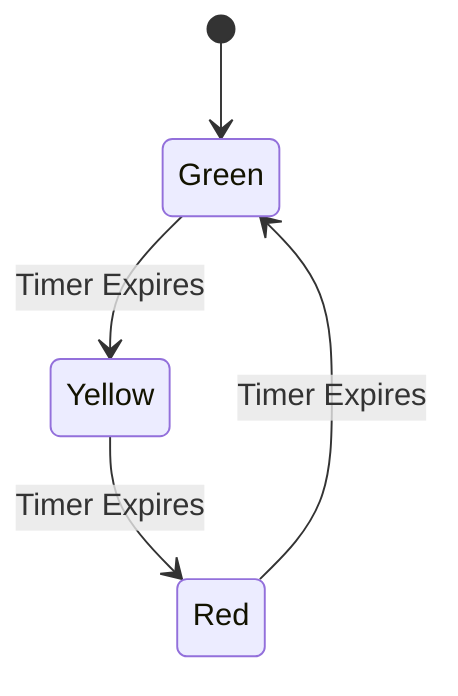
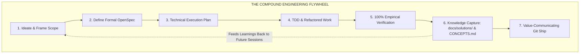
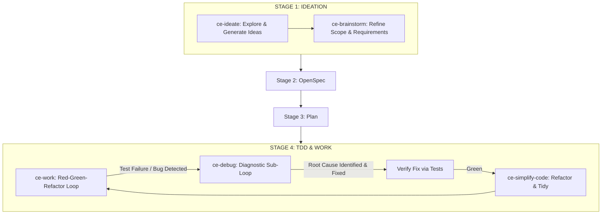
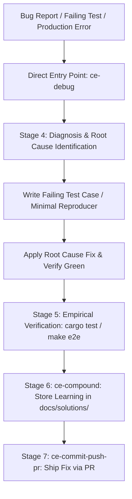
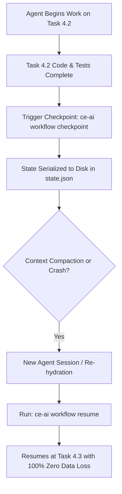
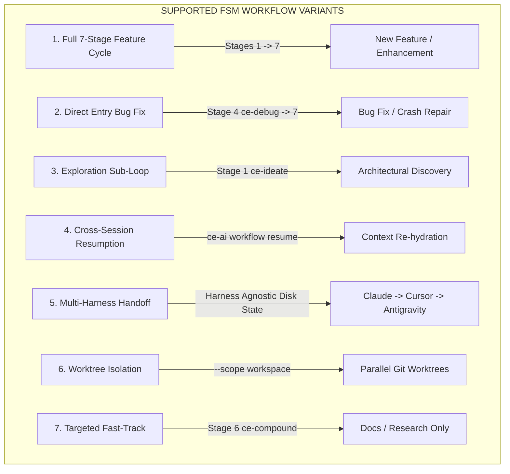

# 🎓 Masterclass: Understanding Finite State Machines (FSM) & Progress Checkpointing in AI Agents

Welcome to this dedicated step-by-step masterclass! If you are encountering terms like **Finite State Machine (FSM)**, **State Transitions**, **Context Compaction**, or **Progress Checkpointing** for the very first time, this guide is designed specifically for you.

We will explain these concepts from absolute scratch using everyday analogies, visual flowcharts, and concrete step-by-step walkthroughs.

---

## 1. The Core Problem: Why AI Agents Need Structure

### 🎲 Probabilistic vs. Deterministic Software

- **Human Software (Deterministic)**: A calculator always produces $2 + 2 = 4$. It follows exact, predictable rules.
- **Artificial Intelligence (Probabilistic)**: Large Language Models (LLMs) do not run rigid rules; they predict the most likely next tokens based on statistical probabilities.

### ❓ The Issue
When an AI agent is asked to build a large software feature, its probabilistic nature can lead to three common failures:
1. **Skipping Planning**: Jumping straight to modifying code without understanding requirements.
2. **Context Amnesia**: Forgetting what steps were completed after long conversations (due to **Context Window Compaction**).
3. **Inconsistent Quality**: Fixing one bug while introducing two regressions because there was no formal verification stage.

To solve this, `ce-ai` places the AI agent inside a **Finite State Machine (FSM)**.

---

## 2. What is a Finite State Machine (FSM)?

### 🚦 Everyday Analogy: The Traffic Light

Think of a standard traffic light:
- It has **3 States**: `RED`, `YELLOW`, `GREEN`.
- It follows **Strict Transition Rules**: `GREEN` can only transition to `YELLOW`, `YELLOW` can only transition to `RED`, and `RED` can only transition to `GREEN`.
- A traffic light **cannot** jump directly from `GREEN` to `RED` without passing through `YELLOW`.



### ⚙️ The FSM in `ce-ai`: The 7-Stage Lifecycle

In `ce-ai`, an AI agent is governed by an FSM that enforces a strict 7-stage lifecycle directly derived from the **Compound Engineering Philosophy**. The agent is **never** allowed to skip a stage.


---

## 3. How the FSM Enforces the Compound Engineering Flywheel

**Compound Engineering** is the foundational philosophy behind `ce-ai`. Its core premise is that software engineering should act as a **compounding flywheel**: every solved bug, architectural decision, and feature implementation must store durable knowledge so that future development becomes exponentially faster, safer, and higher quality.



### Why the FSM is Essential for Compound Engineering:

1. **Eliminates "Zero-Knowledge" Patching**:
   - Without an FSM, AI agents tend to perform superficial symptom patches (editing code without recording *why*). 
   - The FSM forces the agent to enter **Stage 6: Compound (`ce-compound`)**, capturing hard-earned learnings in `docs/solutions/` and `CONCEPTS.md` before a task can be closed.

2. **Guarantees Upstream Spec Grounding**:
   - Stage 4 (`ce-work`) is strictly blocked until Stage 2 (`OpenSpec`) defines explicit `WHEN ... THEN ...` acceptance criteria. This prevents agents from inventing product behavior on the fly.

3. **Self-Reinforcing Quality**:
   - Each completed FSM cycle enriches Engram persistent memory and `docs/solutions/`. In subsequent sessions, agents query these artifacts via `ce-ai tools` and `mem_search`, preventing old bugs from ever re-occurring.

#### The 7 Stages & Skill Alignment Matrix:

| Stage | Stage Name | Canonical CE Skills | Real-World Analogy | What Happens Here? |
| :--- | :--- | :--- | :--- | :--- |
| **Stage 1** | **Ideation** | `ce-brainstorm`<br>`ce-ideate`<br>`ce-strategy` | Architectural Blueprint Discussion | Exploring vague ideas (`ce-ideate`), framing constraints (`ce-brainstorm`), and setting product strategy (`ce-strategy`). |
| **Stage 2** | **OpenSpec Definition** | `openspec/changes/*/` | Formal Contract & Spec Sheet | Writing executable specifications (`proposal.md`, `exploration.md`, `design.md`, `spec.md`, `tasks.md`). |
| **Stage 3** | **Execution Plan** | `ce-plan`<br>`ce-doc-review` | Construction Milestone Breakdown | Structuring implementation units, file lists, test scenarios, and reviewing doc rigor (`ce-doc-review`). |
| **Stage 4** | **TDD & Work** | `ce-work`<br>`ce-debug`<br>`ce-simplify-code` | Laying Bricks & Wiring | Writing tests first (Red), implementing code (Green), running diagnostic debug sub-loops (`ce-debug`), and refactoring (`ce-simplify-code`). |
| **Stage 5** | **Verification** | `ce-code-review`<br>`ce-test-browser`<br>`cargo test` | Safety Inspector Audit | Running linters (`clippy`), unit tests, browser tests (`ce-test-browser`), and Docker containerized E2E gates. |
| **Stage 6** | **Knowledge Capture** | `ce-compound`<br>`ce-compound-refresh` | Updating Operations Manual | Documenting hard-earned discoveries in `docs/solutions/` (`ce-compound`) and auditing stale docs (`ce-compound-refresh`). |
| **Stage 7** | **Git Shipping** | `ce-commit-push-pr`<br>`ce-commit`<br>`ce-resolve-pr-feedback` | Delivering Keys to Client | Creating feature branches, writing value-communicating commit messages, and resolving PR feedback (`ce-resolve-pr-feedback`). |

---

## 4. FSM Sub-Loops & Entry Points: How `ce-ideate` and `ce-debug` Work

The FSM is not just a rigid straight line; it supports **Sub-Loops** and **Diagnostic Interrupts** for specialized skills like `ce-ideate` and `ce-debug`.



### 1. How `ce-ideate` Operates in Stage 1 (Ideation)
- **Role**: `ce-ideate` is an **Exploration Sub-Loop** within **Stage 1 (Ideation)**.
- **Behavior**: When a user or agent doesn't have a concrete feature description yet, `ce-ideate` runs first to generate and evaluate surprise options or architectural directions.
- **Transition**: Once an idea is chosen from `ce-ideate`, the FSM transitions to `ce-brainstorm` (to build the formal requirements document) and then moves forward to Stage 2 (`OpenSpec`).

### 2. How `ce-debug` Operates in Stage 4/5 (Diagnostic Sub-Loop & Direct Entry Point)

#### Can I start an FSM cycle directly with `ce-debug`?
**YES! Absolutely.** When your goal is repairing a bug, resolving a crash, or fixing a failing test (rather than building a new feature from scratch), `ce-debug` serves as a **Direct Entry Point** to the FSM cycle.



#### What happens when starting with `ce-debug`?

1. **Bypasses Feature Planning (Stages 1–3)**: Since you are repairing an existing system defect rather than inventing new product behavior, the FSM bypasses Stage 1 (`Ideation`) and Stage 2 (`OpenSpec`).
2. **Direct Entry into Stage 4 (Work/TDD & Diagnosis)**: The FSM initializes directly in Stage 4 under the diagnostic state.
3. **Empirical Diagnostic Cycle**:
   - *Log Inspection*: Reads un-truncated error tracebacks and failing test outputs.
   - *Minimal Reproducer*: Writes a failing test case reproducing the issue.
   - *Root Cause Fix*: Traces the defect upstream and applies a targeted fix (never masking symptoms with dummy fallbacks or swallowing exceptions).
4. **Mandatory Knowledge Capture (Stage 6: `ce-compound`)**:
   - Once verified in Stage 5, if the bug fix uncovered a non-obvious discovery, architectural gotcha, or edge case, `ce-debug` triggers **Stage 6 (`ce-compound`)**.
   - Captures the solution in `docs/solutions/` and updates `CONCEPTS.md`, enriching Engram memory so the bug never re-occurs in future sessions.
5. **Git Delivery (Stage 7: `ce-commit-push-pr`)**: Ships the fix via a `fix/<name>` feature branch and Pull Request.

---

## 3. What is a Checkpoint? (The "Savegame" Concept)

### 🎮 Everyday Analogy: Video Game Save Points

Imagine playing a massive 50-hour role-playing video game. Before facing a giant boss, you find a **Save Point**. 

If your console crashes or the power goes out, you don't lose 50 hours of effort—you reload your **Savegame** and resume from the exact minute you saved.



### 🧠 Why AI Needs Checkpoints: Context Compaction

Large Language Models have a fixed memory limit called a **Context Window**. When a chat session becomes very long:
1. The AI interface automatically compresses earlier messages (**Context Compaction**).
2. The AI may lose track of which subtasks in `tasks.md` were completed and which are pending.

**The Solution**: By running `ce-ai workflow checkpoint`, the state is written directly to disk (`~/.ce-ai/state.json`) using atomic writes (`write_atomic`). Disk state survives session resets, compaction, and process terminations.

---

## 4. Step-by-Step Workflow Walkthrough

Let's walk through an entire development session step-by-step.

### 📍 Step 1: Querying Workflow Status (`ce-ai workflow status`)

Before starting or resuming work, the developer or agent queries the FSM engine:

```bash
ce-ai workflow status
```

**Output**:
```text
== [Workflow FSM & Progress Recovery Status] ==
7-Stage Cycle: [1:Ideation] ➔ [2:OpenSpec] ➔ [3:Plan] ➔ [4:Work/TDD] ➔ [5:Verify] ➔ [6:Compound] ➔ [7:Ship]
current phase: Stage 4: TDD & Work
active subtask: Unit 2: Companion Tools Manager (tasks.md 2/4 completed)
recovery status: Ready (100% state preserved)
```

---

### 📍 Step 2: Executing Work & Advancing States

The AI agent executes Stage 4 (TDD & Work):
1. Writes a unit test for the feature.
2. Implements the minimum code to make the test pass.
3. Updates `openspec/changes/<feature>/tasks.md` marking the checklist item as completed `[x]`.

---

### 📍 Step 3: Saving a Progress Checkpoint (`ce-ai workflow checkpoint`)

Before performing a heavy task, switching models, or ending a session, the agent calls:

```bash
ce-ai workflow checkpoint --phase "Stage 4: TDD & Work" --task "4.2 Companion Tools Manager Implemented"
```

**Output**:
```text
workflow: checkpoint saved successfully!
  phase: Stage 4: TDD & Work
  task: 4.2 Companion Tools Manager Implemented
```

**What happened behind the scenes?**
- `ce-ai` captured the phase name, active task string, and UTC timestamp.
- It invoked `crate::state::write_atomic`, writing to a `.tmp` file and atomically replacing `state.json`.
- Engram persistent memory recorded the session summary.

---

### 📍 Step 4: Re-Hydrating Context Post-Compaction (`ce-ai workflow resume`)

If the session is interrupted or a new agent instance (e.g. switching from Claude Code to Cursor, Gemini, or OpenCode) takes over:

```bash
ce-ai workflow resume
```

**Output**:
```text
workflow: resuming execution from latest checkpoint...
== [Workflow FSM & Progress Recovery Status] ==
7-Stage Cycle: [1:Ideation] ➔ [2:OpenSpec] ➔ [3:Plan] ➔ [4:Work/TDD] ➔ [5:Verify] ➔ [6:Compound] ➔ [7:Ship]
current phase: Stage 4: TDD & Work
active subtask: 4.2 Companion Tools Manager Implemented
workflow: re-hydrated context successfully. Proceeding with active task.
```

The new agent immediately knows **where it is**, **what was already built**, and **what needs to be done next**—without asking the user or re-doing completed work.

---

## 5. FSM Capability Matrix: Supported Workflow Variants & Transitions

The `ce-ai` FSM engine was specifically designed to support **all real-world engineering variants**:



### Complete Variant Matrix:

| Workflow Variant | FSM Entry Point | FSM Traversal | State & Persistence Mechanism |
| :--- | :--- | :--- | :--- |
| **New Feature / Enhancement** | Stage 1 (`ce-brainstorm`) | Stages 1 ➔ 2 ➔ 3 ➔ 4 ➔ 5 ➔ 6 ➔ 7 | Formal OpenSpec (`proposal`, `spec`, `tasks`) + Plan + TDD + Solution + PR |
| **Bug Fix / Crash Repair** | Stage 4 (`ce-debug`) | Stage 4 (Direct Entry) ➔ 5 ➔ 6 ➔ 7 | Bypasses feature briefs; reproduces test ➔ applies fix ➔ tags `ce-compound` |
| **Architectural Exploration** | Stage 1 (`ce-ideate`) | Stage 1 Sub-Loop ➔ Stage 1 (`ce-brainstorm`) | Generates unconstrained options before formalizing requirements |
| **Session Interruption & Resume** | Any Stage | Resumes at exact checkpoint | Atomic disk writes (`state.json`) + Engram persistent memory re-hydration |
| **Multi-Harness Handoff** | Any Stage | Harness-Agnostic State Traversal | Shared disk state allows Claude Code to ideate, Cursor to edit, and AGY to ship |
| **Git Worktree Isolation** | Worktree Root | Workspace-Scoped Traversal | `install --scope workspace` isolates state and CodeGraph per worktree |
| **Docs / Research Fast-Track** | Stage 1 or Stage 6 | Targeted Pass | Bypasses code implementation; mutates `docs/solutions/` or research summary directly |

---

## 6. Summary Cheat Sheet

| Command | Everyday Analogy | Technical Purpose |
| :--- | :--- | :--- |
| `ce-ai workflow status` | Checking the Map | Queries current FSM stage, active subtask, and variant capability status. |
| `ce-ai workflow checkpoint` | Saving Your Game | Persists stage name, task string, and timestamp atomically to disk. |
| `ce-ai workflow resume` | Reloading Your Save | Re-hydrates state and Engram memory across sessions, handoffs, or compactions. |
