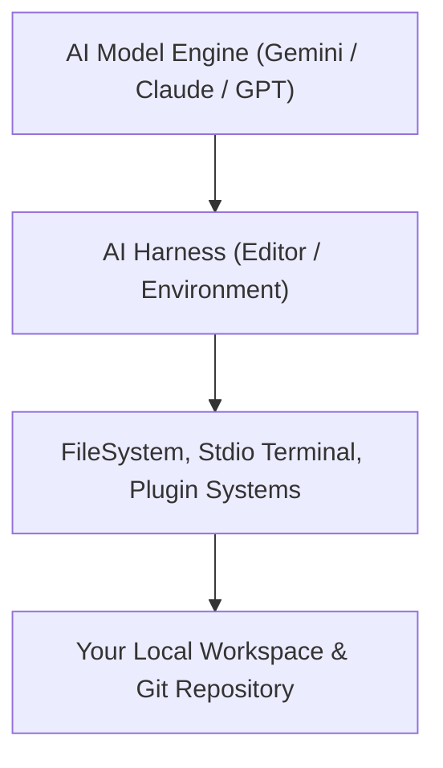
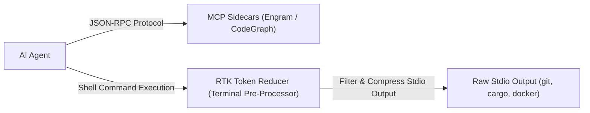
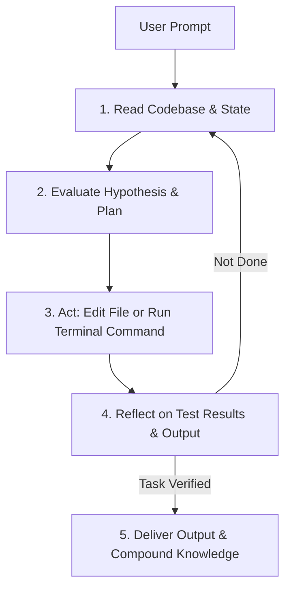
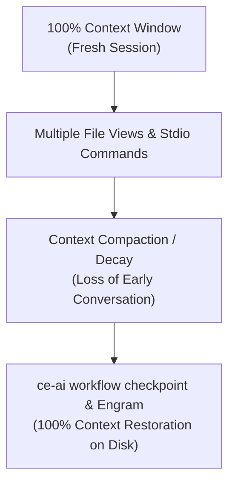

# 🎓 Masterclass: Harnesses, Agent Loops & Context Engineering

Welcome to the **Harnesses, Agent Loops & Context Engineering Masterclass**! This guide is designed specifically for newcomers to explain how AI editors (Harnesses), autonomous execution cycles (Agent Loops), and context optimization mechanics work together inside **`ce-ai`** and **Compound Engineering**.

---

## 1. What is an AI Harness?

### 🧩 Everyday Analogy: The Car Engine vs. The Steering Wheel
Imagine an AI model (like Gemini, Claude, or GPT) is a powerful **racing engine**. 

An **AI Harness** is the **vehicle body, dashboard, and steering wheel** surrounding that engine. It provides the user interface, file-system access, terminal execution, and plugin systems that allow the AI engine to interact with your codebase.

### Supported Harnesses in `ce-ai`:
`ce-ai` is a **Multi-Harness Orchestrator**. It detects, configures, and synchronizes Compound Engineering plugins across:

| Harness Name | Environment Type | How `ce-ai` Integrates |
| :--- | :--- | :--- |
| **OpenCode** | Open-source CLI Harness | Manages `~/.config/opencode/opencode.json` & skill arrays |
| **Claude Code** | Anthropic Terminal Harness | Configures `~/.claude.json` & managed plugin directories |
| **Cursor** | VSCode-based AI Editor | Injects managed rules into `.cursorrules` / `.cursor/rules/` |
| **GitHub Copilot** | JetBrains & VSCode Extension | Manages instructions in `.github/copilot-instructions.md` |
| **Antigravity CLI (`agy`)** | Autonomous Agentic CLI | Native integration via shared `state.json` & sidecars |
| **Pi / Custom JSON** | Custom/Experimental Harnesses | Implements `HarnessAdapter` trait for custom JSON files |

---

## 2. MCP Sidecars vs. CLI Token Reducers (RTK)

A common point of confusion for beginners is the difference between **MCP Sidecars** and **CLI Token Reducers**.

### 1. MCP Sidecars (Protocol-Based Intelligence)
- **What they are**: Model Context Protocol (MCP) servers that run in the background over `stdio` / `JSON-RPC`.
- **Examples in `ce-ai`**:
  - **Engram**: Persistent cross-session memory server. Stores architecture decisions, bug fixes, and user preferences across sessions.
  - **CodeGraph**: Call-graph and blast-radius indexing server. Analyzes functions, callers, callees, and dependencies.
- **Role**: They give the agent **deep long-term memory** and **structural codebase intelligence**.

### 2. CLI Token Reducers (Terminal Output Filters)
- **What they are**: Terminal pre-processors (such as **RTK / Rust Token Killer**) that intercept shell command outputs before sending text to the LLM.
- **Example**: Running `cargo test` or `docker ps` can generate 5,000 lines of verbose terminal output. RTK filters noise (whitespace, duplicate warnings, passing test boilerplate) and compresses the stream by **60% to 90%**.
- **Role**: They save token costs and prevent context window exhaustion. **RTK is NOT an MCP server**; it is a CLI output filter!

---

## 3. What is an Agent Loop?

### 🔄 The Execution Cycle: Read-Evaluate-Act-Reflect (REAR)
An **Agent Loop** is the autonomous, iterative cycle an AI agent runs when executing a prompt:

### Key Agent Loops in Compound Engineering:

1. **The TDD Feedback Loop (Red-Green-Refactor)**:
   - *Red*: Agent writes a failing unit test reproducing the requirement or bug.
   - *Green*: Agent writes the minimal code implementation to pass the test.
   - *Refactor*: Agent runs `/ce-simplify-code` to tidy the implementation without altering behavior.

2. **The Diagnostic Loop (`ce-debug`)**:
   - Freezes forward FSM progress upon encountering a crash or test failure.
   - Formulates hypotheses ➔ extracts un-truncated logs ➔ writes minimal reproducer ➔ applies root cause fix ➔ verifies green test.

3. **The Compounding Knowledge Loop (`ce-compound`)**:
   - Executes at the end of every completed task (Stage 6).
   - Extracts hard-earned learnings, gotchas, and architectural decisions, storing them in `docs/solutions/` and `CONCEPTS.md`.
   - In future sessions, agent loops query these solution docs, preventing past mistakes from ever repeating!

---

## 4. Context Engineering & Token Economics

### 📉 The Problem: Context Compaction & Decay
LLMs have a finite **Context Window** (e.g. 128k, 200k, or 1M tokens). As an agent executes tool calls, views files, and runs terminal commands, earlier conversation turns are truncated or compressed via **Context Compaction**.

If an agent loses context halfway through a 10-step implementation plan, it may hallucinate missing details or repeat steps.

### 🛡️ How `ce-ai` Solves Context Compaction:

1. **Atomic Workflow Checkpoints (`ce-ai workflow checkpoint`)**:
   - Saves current FSM stage index, active subtask string, and timestamp to disk (`state.json`).
   - If context compacts or a session ends, running `ce-ai workflow resume` re-hydrates the exact state from disk.

2. **Engram Memory Persistence**:
   - Session summaries and technical findings are saved outside the LLM context in Engram's SQLite database.
   - Agents query memory via `mem_context` or `mem_search`, instantly recalling past solutions regardless of token limits.

3. **CLI Token Reduction via RTK**:
   - Intercepts verbose terminal outputs (`cargo test`, `git status`, `docker ps`), stripping noise and preserving context capacity.

---

## 📋 Masterclass Summary Checklist for Beginners

- [x] **Harness**: The AI editor/environment (Claude Code, Cursor, Copilot, Antigravity, OpenCode).
- [x] **MCP Sidecars**: Protocol-based background servers for memory (Engram) and codebase graphs (CodeGraph).
- [x] **CLI Reducers**: Shell output filters (RTK) that shrink terminal output by 60–90%.
- [x] **Agent Loop**: The autonomous Read-Evaluate-Act-Reflect cycle driven by TDD and verification.
- [x] **Context Engineering**: Using FSM checkpoints and Engram memory to overcome token compaction.
