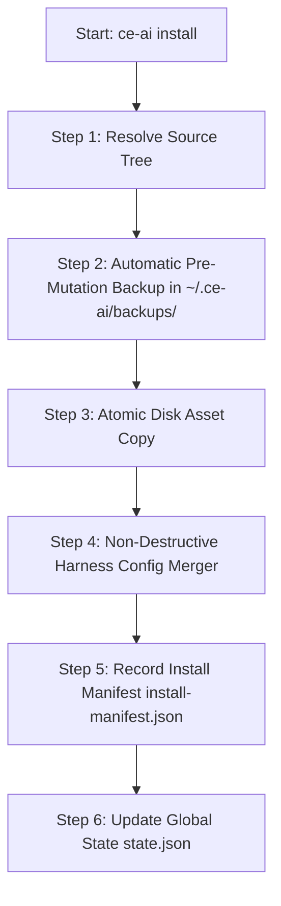

# Step-by-Step Guide: Installation Pipeline and Coexistence with Official Harnesses

This guide explains step-by-step how `ce-ai` installs the **Compound Engineering Plugin** and how it coexists safely with official configurations and setups of tools like **Claude Code**, **OpenCode**, **Cursor**, **GitHub Copilot**, and others.

---

## 💡 Key Concepts & Terminology (Read This First!)

Before reading the installation steps, here are simple explanations for key terms and files used throughout this guide:

### What is `install-manifest.json` and Where Does it Come From?
**`install-manifest.json`** is a digital fingerprint ledger automatically created by `ce-ai` inside each harness's managed folder during installation (`ce-ai install`).
- *Where it lives*: `~/.config/opencode/compound-engineering/install-manifest.json` (or target harness managed directory).
- *What it contains*:
  1. **Version & Source Tag**: Records whether the plugin was installed from GitHub release `vX.Y.Z` or a local development directory.
  2. **SHA256 File Hashes**: An index of cryptographic checksums for every installed skill and loader script.
  3. **Backup Pointer**: A record pointing to the exact timestamped backup of your original pre-install configuration file (e.g., `~/.ce-ai/backups/2026-08-21T12-00-00/claude.json`).

### What is `state.json`?
**`state.json`** is `ce-ai`'s central management state file located at `~/.ce-ai/state.json`. It keeps track of all installed harnesses on your machine, their active versions, last sync timestamps, and agent model assignments (`ce-brainstorm`, `ce-plan`, etc.).

### What is an Automatic Pre-Mutation Backup?
Before `ce-ai` makes any changes to your AI tools' configuration files (like `.claude.json` or `opencode.json`), it creates an exact, timestamped copy of your existing file under `~/.ce-ai/backups/`. If you ever uninstall or need to revert, `ce-ai` uses this backup to restore your system to its exact pre-installation state.

### What is Non-Destructive Config Merging?
"Non-destructive" means `ce-ai` **never deletes or overwrites** your custom settings, API keys, MCP servers, or official application plugins. Instead, it reads your existing JSON configuration file, adds or updates *only* the `compound-engineering` plugin and skill entries, and re-saves the file cleanly.

---

## 1. Step-by-Step Installation Pipeline (`ce-ai install`)

When executing `ce-ai install --harness claude` (or `--all`), `ce-ai` executes a strict 6-step pipeline ensuring **zero data loss**.



### 📋 Detailed Step Breakdown

#### Step 1: Resolve Source Tree
- `ce-ai` determines the plugin source:
  - **Default**: Resolves and caches the latest official release tarball from GitHub (`everyinc/compound-engineering-plugin`).
  - **With `--source <path>`**: Uses a local development directory.
- Extracts and validates the source layout, verifying the presence of the loader (`plugins/compound-engineering.js`) and skills (`skills/`).

#### Step 2: Automatic Pre-Mutation Backup (`~/.ce-ai/backups/`)
- Before writing any files or modifying configuration on disk, `ce-ai` checks if pre-existing harness configuration files (e.g., `.claude.json` or `opencode.json`) exist.
- If present, it creates an immutable, timestamped backup copy inside `~/.ce-ai/backups/<timestamp>/`.
- This guarantees that running `ce-ai uninstall` or restoring a backup reverts your system to its exact pre-installation state.

#### Step 3: Atomic Disk Asset Copy
- Copies skills (`skills/`) and loader scripts into the user's managed directory (`~/.config/opencode/compound-engineering/` or harness-specific directories).
- Writes files using atomic file writers (`write_atomic`) to prevent partial or corrupted file writes on process crash.

#### Step 4: Non-Destructive Config Merger
- Updates target harness configuration files using non-destructive config merger strategies tailored per harness type (see Section 2).

#### Step 5: Record Install Manifest (`install-manifest.json`)
- Writes `install-manifest.json` in the managed directory recording:
  - Installed plugin version and source.
  - Per-file SHA256 hashes.
  - Audit trail linking to the exact pre-install backup path created in Step 2.

#### Step 6: Update Global State (`state.json`)
- Registers the installed harness in `~/.ce-ai/state.json` under `installed_harnesses` with installation and sync timestamps.

---

## 2. Coexistence with Official Harness Setups (Claude Code, Cursor, OpenCode, etc.)

`ce-ai` adheres to the **Total User Configuration Preservation Principle** (ISO/IEC 27001 compliance). It NEVER deletes, overwrites, or clobbers user settings or native official application configurations.

### 🤖 1. Coexistence in Claude Code (`.claude.json` / `~/.claude/`)
- **Strategy**: Safe JSON Config Merger (`ensure_plugin_and_skills`).
- **Coexistence Behavior**:
  - Parses the existing `.claude.json` file.
  - If the user has configured **MCP (Model Context Protocol) servers**, API keys, UI preferences, or official Anthropic / third-party plugins, `ce-ai` **preserves them completely intact**.
  - Merges or updates only the `"compound-engineering"` entry inside the plugin array and skill paths in `"skills"`.
  - Avoids duplicate entries if the plugin was previously registered.

### 💻 2. Coexistence in OpenCode (`~/.config/opencode/opencode.json`)
- **Strategy**: JSON Array Merger (`plugin` & `skills`).
- **Coexistence Behavior**:
  - Parses `opencode.json`.
  - Merges the `compound-engineering` plugin entry and skills paths while keeping all existing user-defined plugins and skills untouched.

### 🖱️ 3. Coexistence in Cursor (`.cursorrules` / `.cursor/rules/`)
- **Strategy**: Markdown Delimited Block Injection.
- **Coexistence Behavior**:
  - If `.cursorrules` already exists with custom user rules, `ce-ai` **does NOT delete or overwrite the file**.
  - Injects or updates Compound Engineering directives inside comment-delimited blocks:
    ```markdown
    <!-- CE-AI MANAGED BLOCK START -->
    ... (CE-AI managed rules) ...
    <!-- CE-AI MANAGED BLOCK END -->
    ```
  - Any custom rules placed above or below the managed block remain 100% untouched.

### 🐙 4. Coexistence in GitHub Copilot (`.github/copilot-instructions.md`)
- **Strategy**: Markdown Delimited Block Injection.
- **Coexistence Behavior**:
  - Preserves all pre-existing repository instructions and injects/updates Compound Engineering directives within HTML comment delimiters.

### 🔮 5. Coexistence in Pi, Kimi, Antigravity (AGY), Codex, Grok, Fx
- **Strategy**: Dedicated Native Harness Adapters.
- **Coexistence Behavior**:
  - Preserves existing key-value structures in each harness's respective native configuration files (`~/.pi/agent/skills/`, `~/.gemini/config/mcp_config.json`, `~/.kimi-code/mcp.json`, `~/.codex/config.toml`, `~/.grok/config.toml`, `~/.fx/mcp.json`).

### 📁 6. Workspace Scoping & Gitignore Isolation (`--scope workspace`)
- **Strategy**: Sentinel-Bounded `.gitignore` Protection.
- **Artifact Boundary**:
  - `compound-engineering/`: Contains machine-local installation files and manifests (`install-manifest.json`) recording absolute local paths. `ce-ai` automatically ensures this directory is ignored inside the sentinel block in `.gitignore`.
  - `.ce-ai/skills-registry.json`: Machine-local skills cache, automatically ignored.
  - `AGENTS.md` / `CLAUDE.md` / `.cursor/rules/`: Shared team governance and directives; these **should be committed** to Git.
  - `opencode.json` / `.claude.json`: Native harness configs; can optionally be committed if sharing team-wide settings and MCP servers.

---

## 🛡️ Summary of Safety Guarantees

1. **Zero Destructive Overwrites**: No official application plugin or custom user configuration is ever deleted.
2. **Clean Uninstallation (`ce-ai uninstall`)**: Uninstallation removes only `ce-ai` managed assets or restores the original pre-install backup created in Step 2.
3. **Auditability**: Every change is tracked in `install-manifest.json` with per-file SHA256 hashes.
4. **Git Repository Cleanliness**: Machine-local workspace installations are automatically excluded via `.gitignore` sentinels.
