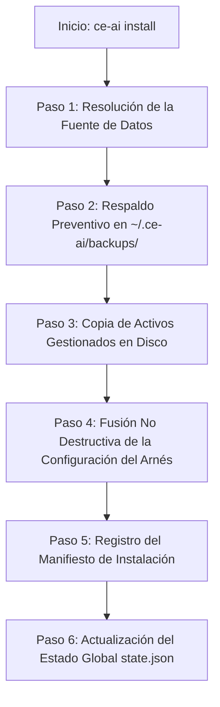

# Guía Explicativa Paso a Paso: Mecanismo de Instalación y Convivencia con Arneses Oficiales

Esta guía detalla paso a paso cómo `ce-ai` instala el **Compound Engineering Plugin** y cómo convive de forma segura con las configuraciones e instalaciones oficiales de herramientas como **Claude Code**, **OpenCode**, **Cursor**, **GitHub Copilot**, entre otras.

---

## 1. Mecanismo de Instalación Paso a Paso (`ce-ai install`)

Cuando ejecutas `ce-ai install --harness claude` (o con `--all`), `ce-ai` ejecuta un flujo estricto garantizando **cero pérdida de datos**.



### 📋 Detalle de cada Paso

#### Paso 1: Resolución de la Fuente de Datos
- `ce-ai` determina el origen del plugin:
  - **Por defecto**: Descarga o utiliza del caché local la última Release oficial de GitHub (`everyinc/compound-engineering-plugin`).
  - **Con `--source <path>`**: Utiliza un directorio local de desarrollo.
- Extrae y valida la estructura garantizando la presencia del cargador (`plugins/compound-engineering.js`) y las habilidades (`skills/`).

#### Paso 2: Respaldo Preventivo Automático (`~/.ce-ai/backups/`)
- Antes de modificar cualquier archivo en tu computadora, `ce-ai` comprueba si el archivo de configuración del arnés (ejemplo: `.claude.json` o `opencode.json`) ya existe.
- Si existe, genera una copia de respaldo inmutable e identificada con fecha y hora en `~/.ce-ai/backups/<timestamp>/`.
- Esto garantiza que con `ce-ai uninstall` o una restauración puedas volver al estado exacto previo a la instalación.

#### Paso 3: Copia de Activos Gestionados en Disco
- Copia las habilidades (`skills/`) y los loaders en el directorio gestionado del usuario (`~/.config/opencode/compound-engineering/` o carpetas específicas del arnés).
- Escribe mediante escrituras atómicas (`write_atomic`) para prevenir archivos incompletos en caso de caídas.

#### Paso 4: Fusión No Destructiva de Configuración
- Modifica el archivo de configuración del arnés de IA aplicando estrategias adapativas según el tipo de arnés (ver Sección 2).

#### Paso 5: Registro del Manifiesto de Instalación (`install-manifest.json`)
- Escribe `install-manifest.json` en el directorio gestionado registrando:
  - Versión instalada y origen.
  - Hashes SHA256 individuales de cada archivo instalado.
  - Enlace al archivo de respaldo creado en el Paso 2.

#### Paso 6: Actualización del Estado Global (`state.json`)
- Registra el arnés en `~/.ce-ai/state.json` bajo `installed_harnesses` con la fecha y hora de instalación y sincronización.

---

## 2. Convivencia con Instalaciones Oficiales (Claude Code, Cursor, OpenCode, etc.)

`ce-ai` está diseñado bajo el principio de **Preservación Total de Configuraciones de Usuario** (Cumplimiento ISO/IEC 27001). NUNCA sobrescribe, borra o reemplaza configuraciones nativas del usuario o de la aplicación oficial.

### 🤖 1. Convivencia en Claude Code (`.claude.json` / `~/.claude/`)
- **Estrategia**: Fusión JSON segura (`ensure_plugin_and_skills`).
- **Cómo convive**:
  - Lee el archivo `.claude.json` existente.
  - Si el usuario tiene configurados servidores MCP (Model Context Protocol), claves de API, preferencias de interfaz o plugins de terceros oficiales de Anthropic / Claude Code, `ce-ai` los **mantiene intactos**.
  - Inserta o actualiza únicamente la entrada `"compound-engineering"` dentro de la matriz de plugins y la ruta de habilidades en `"skills"`.
  - Si la entrada ya existía, la actualiza sin duplicarla.

### 💻 2. Convivencia en OpenCode (`~/.config/opencode/opencode.json`)
- **Estrategia**: Fusión de Arrays JSON (`plugin` & `skills`).
- **Cómo convive**:
  - Lee `opencode.json`.
  - Agrega la entrada de `compound-engineering` respetando cualquier otro plugin instalado por el usuario.

### 🖱️ 3. Convivencia en Cursor (`.cursorrules` / `.cursor/rules/`)
- **Estrategia**: Inyección de Bloques Markdown Delimitados.
- **Cómo convive**:
  - Si el usuario ya tiene reglas personalizadas en su archivo `.cursorrules`, `ce-ai` **NO borra el archivo**.
  - Inyecta o actualiza las reglas de Compound Engineering dentro de marcadores especiales:
    ```markdown
    <!-- CE-AI MANAGED BLOCK START -->
    ... (Reglas gestionadas por ce-ai) ...
    <!-- CE-AI MANAGED BLOCK END -->
    ```
  - Las reglas previas o posteriores escritas por el usuario permanecen 100% intactas fuera del bloque.

### 🐙 4. Convivencia en GitHub Copilot (`.github/copilot-instructions.md`)
- **Estrategia**: Inyección de Bloques Markdown Delimitados.
- **Cómo convive**:
  - Conserva todas las instrucciones previas del repositorio u organización, insertando o actualizando las directivas de Compound Engineering dentro del bloque delimitado por comentarios HTML.

### 🔮 5. Convivencia en Pi, Kimi, Antigravity (AGY), Codex, Grok, DeepSeek, FX
- **Estrategia**: Fusión JSON Genérica Adaptativa.
- **Cómo convive**:
  - Respeta la estructura de clave-valor nativa de cada herramienta en sus respectivas carpetas (`~/.pi/config.json`, `~/.gemini/antigravity-cli/`, `~/.kimi/`, etc.).

---

## 🛡️ Resumen de Garantías de Seguridad

1. **Cero Sobrescribimiento Destructivo**: Ningún plugin oficial de la aplicación o del usuario es eliminado.
2. **Desinstalación Limpia (`ce-ai uninstall`)**: Al desinstalar, `ce-ai` remueve únicamente sus entradas o restaura el respaldo original creado en el Paso 2.
3. **Auditabilidad**: Cada cambio queda registrado en `install-manifest.json` con su respectivo hash SHA256.
