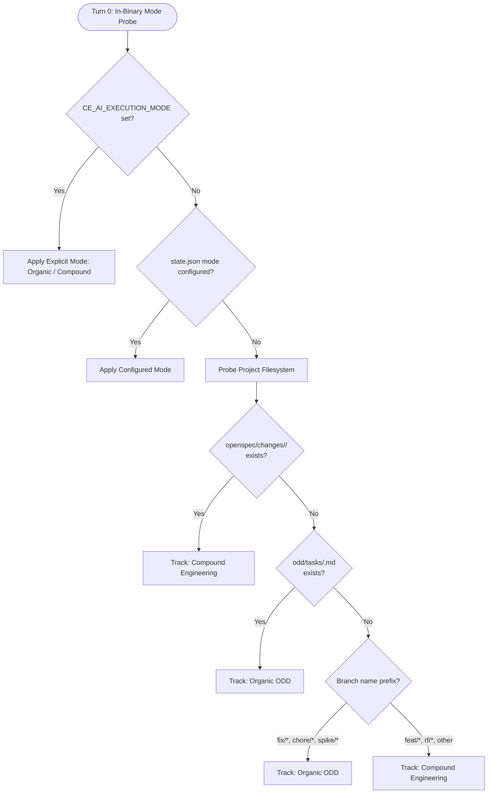
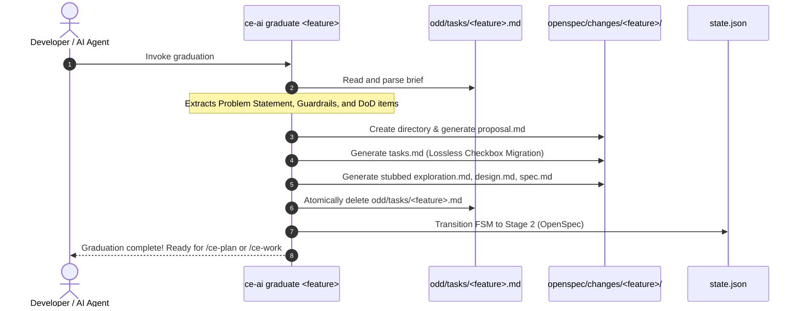
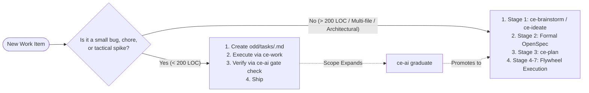

# 🎓 Masterclass: Organic-Driven Development (ODD) Fast-Path & The Graduation Bridge

Welcome to this masterclass! Whether you are an engineer managing rapid bug fixes or a systems architect steering multi-quarter platform migrations, balancing **developer velocity** and **architectural rigor** is a central challenge in modern software engineering.

When working with autonomous AI coding agents, this tension becomes acute. AI agents move fast, but if left unguided they produce code without memory, tests, or architectural coherence. Conversely, forcing an AI agent through a 7-stage formal specification process for a 3-line configuration fix introduces unnecessary friction.

This guide explains how `ce-ai` harmonizes these two worlds by uniting **Organic-Driven Development (ODD)**—pioneered by Gentle AI—with the **7-stage Compound Engineering Flywheel**, powered by an automated **Turn-0 Adaptive Mode Router** and the **Graduation Bridge**.

---

## 1. The Core Dilemma: Agility vs. Compound Intelligence

### 🚤 The Speedboat vs. The Aircraft Carrier

Consider two vessels navigating an ocean:

- **The Speedboat (ODD / Organic Track)**: Nimble, lightweight, and capable of turning on a dime. Ideal for quick reconnaissance, bug fixes, minor chores, and exploratory spikes. It requires minimal overhead: a single problem statement, a few guardrails, and an actionable checklist.
- **The Aircraft Carrier (Compound Engineering Track)**: Massive, resilient, and equipped for sustained strategic operations. Designed for complex features, architectural refactors, and core platform enhancements. It is governed by a formal 7-stage Finite State Machine (FSM): Ideation, OpenSpec definition, planning, work/TDD, empirical verification, knowledge compounding, and shipping.

| Dimension | Organic Track (ODD) | Compound Track (Compound Engineering) |
| :--- | :--- | :--- |
| **Origin & Philosophy** | Gentle AI (Frictionless, lightweight, emergent) | Compound Engineering (Formal, stage-gated, compounding) |
| **Primary Scope** | Bug fixes, chores, spikes, small tasks (< 200 LOC) | Greenfield features, multi-file refactors, architecture changes |
| **Artifact Footprint** | Single file: `odd/tasks/<feature>.md` | Full directory: `openspec/changes/<feature>/` (5 files) |
| **Lifecycle Model** | Linear execution (`probe ➔ execute ➔ gate`) | 7-stage FSM (`Ideation ➔ OpenSpec ➔ Plan ➔ Work ➔ Verify ➔ Compound ➔ Ship`) |
| **Knowledge Capture** | Optional / Engram session notes | Mandatory: `docs/solutions/` + `CONCEPTS.md` |
| **Ceremony Overhead** | ~0 seconds | Structured planning and reviews |

### ⚖️ The Fallacy of the Single Process

Teams typically stumble into one of two extremes:

1. **Ceremonial Fatigue (Over-Specification)**: Demanding a multi-document OpenSpec change (`proposal.md`, `exploration.md`, `design.md`, `spec.md`, `tasks.md`) for a one-line regex fix. Developers and agents spend 80% of their tokens and time authoring specification ceremony for a trivial change.
2. **Context Collapse (Under-Specification)**: Running an entire 1,500-line multi-module subsystem rewrite through a single chat prompt or loose scratchpad. The AI agent suffers from context compaction, hallucinated requirements, lost invariants, and unrecorded architectural debt.

`ce-ai` solves this by introducing a **dual-track execution model** with a dynamic, deterministic bridge between them.

---

## 2. The Turn-0 Adaptive Mode Router

When you run `ce-ai workflow resume`, `ce-ai status`, or trigger your AI coding agent, the system does not pause to query a slow, probabilistic Large Language Model to decide which track to take. Instead, it runs an in-binary, deterministic **Turn-0 Mode Probe** in less than 5 milliseconds.



### 🔍 Routing Precedence

The mode router evaluates the environment using a strict hierarchical cascade:

1. **Environment Override**: `CE_AI_EXECUTION_MODE=organic` or `CE_AI_EXECUTION_MODE=compound`. Used in automated CI runners or headless scripts.
2. **Persistent Configuration**: The `execution_mode` key in `state.json` (`"auto"`, `"organic"`, or `"compound"`).
3. **Active OpenSpec Change**: If `openspec/changes/<feature>/proposal.md` exists for the current branch or active feature, the project is explicitly in the **Compound Track**.
4. **Active ODD Brief**: If `odd/tasks/<feature>.md` exists, the project is explicitly in the **Organic Track**.
5. **Branch Name Heuristics**:
   - Prefixes `fix/`, `chore/`, `spike/`, `hotfix/` default to the **Organic Track**.
   - Prefixes `feat/`, `feature/`, `rf/`, `refactor/`, or any other branch default to the **Compound Track**.

### 🛡️ The Anti-Dual-Tracking Invariant

A fundamental governance rule enforced by `ce-ai` is **state singularity**: a feature cannot legally be tracked on both tracks at the same time.

> [!CAUTION]
> If a repository contains both `openspec/changes/<feature>/proposal.md` AND `odd/tasks/<feature>.md` for the same active feature, the mode router detects **split-brain drift**, emits a diagnostic warning, and prioritizes the formal OpenSpec contract while instructing the agent to run cleanup.

---

## 3. The Anatomy of a Canonical ODD Brief

The Organic Track does not mean "zero documentation." In `ce-ai`, an unstructured AI agent is an unreliable AI agent. Even quick bug fixes require bounded constraints.

The Organic Track uses a single lightweight markdown document: `odd/tasks/<feature>.md`.

```
odd/tasks/fix-token-expiry.md
```

### 📋 The Three Required Sections

A canonical ODD brief contains exactly three sections:

```markdown
# Task: Fix Token Refresh Expiry Off-by-One

## Problem Statement
When access tokens expire at exactly the 3600-second mark, the auth middleware
rejects subsequent requests with a 401 Unauthorized instead of initiating the
refresh token grant, causing intermittent UI logouts.

## Guardrails
- Do NOT alter the public AuthSession interface or token storage schema.
- Do NOT add external dependencies; use existing chrono time comparisons.
- Zero clippy warnings with `-D warnings`.

## Definition of Done
- [x] Reproduce expiry failure in `tests/auth_middleware.rs`
- [ ] Adjust comparator in `src/auth/session.rs` from `>=` to `>`
- [ ] Verify test suite passes with `cargo test`
```

1. **Problem Statement**: 2–3 sentences defining the exact defect or requirement. It answers: *What is broken or missing?*
2. **Guardrails**: Inviolable boundaries that prevent an autonomous agent from taking destructive shortcuts or expanding scope. It answers: *What must the agent NEVER do?*
3. **Definition of Done (DoD)**: Concrete, executable markdown checkboxes (`- [ ]` / `- [x]`). The agent checks off these items as it writes and verifies code.

---

## 4. The Graduation Bridge

Software development is inherently exploratory. What begins as a "quick 20-line bug fix" often reveals deep architectural decay, cross-subsystem coupling, or unsuspected protocol changes.

When an organic task outgrows its original scope, abandoning the work or forcing the developer to manually copy-paste checkboxes into a new OpenSpec change creates friction.

This is where the **Graduation Bridge** comes into play:

```bash
ce-ai graduate <feature>
# or canonical subcommand:
ce-ai workflow graduate <feature>
```



### 🔄 Lossless Checkbox Preservation

When `ce-ai graduate` promotes an ODD task to OpenSpec:
- Completed checkboxes (`- [x]`) in `odd/tasks/<feature>.md` are preserved as `- [x]` in `openspec/changes/<feature>/tasks.md`. Work already verified is never reset.
- Pending checkboxes (`- [ ]`) are migrated with their original text.
- Problem statements and guardrails are automatically structured into `proposal.md`.
- Stubs for `exploration.md`, `design.md`, and `spec.md` are initialized, ready for formalization.
- The original `odd/tasks/<feature>.md` is atomically deleted, maintaining the **Anti-Dual-Tracking Invariant**.

---

## 5. The Dual-Track Quality Gate & The 200 LOC Ceiling

To prevent lightweight tasks from ballooning into untracked, unreviewed monoliths, `ce-ai` incorporates a **Dual-Track Quality Gate** in `ce-ai gate check`.

### 📏 The 200 LOC Boundary

- For features running in the **Organic Track**, the gate measures git diff lines added and removed (`git diff --numstat`).
- If the total changed lines exceed **200 LOC**, the gate surfaces an advisory message:

```text
[gate-check:observe-only] Organic task 'fix-auth-race' diff is 342 lines (> 200 LOC ceiling).
Recommendation: Run 'ce-ai graduate fix-auth-race' to promote to formal OpenSpec.
```

> [!NOTE]
> **Why is the 200 LOC ceiling observe-only and non-blocking?**
> A gate that hard-fails an urgent bugfix because it changed 205 lines causes developers to bypass tooling (`--no-verify`, disabling hooks). In accordance with ISO 42001 and NIST AI RMF governance principles, `ce-ai` treats the 200 LOC ceiling as an **empirically observed risk indicator**, not a bureaucratic blocker. The system informs the engineer and the agent, providing a one-command graduation path without halting emergency remediation.

---

## 6. Pedagogical Anti-Patterns & FAQs

### 🚫 Common Anti-Patterns

#### Anti-Pattern 1: The Infinite Spike
- **Symptom**: An agent continues working on an `odd/tasks/` file across 15 files and 900 lines of code without graduating.
- **Consequence**: The repository loses architecture history, no solutions document is authored in `docs/solutions/`, and subsequent agents have no record of design decisions.
- **Remedy**: As soon as a spike touches more than 2 files or crosses 200 LOC, graduate it immediately: `ce-ai graduate <feature>`.

#### Anti-Pattern 2: The Ceremonial Typo
- **Symptom**: Creating a full OpenSpec change for updating a broken documentation URL or fixing a compiler warning.
- **Consequence**: High token waste, cognitive overload, and delayed PR delivery.
- **Remedy**: Use the Organic Track. Create `odd/tasks/<name>.md`, make the fix, run verification, and ship.

#### Anti-Pattern 3: Manual Dual-Tracking
- **Symptom**: A developer keeps an `odd/tasks/feature.md` file while simultaneously writing `openspec/changes/feature/spec.md`.
- **Consequence**: The agent becomes confused about which task list represents reality.
- **Remedy**: Never dual-track. If you have an OpenSpec directory, delete the ODD brief; if you start in ODD and need OpenSpec, run `ce-ai graduate`.

---

## 7. Decision Matrix & Quick Cheatsheet

Use this matrix when starting a new task:



### CLI Quick Reference

| Command | Action | Track |
| :--- | :--- | :--- |
| `ce-ai workflow resume` | Automatically probes Turn-0 mode and resumes context | Both |
| `ce-ai gate check` | Verifies DoD, tests, and diff size (observe-only) | Both |
| `ce-ai graduate <feature>` | Promotes an ODD brief into a formal OpenSpec change | Bridge |
| `ce-ai workflow status` | Inspects current FSM stage and active feature | Both |
| `ce-ai workflow checkpoint` | Records verified FSM stage transitions in `state.json` | Compound |

---

## Conclusion

The combination of Organic-Driven Development and the Compound Engineering Flywheel gives your engineering team the best of both worlds:
- **Maximum speed and zero friction** for daily chores, bug fixes, and exploration.
- **Complete structural safety, architectural memory, and governance** for strategic systems work.
- **A seamless, lossless bridge** between the two whenever small ideas grow into large architectures.
