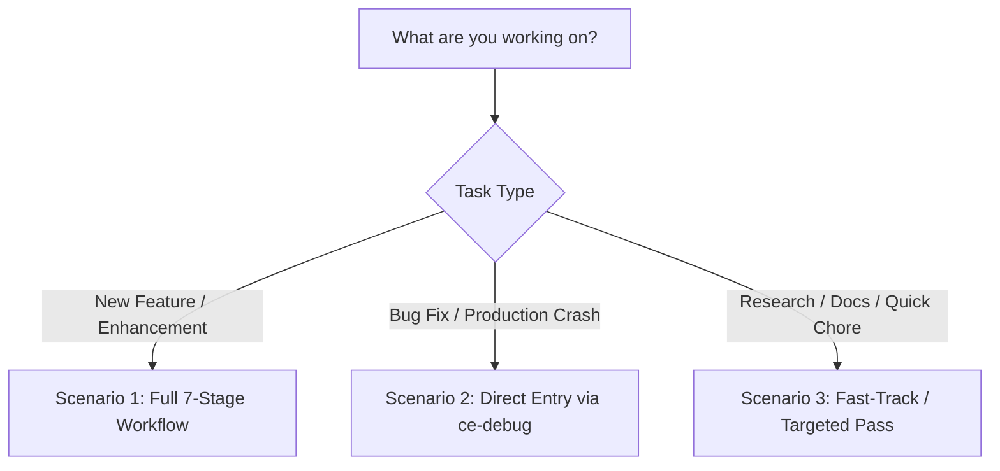
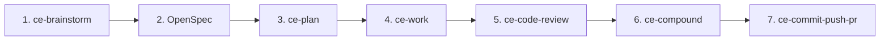
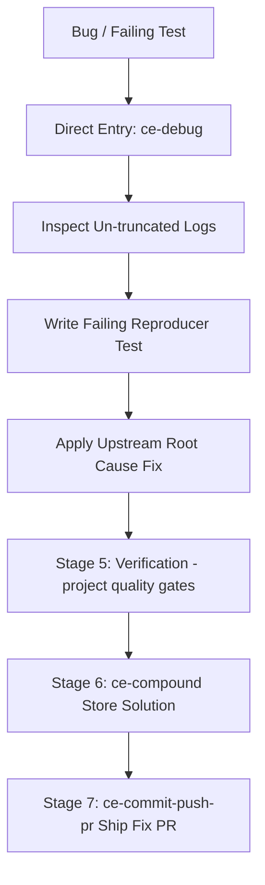
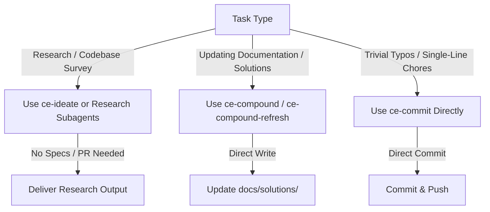
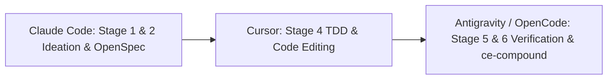
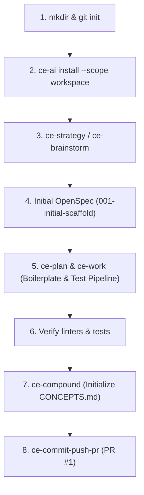
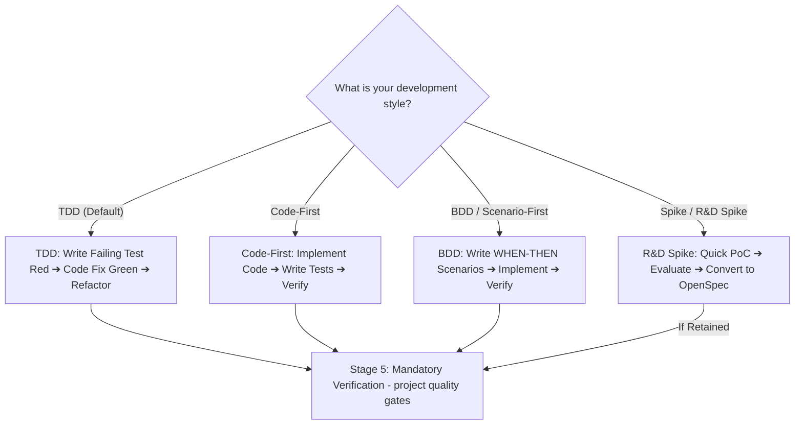
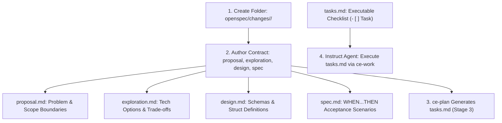
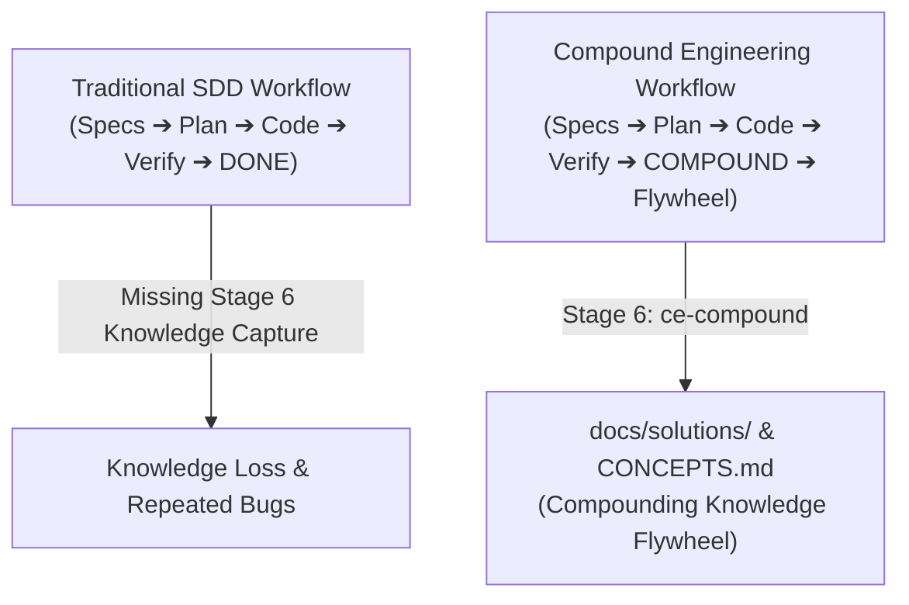

# 🎓 Quick Start Guide: Compound Engineering & `ce-ai` in Practice

Welcome to the beginner's Quick Start guide! Whether you are building a new feature, fixing a production bug, or simply researching a codebase, this guide explains step-by-step how to use **Compound Engineering** skills alongside **`ce-ai`**.

> 🌱 **Haven't installed `ce-ai` or run a slash command yet?** This guide assumes both are already done. Start with [Getting Started](getting-started.md) first, then come back here.

---

## 💡 The Core Philosophy: Orchestrator + Methodology

- **`ce-ai`**: Your command-line orchestrator that manages harness configurations, sidecars (Engram, CodeGraph), scope isolation, and workflow state persistence (`ce-ai workflow`).
- **Compound Engineering**: The engineering methodology (skills and guidelines) that ensures every task builds compounding knowledge so your codebase becomes cleaner, safer, and easier to maintain over time.

---

## 🚀 Workflow Selection Matrix

Choose your entry point based on your task type:



---

## 🛠️ Scenario 1: Building a New Feature or Enhancement

When introducing a new capability, UI screen, or major architectural change, follow the complete 7-stage lifecycle:



### Step-by-Step Flow:

1. **Stage 1: Ideation & Requirements**
   - Run `/ce-brainstorm` when requirements are fuzzy. Only run `/ce-ideate` first if even the technical approach is uncertain (see Section 7 FAQ 0).
   - *Goal*: Clarify scope, user constraints, and out-of-scope boundaries. Writes `docs/brainstorms/<date>-<name>-requirements.md` — disposable input for Stage 2 (retained on disk as raw history, never deleted by rule), never a second source of truth.

2. **Stage 2: OpenSpec Definition — Contract Authoring (Progressive Lifecycle)**
   - Create a dedicated change directory: `openspec/changes/<feature_name>/`.
   - Author the contract progressively:
     - `proposal.md`: Problem statement, scope boundaries, risk assessment, and success criteria.
     - `exploration.md`: Technical investigation, evaluated options, and trade-offs.
     - `design.md`: System architecture, struct definitions, data schemas, and API contracts.
     - `spec.md`: Formal behavioral rules in explicit `WHEN ... THEN ...` format.
   - *How to Instruct an AI Agent*: Provide the path `openspec/changes/<feature_name>/` to your AI harness.

3. **Stage 3: Technical Execution Plan — `tasks.md` Generation**
   - Run `/ce-plan` (and optionally `/ce-doc-review` to audit plan rigor).
   - *Goal*: `/ce-plan` reads `spec.md` + `design.md` and **generates the executable checklist** `openspec/changes/<feature_name>/tasks.md` (atomic units with TDD verification steps), plus the sequencing plan under `docs/plans/`. When you reach Stage 4, OpenSpec is complete.

4. **Stage 4: TDD & Work**
   - Run `/ce-work` (or `/ce-simplify-code` after implementing).
   - *Goal*: Write tests first (Red), implement code (Green), and refactor cleanly. Save progress checkpoints via `ce-ai workflow checkpoint`.

5. **Stage 5: Empirical Verification**
   - Run `/ce-code-review` plus the project's own verification suite — unit tests, linters and E2E gates as defined by your stack (e.g. `cargo test`, `npm test`, `pytest`).
   - *Goal*: Zero lint warnings under your project's configuration and a 100% green test suite.

6. **Stage 6: Knowledge Capture**
   - Run `/ce-compound`.
   - *Goal*: Capture non-obvious discoveries and architecture patterns in `docs/solutions/` and `CONCEPTS.md`.

7. **Stage 7: Git Delivery**
   - Run `/ce-commit-push-pr`.
   - *Goal*: Create a feature branch, commit with value-communicating message, and open a Pull Request.

---

## 🐞 Scenario 2: Fixing a Bug or Production Crash

When fixing a defect, you **do not** need to write feature briefs or OpenSpec documents! You enter the workflow directly at Stage 4.



### Step-by-Step Flow:

1. **Direct Entry (Stage 4: Diagnosis)**
   - Run `/ce-debug`.
   - *Behavior*: Inspects error tracebacks, writes a minimal failing test case (Red), and applies a targeted fix to upstream logic (Green).

2. **Stage 5: Verification**
   - Re-run the failing reproducer plus the project's full verification suite to confirm zero regressions.

3. **Stage 6: Knowledge Capture**
   - Run `/ce-compound`.
   - *Goal*: Store the bug solution in `docs/solutions/` so Engram memory remembers the fix for future sessions.

4. **Stage 7: Git Delivery**
   - Run `/ce-commit-push-pr` to ship the fix on a `fix/<name>` branch.

---

## ⚡ Scenario 3: Bypassing / Fast-Tracking the Workflow

### ❓ Can I skip or fast-track the workflow?
**YES!** Not every task is a multi-file feature or bug fix. Compound Engineering provides targeted shortcuts for specialized tasks:



### 1. Research & Codebase Surveys
- **Use**: `/ce-ideate` or dispatch read-only research subagents.
- **Workflow**: Bypasses OpenSpec, execution plans, and PR delivery. Generates a summary report or dossier directly for the user.
- ⚠️ **Two distinct uses of `/ce-ideate` — do not confuse them**:
  - **Use A — Standalone research (this scenario)**: you want ideas or a survey as the *final deliverable*. Nothing feeds forward; full bypass.
  - **Use B — Upstream of a feature**: you run ideation because the approach is uncertain, then continue into `ce-brainstorm` → Stage 2. In that case it is NOT a bypass: the chosen idea and rejected alternatives distill into `exploration.md` (see Section 7, FAQ 1b).

### 2. Documentation Generation & Knowledge Audits
- **Use**: `/ce-compound` or `/ce-compound-refresh`.
- **Workflow**: Bypasses feature planning and TDD. Reads recent solutions or codebase state and writes directly to `docs/solutions/` or `CONCEPTS.md`.

### 3. Trivial Chores & Typo Fixes
- **Use**: Direct `/ce-commit` or `/ce-commit-push-pr`.
- **Workflow**: Bypasses Stages 1–3. Makes the minor edit, runs the project's relevant checks, and commits immediately.

---

## 🛠️ Advanced Workflow Patterns

### 1. Interrupting & Resuming Work Across Sessions

If you need to stop working and continue hours or days later:

1. **Before Stopping (Save Progress)**:
   ```bash
   ce-ai workflow checkpoint --phase "Stage 4: Work/TDD" --task "4.2 Implementing Unit 2"
   ```
2. **When Resuming Later**:
   ```bash
   ce-ai workflow resume
   ```
3. **What Happens Behind the Scenes**:
   - `ce-ai` reads `state.json` and queries Engram persistent memory (`mem_context` / `mem_search`) to restore your exact 7-stage phase, active task string, and OpenSpec checklist state—allowing you to pick up with 100% zero context loss.

---

### 2. Multi-Harness Collaboration (Harness Handoffs)

You are not locked into a single AI harness! Because `ce-ai` stores state in shared, standardized disk files (`state.json`, `openspec/changes/`, `docs/solutions/`), different AI tools can handle different stages of the exact same task:



- **Example Workflow**:
  - Use **Claude Code** for Stage 1 (`ce-brainstorm`) and Stage 2 (`OpenSpec`).
  - Use **Cursor** or **Copilot** for Stage 4 (`ce-work` / TDD code editing).
  - Use **Antigravity CLI (`agy`)** or **OpenCode** for Stage 5 (`Verify`), Stage 6 (`ce-compound`), and Stage 7 (`ce-commit-push-pr`).
- **Handoff Mechanism**: In any harness, simply execute `ce-ai workflow status` or `ce-ai workflow resume`. The active harness reads the shared state on disk and seamlessly continues from the previous tool's checkpoint.

---

### 3. Working with Multiple Git Worktrees (`ce-worktree`)

When working on multiple features or PRs concurrently, use isolated Git worktrees (`ce-worktree`):

- **Worktree Placement Rule**: Place worktrees as siblings under your project parent directory (e.g. `../my-repo-worktrees/feature-auth/`).
- **Workspace Scope Isolation**:
  ```bash
  ce-ai install --scope workspace
  ```
  Installing with `--scope workspace` inside a worktree places skills and configs (`./.opencode/`, `./.claude/`) strictly inside that worktree without polluting `main` or other parallel worktrees.
- **CodeGraph & Engram Isolation**:
  - *CodeGraph*: Each worktree maintains its own independent index. Run `gentle-ai codegraph init --cwd <worktree-root>` inside the new worktree.
  - *Engram*: Memory observations are tagged with the worktree path so findings remain cleanly isolated per workspace.

### 4. Scenario 4: Starting a Project from Scratch (Greenfield Setup)

When creating a brand new project in an empty directory:



#### Step-by-Step Greenfield Process:

1. **Initialize Directory & `ce-ai`**:
   ```bash
   mkdir my-new-project && cd my-new-project
   git init
   ce-ai install --scope workspace
   ```

2. **Define High-Level Product Strategy (Stage 1: Strategy)**:
   - Run `/ce-strategy`.
   - *Goal*: Establish tech stack (e.g. Rust, TypeScript, React), macro goals, and architectural principles in `STRATEGY.md`.

3. **Bridge from Strategy to OpenSpec: When to use `/ce-ideate` vs `/ce-brainstorm`**:
   - **Do I need `/ce-ideate` or `/ce-brainstorm` before drafting OpenSpec?**
     - **Option A (Feature Scope is Known)**: Run `/ce-brainstorm`.
       - *Why*: `/ce-brainstorm` refines your feature idea, resolves user constraints, and defines explicit out-of-scope boundaries. The output (`docs/brainstorms/`) feeds directly into drafting `openspec/changes/<feature_name>/`.
      - **Option B (Uncertain Technical Approach or Architecture Alternatives)**: Run `/ce-ideate` first, then `/ce-brainstorm`.
        - *Why*: `/ce-ideate` generates and ranks mechanism-level directions with explicit rejection reasons in `docs/ideation/`. Once one direction is chosen, run `/ce-brainstorm` to lock requirements before writing OpenSpec; the chosen idea and rejected alternatives distill into `exploration.md`.
     - **Option C (Standard Repository Scaffolding)**: Skip both and write `openspec/changes/001-initial-scaffold/` directly.
       - *Why*: Basic repository boilerplate (`Cargo.toml`, linter configs, directory tree) is standard and un-ambiguous.

4. **Draft Initial Scaffold OpenSpec (Stage 2: OpenSpec)**:
   - Create `openspec/changes/001-initial-scaffold/` containing `proposal.md` and `spec.md` (`ce-plan` generates `tasks.md` at Stage 3).

5. **Build Boilerplate & Test Pipeline (Stage 3 & 4: Plan & Work/TDD)**:
   - Run `/ce-plan` ➔ `/ce-work`. Build initial files, configure linters (`clippy`, `eslint`), and set up tests.

6. **Establish Verification Gates (Stage 5: Verification)**:
   - Configure and run the project's test suite (`cargo test`, `npm test`, `pytest`, …) to keep it green.

7. **Capture Initial Architecture Concepts (Stage 6: Knowledge Capture)**:
   - Run `/ce-compound` to initialize `CONCEPTS.md` and document initial structural decisions in `docs/solutions/`.

8. **Ship First Commit (Stage 7: Git Delivery)**:
   - Run `/ce-commit-push-pr` to commit initial repository structure.

---

### 5. Alternative Development Methodologies: What if I don't use TDD?

While Test-Driven Development (TDD: Red-Green-Refactor) is the recommended default in Stage 4, **`ce-ai` and Compound Engineering fully support alternative development styles**:



#### How Non-TDD Variants Work in the FSM:

1. **Code-First + Post-Verification**:
   - *Flow*: Implement code directly in Stage 4 based on OpenSpec requirements (`spec.md`), then write tests afterwards.
   - *FSM Rule*: The FSM does not restrict whether code or test files were written first. However, **Stage 5 (Empirical Verification)** requires — by workflow contract and review policy, not by a CLI gate — that unit/integration tests exist and pass 100% green before shipping.

2. **Behavior-Driven Development (BDD)**:
   - *Flow*: Define acceptance scenarios using explicit `WHEN <condition> THEN <expected outcome>` blocks in Stage 2 (`OpenSpec`). Tests are written to validate high-level behavior contracts.

3. **Spike Prototyping / R&D Spikes**:
   - *Flow*: Run `/ce-ideate` to generate and rank candidate directions (it produces an idea dossier in `docs/ideation/`, **not code**). Once one direction is chosen, build the throwaway PoC yourself or with `/ce-work` in a scratch branch — no tests or specs at this point.
   - *Transition*: If the spike proves viable, convert the learnings into Stage 2 (`OpenSpec`) and proceed through standard verification. If not, discard the branch — the only durable output was the decision recorded in the dossier.

> ⚠️ **The Non-Negotiable Rule**: Regardless of whether you use TDD, Code-First, or BDD, **Stage 5 (Empirical Verification)** and **Stage 6 (`ce-compound`)** remain mandatory: code must be verified empirically via tests, and discoveries must be documented in `docs/solutions/`.

### 6. Practical Guide: How to Author & Instruct OpenSpec Specifications

OpenSpec is the formal contract engine in Stage 2. Here is how to author and instruct AI agents using OpenSpec:



#### The Standard OpenSpec Files:

1. **`proposal.md`**:
   - Defines the problem statement, in-scope vs. out-of-scope boundaries, risk evaluation, and success criteria.
2. **`exploration.md`**:
   - Documents technical research, evaluated libraries, architectural trade-offs, and prototype findings.
3. **`design.md`**:
   - Details technical architecture, data schemas, API contracts, struct fields, and error exit code mappings.
4. **`spec.md`**:
   - Written in formal `WHEN ... THEN ...` scenario blocks:
      ```markdown
      ### Scenario 1: Workspace Installation
      WHEN the user runs `ce-ai install --scope workspace` inside a Git repository
      THEN it MUST write `.opencode/` and `state.json` isolated to the repository root.
      ```
5. **`tasks.md`** — *generated by `/ce-plan` in Stage 3*, not hand-authored in Stage 2:
   - Contains checkable tasks (`- [ ]`) broken into atomic implementation units:
      ```markdown
      - [ ] Unit 1: Add `--scope workspace` CLI flag parsing in `src/commands/install.rs`
      - [ ] Unit 2: Implement repository root resolution via `git rev-parse`
      - [ ] Unit 3: Add integration tests in `tests/cli.rs`
      ```

#### How to Instruct an AI Agent with OpenSpec:
- **Prompt Example**:
  > *"Execute the tasks defined in `openspec/changes/001-workspace-scope/tasks.md` using the `/ce-work` skill. Update each checklist item to `- [x]` as tests pass."*

---

### 7. Transitioning from Spec-Driven Development (SDD / `gentle-ai`)

#### How does `ce-ai` handle projects migrating from SDD?

If your project previously used **Spec-Driven Development (SDD)** (such as `gentle-ai` or OpenSpec):



- **100% Backward Compatibility**: `ce-ai`'s Stage 2 **IS** OpenSpec / SDD. All existing specifications in `openspec/changes/<feature_name>/` (`proposal.md`, `exploration.md`, `design.md`, `spec.md`, `tasks.md`) remain valid and untouched.

#### The Mental Model: OpenSpec Is the Contract — CE Skills Wrap Around It, Never Rewrite It

> 💡 **KISS · YAGNI · DRY**: Write each fact exactly once. The OpenSpec files are the **single source of truth** for *what* to build and *when it is done*. Every other skill either **feeds** them, **completes** them, **executes** them, or **learns from** them. If you find yourself copying the same content into two documents, stop — one of them should reference the other.

**Who touches what (and what each stage adds):**

| Stage | Skill | Reads (Input) | Writes (Output) | Relationship to OpenSpec |
| :--- | :--- | :--- | :--- | :--- |
| 0. Idea Discovery *(optional)* | `/ce-ideate` | Focus hint + repo scan | `docs/ideation/*.md` dossier | **Feeds it**: the chosen idea plus rejected alternatives distill into `exploration.md`. Dossier is disposable input — retained as raw history, not a maintained document. Expensive (~9 sub-agents) — skip when the approach is already known |
| 1. Ideation | `/ce-brainstorm` | Your idea + constraints | `docs/brainstorms/*.md` | **Feeds it**: raw material to distill into `proposal.md` / `exploration.md` |
| 2. Spec | You (+ agent) | Brainstorm doc | `proposal.md`, `exploration.md`, `design.md`, `spec.md` | **IS the contract**: single source of truth |
| Gate | `/ce-doc-review` | Brainstorm or plan docs | Findings only | **Audits it**: flags gaps; never rewrites specs |
| 3. Plan | `/ce-plan` | `spec.md` + `design.md` | `openspec/.../tasks.md` + `docs/plans/*.md` | **Completes it**: generates the executable checklist (`tasks.md`) from the contract and sequences units by ID with file/test mapping — by Stage 4, OpenSpec is complete |
| 4. Work | `/ce-work` | `tasks.md` + plan | Code + green tests | **Executes it**: ticks `- [x]` items — `tasks.md` is the progress ledger |
| 5. Verify | Tests / E2E | Code | Evidence | **Validates it**: proves every `spec.md` WHEN/THEN scenario |
| 6. Capture | `/ce-compound` | Session learnings | `docs/solutions/`, `CONCEPTS.md` | **Extends beyond it**: knowledge the spec never contained |
| 7. Ship | `/ce-commit-push-pr` | Branch | PR | **Delivers it**: spec + code + evidence together |

**Newbie FAQ — "Where does the duplication go?"**

0. *"Do I always need `/ce-ideate` or `/ce-brainstorm` before OpenSpec?"*
   No. KISS: if requirements AND approach are clear, write OpenSpec directly. Brainstorm only when requirements are fuzzy; ideate only when even the approach is uncertain (and remember it dispatches ~9 sub-agents — the most expensive skill in the pipeline).

1. *"If I already wrote `proposal.md`, does `/ce-brainstorm` duplicate it?"*
   No. Run brainstorm **before** Stage 2. Its conclusions get distilled into `proposal.md`; the brainstorm doc is disposable input — retained on disk as raw history, never a second source of truth.

1b. *"Doesn't `/ce-ideate` duplicate `exploration.md`?"*
   No — same distillation rule, different target. The ideation dossier (`docs/ideation/`) lists many ideas with critiques; `exploration.md` records only the ONE chosen direction plus one-line reasons for the rejected alternatives, linking back to the dossier:
   ```markdown
   # openspec/changes/auth-refactor/exploration.md
   Chosen: session-as-entity (survivor #1 of ideation run 2026-08-22)
   Rejected: JWT-stateless — revocation would require a token blacklist (docs/ideation/auth-ideas.md §critique)
   ```
   After this entry exists, the dossier is conversation history, not a maintained document.

2. *"Doesn't `/ce-plan` duplicate `tasks.md`?"*
   No — under the progressive lifecycle there is nothing to duplicate: `/ce-plan` **generates** `tasks.md` from the frozen contract (`spec.md` + `design.md`) in Stage 3, then adds execution order and file/test mapping per unit (referencing IDs like `U2`) in its `docs/plans/` document. Each fact lives exactly once: acceptance behavior in `spec.md`, task breakdown in `tasks.md`, sequencing in the plan.

3. *"When I run `/ce-work`, which document does it follow?"*
   All three, with distinct roles: `tasks.md` is the **checklist it ticks** (`- [x]`, the OpenSpec ledger); the plan is the **execution order**; `spec.md`'s WHEN/THEN blocks define **done**.

4. *"What about the review/test loop and human QA?"*
   `/ce-code-review` findings send you back into Stage 4 iterations until tests are 100% green. Human QA happens after `/ce-compound`, before opening/merging the PR (Stage 7).

**Migration Steps** (from traditional SDD):
1. Run `ce-ai install --scope workspace` in the repository.
2. Keep all existing `openspec/` files intact — they are already your Stage 2 contract.
3. Run `/ce-compound-refresh` once to audit historical learnings against the codebase.
4. Continue writing OpenSpecs as before in Stage 2, enjoying the automatic compounding flywheel!

---

## 📋 Quick Reference Cheat Sheet

| Task Goal | Entry Skill | Workflow Stages Used | Deliverable Output |
| :--- | :--- | :--- | :--- |
| **New Feature** | `/ce-brainstorm` | Full Stages 1 ➔ 7 | OpenSpec + Implementation + Solution + PR |
| **Implementation Plan** | `/ce-plan` | Stage 3 | Numbered unit plan in `docs/plans/` |
| **Implement / TDD Execution** | `/ce-work` | Stage 4 | Code + green tests, `tasks.md` items ticked |
| **Doc / Plan Quality Audit** | `/ce-doc-review` | Gate after Stages 1 & 3 | Review findings (no rewrites) |
| **Approach Uncertain (pre-feature)** | `/ce-ideate` | Stage 0/1 Sub-Loop ➔ Stage 2 | Idea dossier in `docs/ideation/` → distills into `exploration.md` |
| **Standalone Research / Survey** | `/ce-ideate` / Subagents | Targeted Pass (bypass) | Research report for the user only |
| **Bug Fix / Crash Repair** | `/ce-debug` | Direct Entry: Stage 4 ➔ 7 | Reproducer Test + Fix + Solution + PR |
| **Refactoring Clean Code** | `/ce-simplify-code` | Stage 4 (Sub-Loop) | Non-behavioral code tidying |
| **Documentation Update** | `/ce-compound` | Targeted Pass (Stage 6) | Solution doc in `docs/solutions/` |
| **Trivial Chore / Typo** | Direct Edit | Fast-Track: Stage 4 ➔ 7 | Direct git commit |
