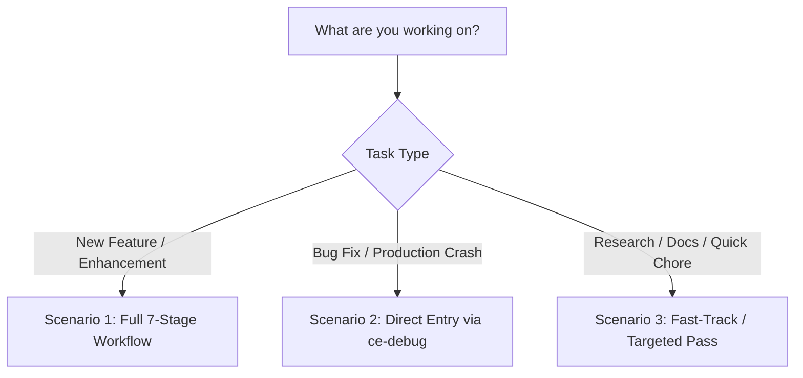
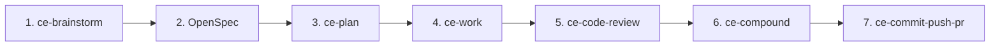
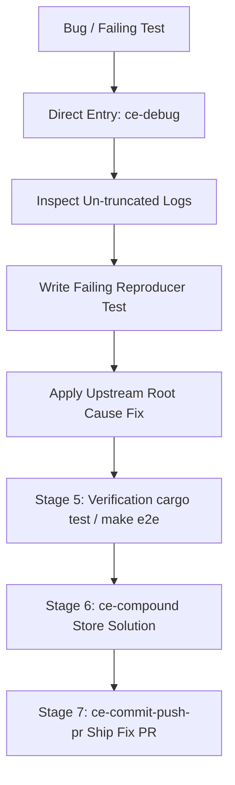
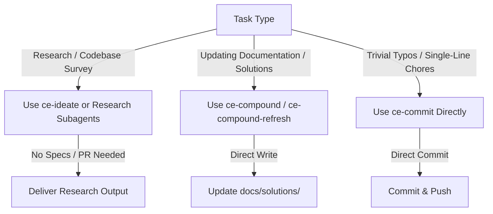
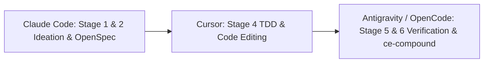
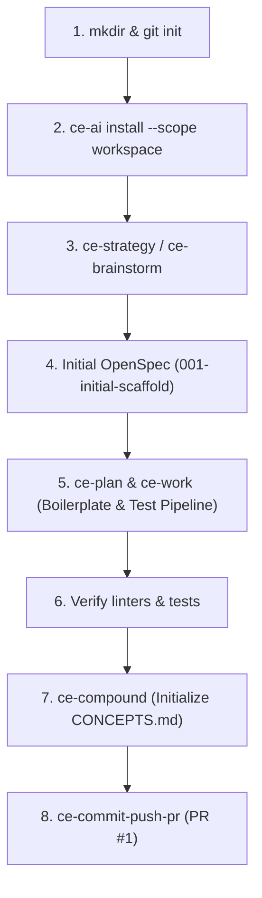
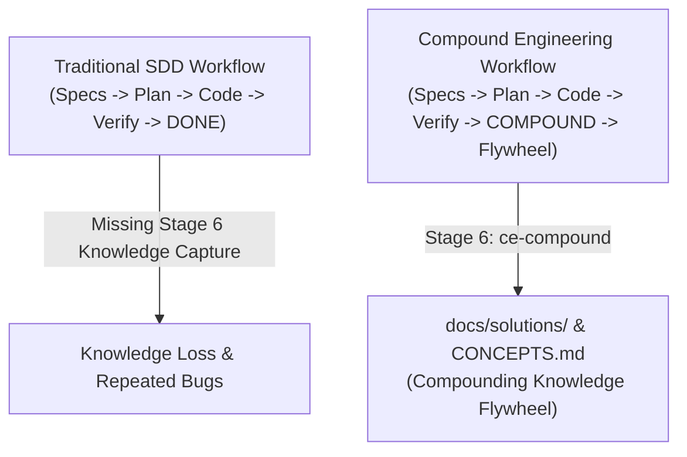

# 🎓 Quick Start Guide: Compound Engineering & `ce-ai` in Practice

Welcome to the beginner's Quick Start guide! Whether you are building a new feature, fixing a production bug, or simply researching a codebase, this guide explains step-by-step how to use **Compound Engineering** skills alongside **`ce-ai`**.

---

## 💡 The Core Philosophy: Orchestrator + Methodology

- **`ce-ai`**: Your command-line orchestrator that manages harness configurations, sidecars (Engram, CodeGraph), scope isolation, and workflow state persistence (`ce-ai workflow`).
- **Compound Engineering**: The engineering methodology (skills and guidelines) that ensures every task builds compounding knowledge so your codebase becomes cleaner, safer, and easier to maintain over time.

---

## 🚀 Workflow Selection Matrix

Choose your entry point based on your task type:



---

## 🛠️ Scenario 1: Building a New Feature or Enhancement

When introducing a new capability, UI screen, or major architectural change, follow the complete 7-stage lifecycle:



### Step-by-Step Flow:

1. **Stage 1: Ideation & Requirements**
   - Run `/ce-brainstorm` (or `/ce-ideate` to explore surprise options).
   - *Goal*: Clarify scope, user constraints, and out-of-scope boundaries. Writes `docs/brainstorms/<date>-<name>-requirements.md`.

2. **Stage 2: OpenSpec Definition**
   - Create formal specs under `openspec/changes/<feature_name>/`:
     - `proposal.md`, `exploration.md`, `design.md`, `spec.md`, and `tasks.md`.
   - *Goal*: Define explicit `WHEN ... THEN ...` acceptance criteria.

3. **Stage 3: Technical Execution Plan**
   - Run `/ce-plan` (and optionally `/ce-doc-review` to audit plan rigor).
   - *Goal*: Break implementation into numbered units (`U1`, `U2`) with file targets and test scenarios under `docs/plans/`.

4. **Stage 4: TDD & Work**
   - Run `/ce-work` (or `/ce-simplify-code` after implementing).
   - *Goal*: Write tests first (Red), implement code (Green), and refactor cleanly. Save progress checkpoints via `ce-ai workflow checkpoint`.

5. **Stage 5: Empirical Verification**
   - Run `/ce-code-review`, unit tests (`cargo test`), and containerized E2E gates (`make e2e`).
   - *Goal*: Zero warnings (`-D warnings`), 100% green tests.

6. **Stage 6: Knowledge Capture**
   - Run `/ce-compound`.
   - *Goal*: Capture non-obvious discoveries and architecture patterns in `docs/solutions/` and `CONCEPTS.md`.

7. **Stage 7: Git Delivery**
   - Run `/ce-commit-push-pr`.
   - *Goal*: Create a feature branch, commit with value-communicating message, and open a Pull Request.

---

## 🐞 Scenario 2: Fixing a Bug or Production Crash

When fixing a defect, you **do not** need to write feature briefs or OpenSpec documents! You enter the workflow directly at Stage 4.



### Step-by-Step Flow:

1. **Direct Entry (Stage 4: Diagnosis)**
   - Run `/ce-debug`.
   - *Behavior*: Inspects error tracebacks, writes a minimal failing test case (Red), and applies a targeted fix to upstream logic (Green).

2. **Stage 5: Verification**
   - Run `cargo test` / `make e2e` to verify zero regressions.

3. **Stage 6: Knowledge Capture**
   - Run `/ce-compound`.
   - *Goal*: Store the bug solution in `docs/solutions/` so Engram memory remembers the fix for future sessions.

4. **Stage 7: Git Delivery**
   - Run `/ce-commit-push-pr` to ship the fix on a `fix/<name>` branch.

---

## ⚡ Scenario 3: Bypassing / Fast-Tracking the Workflow

### ❓ Can I skip or fast-track the workflow?
**YES!** Not every task is a multi-file feature or bug fix. Compound Engineering provides targeted shortcuts for specialized tasks:



### 1. Research & Codebase Surveys
- **Use**: `/ce-ideate` or dispatch read-only research subagents.
- **Workflow**: Bypasses OpenSpec, execution plans, and PR delivery. Generates a summary report or dossier directly for the user.

### 2. Documentation Generation & Knowledge Audits
- **Use**: `/ce-compound` or `/ce-compound-refresh`.
- **Workflow**: Bypasses feature planning and TDD. Reads recent solutions or codebase state and writes directly to `docs/solutions/` or `CONCEPTS.md`.

### 3. Trivial Chores & Typo Fixes
- **Use**: Direct `/ce-commit` or `/ce-commit-push-pr`.
- **Workflow**: Bypasses Stages 1–3. Makes the minor edit, verifies with `cargo test`, and commits immediately.

---

## 🛠️ Advanced Workflow Patterns

### 1. Interrupting & Resuming Work Across Sessions

If you need to stop working and continue hours or days later:

1. **Before Stopping (Save Progress)**:
   ```bash
   ce-ai workflow checkpoint --phase "Stage 4: Work/TDD" --task "4.2 Implementing Unit 2"
   ```
2. **When Resuming Later**:
   ```bash
   ce-ai workflow resume
   ```
3. **What Happens Behind the Scenes**:
   - `ce-ai` reads `state.json` and queries Engram persistent memory (`mem_context` / `mem_search`) to restore your exact 7-stage phase, active task string, and OpenSpec checklist state—allowing you to pick up with 100% zero context loss.

---

### 2. Multi-Harness Collaboration (Harness Handoffs)

You are not locked into a single AI harness! Because `ce-ai` stores state in shared, standardized disk files (`state.json`, `openspec/changes/`, `docs/solutions/`), different AI tools can handle different stages of the exact same task:



- **Example Workflow**:
  - Use **Claude Code** for Stage 1 (`ce-brainstorm`) and Stage 2 (`OpenSpec`).
  - Use **Cursor** or **Copilot** for Stage 4 (`ce-work` / TDD code editing).
  - Use **Antigravity CLI (`agy`)** or **OpenCode** for Stage 5 (`Verify`), Stage 6 (`ce-compound`), and Stage 7 (`ce-commit-push-pr`).
- **Handoff Mechanism**: In any harness, simply execute `ce-ai workflow status` or `ce-ai workflow resume`. The active harness reads the shared state on disk and seamlessly continues from the previous tool's checkpoint.

---

### 3. Working with Multiple Git Worktrees (`ce-worktree`)

When working on multiple features or PRs concurrently, use isolated Git worktrees (`ce-worktree`):

- **Worktree Placement Rule**: Place worktrees as siblings under your project parent directory (e.g. `../my-repo-worktrees/feature-auth/`).
- **Workspace Scope Isolation**:
  ```bash
  ce-ai install --scope workspace
  ```
  Installing with `--scope workspace` inside a worktree places skills and configs (`./.opencode/`, `./.claude/`) strictly inside that worktree without polluting `main` or other parallel worktrees.
- **CodeGraph & Engram Isolation**:
  - *CodeGraph*: Each worktree maintains its own independent index. Run `gentle-ai codegraph init --cwd <worktree-root>` inside the new worktree.
  - *Engram*: Memory observations are tagged with the worktree path so findings remain cleanly isolated per workspace.

### 4. Scenario 4: Starting a Project from Scratch (Greenfield Setup)

When creating a brand new project in an empty directory:



#### Step-by-Step Greenfield Process:

1. **Initialize Directory & `ce-ai`**:
   ```bash
   mkdir my-new-project && cd my-new-project
   git init
   ce-ai install --scope workspace
   ```
2. **Define Product Strategy & Framing (Stage 1: Ideation)**:
   - Run `/ce-strategy` or `/ce-brainstorm`.
   - *Goal*: Establish tech stack, architecture boundaries, and core goals in `STRATEGY.md` or `docs/brainstorms/`.
3. **Draft Initial Scaffold OpenSpec (Stage 2: OpenSpec)**:
   - Create `openspec/changes/001-initial-scaffold/` containing `proposal.md`, `spec.md`, and `tasks.md`.
4. **Build Boilerplate & Test Pipeline (Stage 3 & 4: Plan & Work/TDD)**:
   - Run `/ce-plan` ➔ `/ce-work`. Build initial files, configure linters (`clippy`, `eslint`), and set up tests.
5. **Establish Verification Gates (Stage 5: Verification)**:
   - Run `cargo test` or `npm test` to ensure green tests.
6. **Capture Initial Architecture Concepts (Stage 6: Knowledge Capture)**:
   - Run `/ce-compound` to initialize `CONCEPTS.md` and document initial structural decisions in `docs/solutions/`.
7. **Ship First Commit (Stage 7: Git Delivery)**:
   - Run `/ce-commit-push-pr` to commit initial repository structure.

---

### 5. Transitioning from Spec-Driven Development (SDD / `gentle-ai`)

#### How does `ce-ai` handle projects migrating from SDD?

If your project previously used **Spec-Driven Development (SDD)** (such as `gentle-ai` or OpenSpec):



- **100% Backward Compatibility**:
  - `ce-ai`'s Stage 2 **IS** OpenSpec / SDD! All existing specifications in `openspec/changes/<feature_name>/` (`proposal.md`, `exploration.md`, `design.md`, `spec.md`, `tasks.md`) remain 100% valid and untouched.
- **What Compound Engineering Adds to SDD**:
  - Traditional SDD stops after code passes tests (Stage 5: Verify).
  - Compound Engineering extends SDD by enforcing **Stage 6 (`ce-compound`)**: capturing hard-earned discoveries in `docs/solutions/` and updating `CONCEPTS.md`.
- **Migration Steps**:
  1. Run `ce-ai install --scope workspace` in the repository.
  2. Keep all existing `openspec/` files intact.
  3. Run `/ce-compound-refresh` once to audit historical learnings against the codebase.
  4. Continue writing OpenSpecs as before in Stage 2, enjoying the automatic compounding flywheel!

---

## 📋 Quick Reference Cheat Sheet

| Task Goal | Entry Skill | Workflow Stages Used | Deliverable Output |
| :--- | :--- | :--- | :--- |
| **New Feature** | `/ce-brainstorm` | Full Stages 1 ➔ 7 | OpenSpec + Implementation + Solution + PR |
| **Architectural Option Exploration** | `/ce-ideate` | Stage 1 (Sub-Loop) | Evaluation dossier & trade-off analysis |
| **Bug Fix / Crash Repair** | `/ce-debug` | Direct Entry: Stage 4 ➔ 7 | Reproducer Test + Fix + Solution + PR |
| **Refactoring Clean Code** | `/ce-simplify-code` | Stage 4 (Sub-Loop) | Non-behavioral code tidying |
| **Research / Exploration** | `/ce-ideate` / Subagents | Targeted Pass (Stage 1) | Research summary report |
| **Documentation Update** | `/ce-compound` | Targeted Pass (Stage 6) | Solution doc in `docs/solutions/` |
| **Trivial Chore / Typo** | Direct Edit | Fast-Track: Stage 4 ➔ 7 | Direct git commit |
