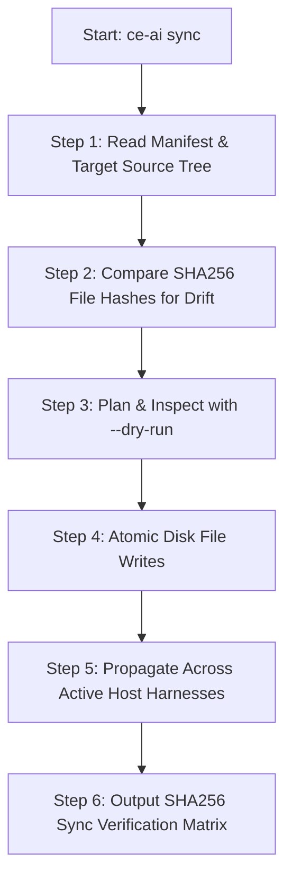
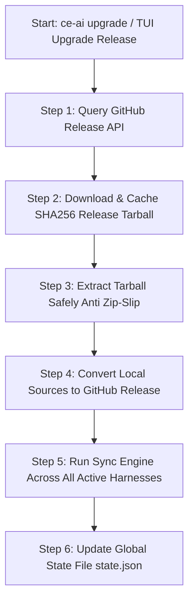

# Step-by-Step Guide: Sync & Reconcile and Upgrade Release Mechanisms

This guide explains in detail the step-by-step internal execution flow of **Sync & Reconcile** (`ce-ai sync`) and **Upgrade Release** (`ce-ai upgrade`) in `ce-ai`.

---

## 💡 Key Concepts & Terminology (Read This First!)

Before diving into the workflows, here are simple explanations for key terms and files used throughout this guide:

### What is "Drift"?
**Drift** refers to any unexpected discrepancy or difference between the managed files on your computer and the official reference files from the plugin package.
- *How drift happens*: If you accidentally delete a skill file, manually edit a prompt, or if an external tool alters a loader script, your local installation has "drifted" from the expected state.
- *How `ce-ai` fixes it*: Running `ce-ai sync` compares your files against the official manifest, identifies any drifted (missing, modified, or stale) files, and restores them to 100% integrity.

### What is `install-manifest.json` and Where Does it Come From?
**`install-manifest.json`** is a digital fingerprint ledger automatically generated by `ce-ai` during the installation process (`ce-ai install`).
- *Where it lives*: Stored inside each harness's managed asset directory (e.g., `~/.config/opencode/compound-engineering/install-manifest.json`).
- *What it contains*:
  1. **Version & Source Tag**: Records whether the plugin was installed from GitHub release `vX.Y.Z` or a local development directory.
  2. **SHA256 File Hashes**: An index of cryptographic checksums for every installed skill and loader script.
  3. **Backup Pointer**: A record pointing to the exact timestamped backup of your original pre-install configuration file (e.g., `~/.ce-ai/backups/2026-08-21T12-00-00/opencode.json`).

### What is a "Harness"?
A **Harness** is an external AI agent tool or editor environment (such as `Claude Code`, `OpenCode`, `Cursor`, `GitHub Copilot`, `Pi`, `Kimi`, `Antigravity`, etc.) that executes AI prompts and skill directives. `ce-ai` acts as a unified manager across all of them.

### What is an "Atomic Write"?
An **Atomic Write** (`write_atomic`) is a safety mechanism used when writing files to disk. Instead of overwriting a file directly (which risks leaving a corrupted half-written file if the application crashes or power is lost), `ce-ai` writes data to a temporary file first and then atomically renames it over the target file in a single, instantaneous operating system operation.

---

## 1. Sync & Reconcile Mechanism (`ce-ai sync`)

The `ce-ai sync` command (or the `Sync & Reconcile` tab in the TUI) is responsible for **guaranteeing managed asset integrity** and repairing any accidental modifications or deleted files (drift) across your AI tools (`OpenCode`, `Claude Code`, `Pi`, `Cursor`, `Copilot`, `Kimi`, `Antigravity`, etc.).

### 🛠️ Step-by-Step Sync Workflow



#### Step 1: Read Manifest & Target Source Tree
- `ce-ai` reads `install-manifest.json` (described above) located in `~/.config/opencode/compound-engineering/` to determine the registered source tree (a GitHub release tarball cached in `~/.ce-ai/cache/` or a local source directory).
- Scans skill files (`skills/`) and loaders (`plugins/compound-engineering.js`) in the source.

#### Step 2: Compare SHA256 Hashes (Drift Detection)
- Computes the **SHA256** hash for each managed asset on disk and compares it against the desired source recorded in `install-manifest.json`:
  - **Copy**: If a managed file is missing on disk, it is marked to be copied.
  - **Restore**: If a file was locally modified or corrupted (drifted), it is marked for restoration.
  - **Remove**: If a file is stale or deleted in the target version, it is marked for removal.

#### Step 3: Dry-Run Inspection (`--dry-run`)
- When running `ce-ai sync --dry-run`, `ce-ai` outputs the exact planned diff actions without writing any data to disk.

#### Step 4: Safe Atomic Disk Writes
- Disk updates use the **atomic write pattern** (`write_atomic`): writes to a temporary file first and performs an atomic `rename`, ensuring system crashes or power interruptions never leave corrupt partial files on disk.

#### Step 5: Propagate Across All Active Host Harnesses
- Merges and maintains skill paths and plugin entries in the configuration of **all installed harnesses on your machine** (`opencode.json`, `claude.json`, `config.json`, `antigravity.json`, `.cursorrules`, etc.).

#### Step 6: Output SHA256 Sync Verification Matrix
- Upon completion, `ce-ai` outputs an itemized integrity verification audit table:
  ```text
  == [Sync Verification Matrix] ==
  version: v0.4.0
  source: github-release
    ✓ harness 'opencode': synced & verified (12 files, SHA256 integrity match)
    ✓ harness 'claude': synced & verified (12 files, SHA256 integrity match)
    ✓ harness 'agy': synced & verified (12 files, SHA256 integrity match)
    ✓ harness 'kimi': synced & verified (12 files, SHA256 integrity match)
  reconciliation status: 100% Verified (0 drift)
  ```

---

## 2. Upgrade Release Mechanism (`ce-ai upgrade`)

The `ce-ai upgrade` command (or the `Upgrade Release` tab in the TUI) fetches the **latest official release of the Compound Engineering Plugin published on GitHub** and safely updates all active host harnesses.

### 🚀 Step-by-Step Upgrade Workflow



#### Step 1: Query GitHub Release API
- `ce-ai` queries GitHub API to resolve the latest release tag of `everyinc/compound-engineering-plugin` (or the specific tag supplied via `--to <tag>`).
- **Fail-loudly contract**: ce-ai only ever downloads immutable release tags. If the API is unreachable, returns an HTTP error, or answers with an unparseable payload, the command exits with code `5` (`Network`) instead of guessing. If no `compound-engineering-v*` release exists yet, it exits with code `2` (`Usage`). There is no silent fallback to a moving branch — pin a tag with `--to <tag>` or install a local tree with `--source <path>`.
- See [Determinism & ce-ai Explained](determinism-explained.md) for why this matters.

#### Step 2: Download & Cache Tarball (`~/.ce-ai/cache/`)
- Downloads the official `.tar.gz` archive and computes its SHA256 digest.
- Caches the file at `~/.ce-ai/cache/ce-<sha256>.tar.gz` to enable fast offline re-installs and test runs.

#### Step 3: Zip-Slip Safe Extraction
- Inspects each entry inside the `.tar.gz` archive before unpacking.
- **Security Check**: Rejects any entry containing path traversal sequences (`../`, absolute paths `/etc/`), preventing arbitrary file overwrite attacks.

#### Step 4: Transparent Conversion from Local Sources (`source: local`)
- If a harness was previously installed from a local development tree (`dev`), `ce-ai upgrade` displays a notice:
  `notice: upgrading harnesses with local source to latest GitHub release.`
- Automatically converts the installation from local source code to the latest official stable GitHub release tag.

#### Step 5: Execute Sync Engine Across All Active Harnesses
- Triggers the `sync` engine (detailed in Section 1) to update skills, loaders, and configuration entries across **all** active AI agent harnesses installed on your system.

#### Step 6: Update Global State (`state.json`)
- Updates `~/.ce-ai/state.json` recording the new release tag, synchronization timestamp (`last_synced_at`), and manifest index.

---

## 📊 Comparison Matrix: When to use Sync vs Upgrade?

| Feature | 🔄 Sync & Reconcile (`ce-ai sync`) | 🚀 Upgrade Release (`ce-ai upgrade`) |
| :--- | :--- | :--- |
| **Purpose** | Repair drift, recover deleted or modified files. | Update plugin to a newer GitHub release. |
| **Data Source** | Currently registered source tree (local or cache). | Queries and downloads latest GitHub Releases. |
| **TUI Usage** | Press **`[Enter]`** in `Sync & Reconcile` tab. | Press **`[Enter]`** in `Upgrade Release` tab. |
| **Result** | Files 100% identical to currently installed version. | Files updated to latest official GitHub release tag. |
