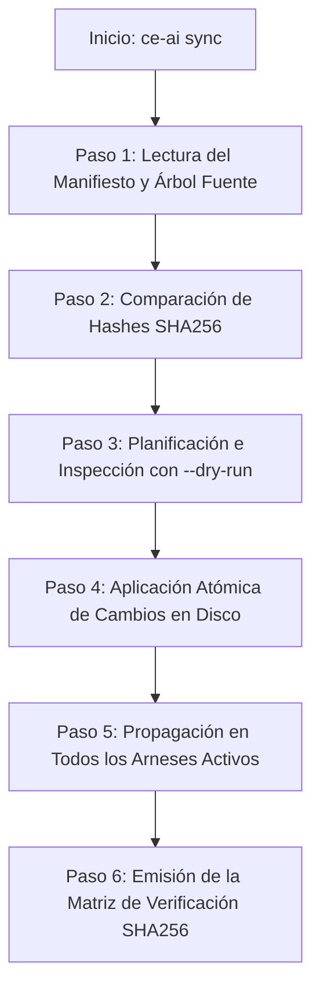
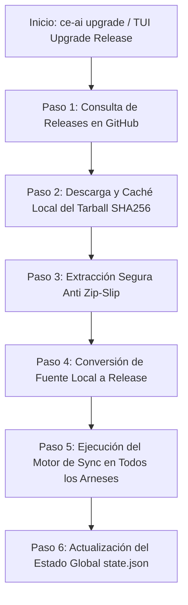

# Guía Explicativa Paso a Paso: Mecanismos de Sync & Reconcile y Upgrade Release

Esta guía explica en detalle y paso a paso cómo funcionan internamente los comandos de **Sync & Reconcile** (`ce-ai sync`) y **Upgrade Release** (`ce-ai upgrade`) en `ce-ai`.

---

## 1. Mecanismo de Sync & Reconcile (`ce-ai sync`)

El comando `ce-ai sync` (o el botón `Sync & Reconcile` en la TUI) se encarga de **garantizar la integridad de los archivos gestionados** y corregir cualquier alteración o borrado accidental (drift) en tus herramientas de IA (`OpenCode`, `Claude Code`, `Pi`, `Cursor`, `Copilot`, `Kimi`, `Antigravity`, etc.).

### 🛠️ Paso a Paso del Proceso de Sync



#### Paso 1: Lectura del Manifiesto y Árbol Fuente
- `ce-ai` lee el manifiesto de instalación (`install-manifest.json`) en `~/.config/opencode/` para saber cuál es la fuente oficial registrada (una Release descargada de GitHub o un repositorio local).
- Escanea los archivos de habilidades (`skills/`) y cargadores (`plugins/compound-engineering.js`) en la fuente.

#### Paso 2: Comparación de Hashes SHA256 (Detección de Drift)
- Para cada archivo gestionado, calcula su hash **SHA256** actual en disco y lo compara contra la fuente deseada:
  - **Copy**: Si falta un archivo en tu equipo, se marca para ser copiado.
  - **Restore**: Si modificaste un archivo localmente o se corrompió, se marca para ser restaurado.
  - **Remove**: Si hay un archivo viejo o eliminado en la nueva versión, se marca para ser removido.

#### Paso 3: Modo Prevención / Previsualización (`--dry-run`)
- Si ejecutas `ce-ai sync --dry-run`, `ce-ai` te muestra el plan exacto de cambios sin escribir una sola línea en el disco.

#### Paso 4: Escritura Atómica Segura en Disco
- Las escrituras en disco usan el patrón de **escritura atómica** (`write_atomic`): escribe en un archivo temporal y realiza un renombrado atómico (`rename`), garantizando que un apagón o caída del sistema nunca deje archivos corruptos.

#### Paso 5: Propagación en Todos los Arneses de IA Activos
- Inscribe y mantiene actualizadas las rutas de habilidades y plugins en la configuración de **todos los arneses instalados en tu equipo** (`opencode.json`, `claude.json`, `config.json`, `antigravity.json`, `.cursorrules`, etc.).

#### Paso 6: Emisión de la Matriz de Verificación de Integridad
- Al finalizar, `ce-ai` emite un reporte claro en pantalla:
  ```text
  == [Sync Verification Matrix] ==
  version: v0.4.0
  source: github-release
    ✓ harness 'opencode': synced & verified (12 files, SHA256 integrity match)
    ✓ harness 'claude': synced & verified (12 files, SHA256 integrity match)
    ✓ harness 'agy': synced & verified (12 files, SHA256 integrity match)
    ✓ harness 'kimi': synced & verified (12 files, SHA256 integrity match)
  reconciliation status: 100% Verified (0 drift)
  ```

---

## 2. Mecanismo de Upgrade Release (`ce-ai upgrade`)

El comando `ce-ai upgrade` (o el botón `Upgrade Release` en la TUI) se encarga de **obtener la versión más reciente del Compound Engineering Plugin lanzada en GitHub** e instalarla de forma segura en todos tus arneses.

### 🚀 Paso a Paso del Proceso de Upgrade



#### Paso 1: Consulta de Releases en la API de GitHub
- `ce-ai` consulta la API de GitHub para obtener la última Release publicada de `everyinc/compound-engineering-plugin` (o el tag especificado con `--to <tag>`).

#### Paso 2: Descarga y Almacenamiento en Caché Local (`~/.ce-ai/cache/`)
- Descarga el archivo `.tar.gz` oficial y calcula su hash SHA256.
- Guarda la versión en el caché interno `~/.ce-ai/cache/ce-<sha256>.tar.gz` para que no tengas que volver a descargarla si re-instalas o trabajas offline.

#### Paso 3: Extracción Segura (Prevención de Zip-Slip / Path Traversal)
- Inspecciona cada entrada dentro del archivo `.tar.gz` antes de descomprimirla.
- **Protección de Seguridad**: Rechaza cualquier archivo que contenga secuencias peligrosas de directorio (`../`, rutas absolutas `/etc/`, etc.) previniendo ataques de sobrescritura de archivos del sistema.

#### Paso 4: Conversión Transparente desde Fuentes Locales (`source: local`)
- Si tu arnés estaba instalado desde código fuente local (`dev`), `ce-ai upgrade` emite una notificación:
  `notice: upgrading harnesses with local source to latest GitHub release.`
- Convierte automáticamente tu instalación a la última versión oficial estable de Release publicada en GitHub.

#### Paso 5: Ejecución del Motor de Sincronización
- Invoca el motor de `sync` (explicado en la Sección 1) para reemplazar y actualizar las habilidades, loaders y configuraciones en **todos** los arneses de IA activos en tu computadora.

#### Paso 6: Actualización de Estado Global (`state.json`)
- Actualiza `~/.ce-ai/state.json` reflejando el nuevo número de tag de release, la marca de tiempo de sincronización (`last_synced_at`) y el manifiesto en disco.

---

## 📊 Cuadro Comparativo: ¿Cuándo usar Sync vs Upgrade?

| Característica | 🔄 Sync & Reconcile (`ce-ai sync`) | 🚀 Upgrade Release (`ce-ai upgrade`) |
| :--- | :--- | :--- |
| **Propósito** | Reparar drift, recuperar archivos borrados o desalineados. | Actualizar el plugin a una versión o release más nueva. |
| **Origen de Datos** | La fuente actual registrada en tu sistema (local o caché). | Consulta y descarga la última Release de GitHub. |
| **Uso en TUI** | Presionar **`[Enter]`** en pestaña `Sync & Reconcile`. | Presionar **`[Enter]`** en pestaña `Upgrade Release`. |
| **Resultado** | Archivos 100% idénticos a la versión instalada actual. | Archivos actualizados a la nueva versión de GitHub. |
