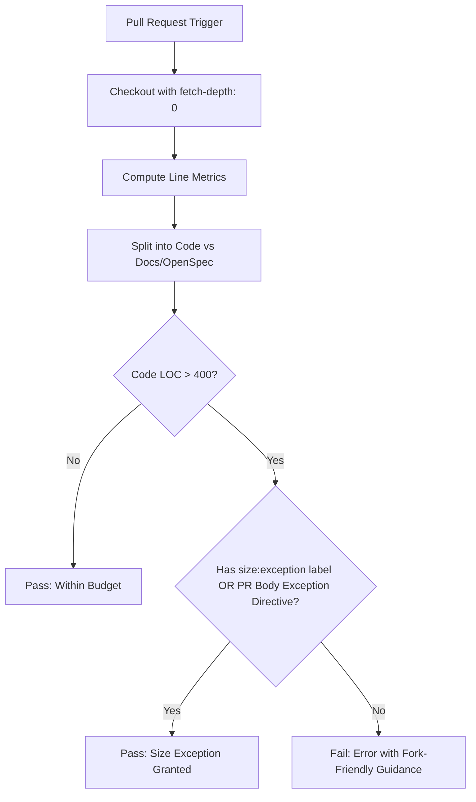

# Design: CI PR Size Budget Fork Exception Fallback and OpenSpec Exemption

## 1. System Architecture & CI Workflow Layout

The enhancement modifies `.github/workflows/ci.yml` within the `pr-size-budget` job.



## 2. Line Counting Schema

### Excluded from Code Counting:
- `Cargo.lock`, `*.lock` (lockfiles)
- `openspec/changes/**` (governance specification contracts)
- `docs/**` (pure documentation and user guides)

### Computed Metrics:
- `CODE_ADDED` / `CODE_DELETED` / `CODE_TOTAL`
- `DOCS_ADDED` / `DOCS_DELETED` / `DOCS_TOTAL`
- `TOTAL = CODE_TOTAL + DOCS_TOTAL`

## 3. PR Body Exemption Recognition

The regex pattern used by `grep -Ei -q` matches:
```text
(^#{1,4}[[:space:]]*size[[:space:]]+exception|<!--[[:space:]]*size[-:]exception|\b(size[-:]exception):|(\*\*|_)size[[:space:]]+exception(\*\*|_):?)
```

Supported forms in PR descriptions:
1. `### Size Exception` (Markdown section)
2. `<!-- size-exception -->` or `<!-- size:exception: <rationale> -->` (HTML comment)
3. `Size-Exception: <rationale>` (git-trailer style)
4. `**Size Exception**: <rationale>` (inline bold declaration)

## 4. GitHub Step Summary & Diagnostic Messages

When `CODE_TOTAL > 400`:
- If approved via label: Logs `Size exception granted via 'size:exception' label.`
- If approved via body directive: Logs `Size exception granted via PR description directive.`
- If neither: Emits an actionable error message indicating how to unblock:
  `::error::PR code changes exceed the 400-line review boundary ($CODE_TOTAL LOC). If this change cannot be sliced further, add a '### Size Exception' section with rationale to the PR description, or request a maintainer add the 'size:exception' label.`
