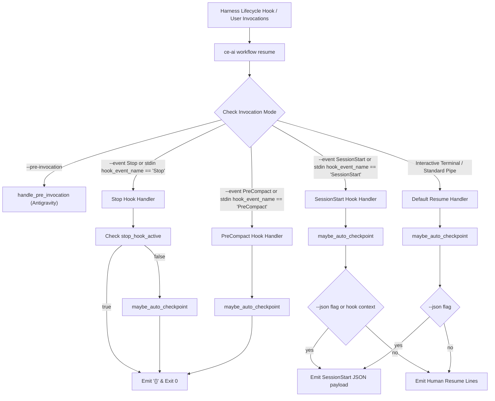

# Design: Codex and Multi-Harness Stop Hook Clean JSON Output

## System Architecture



## Data Structures & CLI Schemas

### 1. `Action::Resume` Arguments in `src/commands/workflow.rs`
```rust
    Resume {
        /// Output machine-readable JSON format.
        #[arg(long)]
        json: bool,
        /// Antigravity PreInvocation hook mode (reads stdin, dedupes per conversationId, injects ephemeralMessage).
        #[arg(long)]
        pre_invocation: bool,
        /// Execution mode override: auto, organic (odd), compound (ce).
        #[arg(long, value_name = "MODE")]
        mode: Option<String>,
        /// Explicit lifecycle hook event (e.g., SessionStart, Stop, PreCompact).
        #[arg(long, value_name = "EVENT")]
        event: Option<String>,
    },
```

### 2. Hook Payload Deserializer
```rust
#[derive(serde::Deserialize, Default, Debug)]
struct HookPayload {
    #[serde(alias = "hook_event_name", alias = "hookEventName")]
    hook_event_name: Option<String>,
    #[serde(alias = "stop_hook_active", alias = "stopHookActive")]
    stop_hook_active: Option<bool>,
    #[serde(alias = "session_id", alias = "sessionId")]
    session_id: Option<String>,
}
```

### 3. Event Resolution Logic
```rust
fn resolve_hook_context(
    cli_event: Option<&str>,
) -> (Option<String>, Option<bool>) {
    if let Some(ev) = cli_event {
        return (Some(ev.to_string()), None);
    }

    if !std::io::stdin().is_terminal() {
        let mut buffer = String::new();
        if std::io::stdin().read_to_string(&mut buffer).is_ok() && !buffer.trim().is_empty() {
            if let Ok(payload) = serde_json::from_str::<HookPayload>(buffer.trim()) {
                if let Some(name) = payload.hook_event_name {
                    return (Some(name), payload.stop_hook_active);
                }
                if payload.stop_hook_active.is_some() {
                    return (Some("Stop".to_string()), payload.stop_hook_active);
                }
            }
        }
    }

    (None, None)
}
```

### 4. Hook Processing Dispatch
When `resolved_event` is:
- `"stop"` (case-insensitive):
  If `stop_hook_active == Some(true)`, print `{}` and return.
  Execute `maybe_auto_checkpoint(ctx, &repo_root, &state_path)`.
  Print `{}` and return.
- `"precompact"` (case-insensitive):
  Execute `maybe_auto_checkpoint(ctx, &repo_root, &state_path)`.
  Print `{}` and return.
- `"sessionstart"` (case-insensitive) or `None`:
  Execute `maybe_auto_checkpoint(ctx, &repo_root, &state_path)`.
  If `--json` is set, print JSON payload.
  Else if resolved from hook stdin, print JSON payload.
  Else print human resume lines.

## Harness Adapter Contracts
In `src/harness/codex.rs` and `src/harness/claude.rs`:
- `has_codex_event_hook` and `has_event_hook` match both exact command strings and commands beginning with `ce-ai workflow resume`.
- `remove_session_start_hook` removes any command matching or beginning with `ce-ai workflow resume`.
