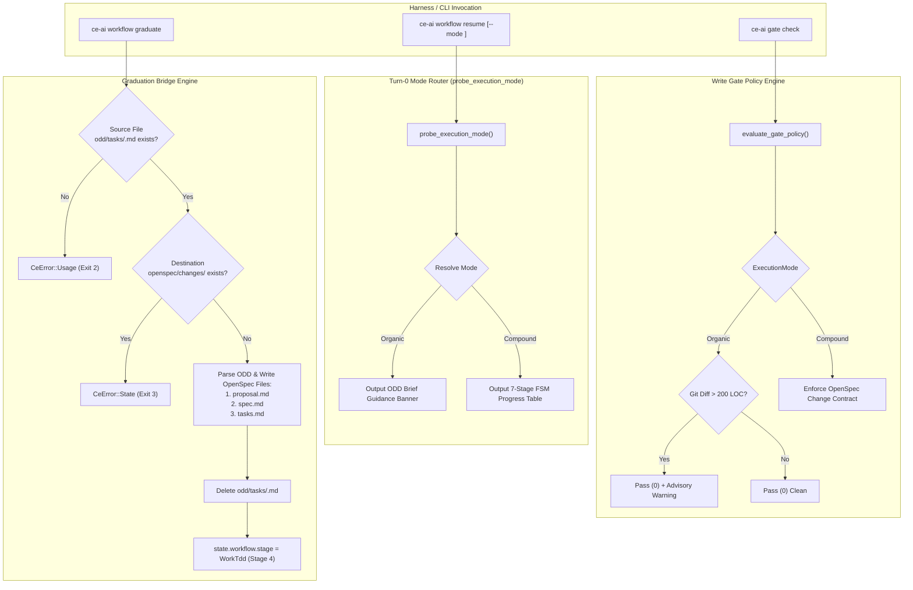

# Technical Design: Adaptive Mode Router & Graduation Bridge

## System Architecture

The Adaptive Mode Router and Graduation Bridge consist of four integrated subsystems:
1. **Domain Models & State (`src/state/state.rs`)**: Serialization and deserialization of `ExecutionMode` within `WorkflowState`.
2. **Turn-0 Mode Router (`src/commands/workflow.rs`)**: Sub-5ms deterministic environment classifier and tailored banner generator in `resume_lines()`.
3. **Graduation Bridge (`src/commands/workflow.rs` & `src/commands/registry.rs`)**: Non-destructive promotion engine transforming `odd/tasks/<feature>.md` into `openspec/changes/<feature>/` and advancing workflow stage to `WorkTdd`.
4. **Dual-Track Write Gate Engine (`src/commands/gate.rs`)**: Observe-only gate policy permitting organic edits with ~200 LOC ceiling notifications.



## Data Models & Schema Contracts

### 1. `ExecutionMode` Enum (`src/state/state.rs`)

```rust
#[derive(Debug, Clone, Copy, PartialEq, Eq, Serialize, Deserialize, Default)]
#[serde(rename_all = "lowercase")]
pub enum ExecutionMode {
    #[default]
    Auto,
    Organic,
    Compound,
}

impl ExecutionMode {
    pub fn as_str(&self) -> &'static str {
        match self {
            ExecutionMode::Auto => "auto",
            ExecutionMode::Organic => "organic",
            ExecutionMode::Compound => "compound",
        }
    }

    pub fn parse(s: &str) -> Result<Self, CeError> {
        let clean = s.trim().to_lowercase();
        match clean.as_str() {
            "auto" => Ok(ExecutionMode::Auto),
            "organic" | "odd" => Ok(ExecutionMode::Organic),
            "compound" | "ce" | "openspec" => Ok(ExecutionMode::Compound),
            _ => Err(CeError::Usage(format!(
                "invalid execution mode '{s}'. Valid modes: auto, organic (odd), compound (ce)"
            ))),
        }
    }
}
```

### 2. `WorkflowState` Extension (`src/state/state.rs`)

```rust
#[derive(Debug, Clone, PartialEq, Eq, Serialize, Deserialize, Default)]
pub struct WorkflowState {
    pub stage: WorkflowStage,
    pub task: String,
    #[serde(default, skip_serializing_if = "Option::is_none")]
    pub feature_name: Option<String>,
    pub updated_at: String,
    #[serde(default)]
    pub source: WorkflowSource,
    #[serde(default, skip_serializing_if = "Option::is_none")]
    pub resolution: Option<FeatureResolution>,
    #[serde(default)]
    pub new_cycle: bool,
    #[serde(default, skip_serializing_if = "Option::is_none")]
    pub execution_mode: Option<ExecutionMode>,
}
```

### 3. Canonical ODD Task Model (`odd/tasks/<feature>.md`)

```markdown
---
feature: parser-escape-bug
mode: organic
created: 2026-09-16
status: active
---

# Problem Statement
Under certain JSON escape sequences, the stream lexer panics with an unexpected EOF.

# Guardrails & Invariants
- Zero external crate dependencies added.
- RFC 8259 compliance maintained across all unicode boundary checks.
- Memory allocations must remain O(1) during tokenization.

# Definition of Done (DoD)
- [x] Reproduce panic in unit test fixture
- [ ] Fix escape lookahead offset in stream parser
- [ ] Run cargo test and cargo clippy cleanly
```

### 4. Parsed ODD Task Representation (`src/commands/workflow.rs`)

```rust
#[derive(Debug, Clone, PartialEq, Eq)]
pub struct OddTaskContent {
    pub feature: String,
    pub problem_statement: String,
    pub guardrails: String,
    pub dod_items: Vec<OddDoDItem>,
}

#[derive(Debug, Clone, PartialEq, Eq)]
pub struct OddDoDItem {
    pub checked: bool,
    pub title: String,
}
```

## CLI Commands & Parameter Contracts

### 1. `workflow resume`, `status`, `checkpoint` Flags
Added flag to clap CLI:
```rust
#[arg(long, value_name = "MODE", help = "Execution mode override: auto, organic (odd), compound (ce)")]
pub mode: Option<String>,
```

### 2. `workflow graduate` Subcommand
```rust
#[derive(Debug, Args)]
pub struct GraduateArgs {
    #[arg(help = "Target feature name to graduate from odd/tasks/<feature>.md to openspec/changes/<feature>/")]
    pub feature: Option<String>,
}
```
Top-level alias registered in `src/commands/registry.rs`:
`ce-ai graduate [feature]` delegates to `ce-ai workflow graduate [feature]`.

## Exit Code & Error Mapping

| Scenario | Error Variant | Exit Code |
|---|---|---|
| Success | `Ok(())` | `0` |
| Invalid `--mode` argument | `CeError::Usage` | `2` |
| Source file `odd/tasks/<feature>.md` not found | `CeError::Usage` | `2` |
| Destination `openspec/changes/<feature>` already exists | `CeError::State` | `3` |
| Filesystem write or delete error | `CeError::Io` | `4` |

## Graduation Bridge Transformation Logic

When `run_graduate` executes:
1. **Source Resolution**: Read `odd/tasks/<feature>.md`. If missing, return `CeError::Usage`.
2. **Collision Check**: If `openspec/changes/<feature>` exists, return `CeError::State`.
3. **Parsing**: Parse YAML frontmatter, `# Problem Statement`, `# Guardrails & Invariants`, and `# Definition of Done (DoD)`.
4. **Scaffolding OpenSpec Package**:
   - `proposal.md`:
     ```markdown
     # Proposal: <feature>

     ## Problem Statement
     <problem_statement>

     ## In-Scope
     - Promoted from Organic Task `odd/tasks/<feature>.md`.
     - Implement all Definition of Done deliverables.

     ## Out-of-Scope
     - Unrelated architectural refactorings outside the scoped problem statement.
     ```
   - `spec.md`:
     ```markdown
     # Specification: <feature>

     ## Requirements & Guardrails
     <guardrails>
     ```
   - `tasks.md`:
     ```markdown
     # Tasks: <feature>

     - [ ] **Work Unit 1: Implementation & Verification** (~200 LOC)
     <mapped_dod_checkboxes_preserving_[x]>
     ```
5. **Disk Commit**: Write all three files to `openspec/changes/<feature>/`.
6. **Cleanup**: Remove `odd/tasks/<feature>.md` to prevent dual-tracking drift.
7. **State Mutation**: Use `crate::state::write_atomic` to update `state.json`:
   - `task = <feature>`
   - `stage = WorkflowStage::WorkTdd` (Stage 4)
   - `execution_mode = Some(ExecutionMode::Compound)`
   - `feature_name = Some(<feature>)`

## Gate Policy Integration

In `evaluate_gate_policy` (`src/commands/gate.rs`):
1. Evaluate mode using `probe_execution_mode`.
2. If mode is `ExecutionMode::Organic`:
   - Bypass OpenSpec package validation.
   - Run `git diff --numstat` (or reuse existing dirty files LOC sum).
   - If changed lines exceed 200 LOC, push notice:
     `"Notice: Organic task diff (+X LOC) exceeds 200 LOC ceiling. Consider running 'ce-ai workflow graduate' to formalize in OpenSpec."`
   - Return `GateDecision::Pass` (exit code 0).
3. If mode is `ExecutionMode::Compound`:
   - Continue strict stage-gated OpenSpec enforcement.
